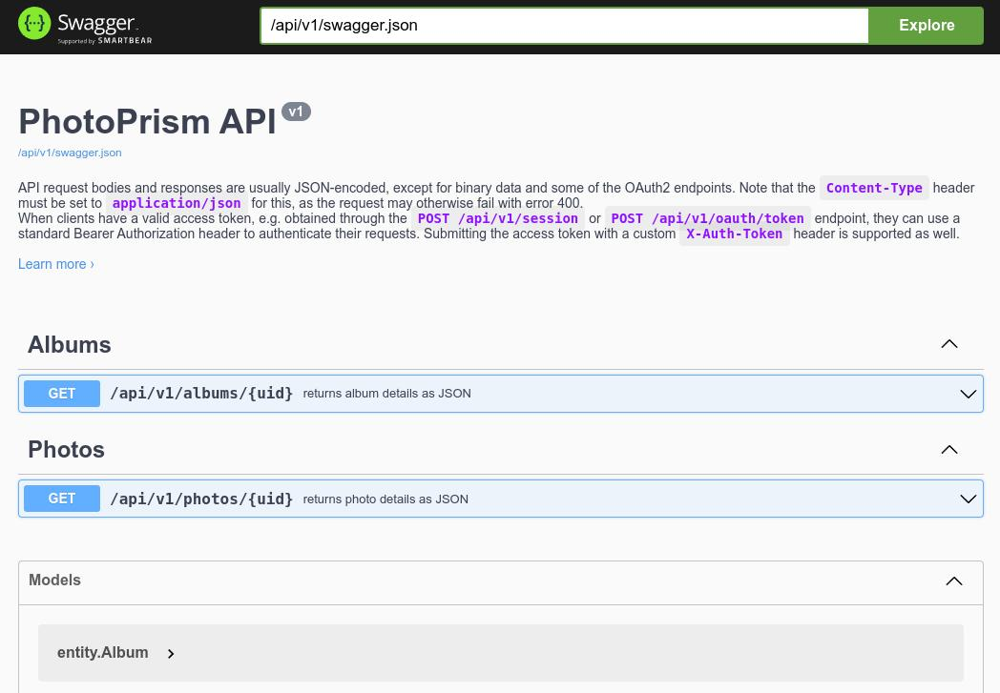

# Swagger API Documentation

Our [interactive API documentation](https://docs.photoprism.dev/), publicly available at [docs.photoprism.dev](https://docs.photoprism.dev/), is automatically generated from the [source code annotations](https://github.com/swaggo/swag) in the [`/internal/api`](https://github.com/photoprism/photoprism/tree/develop/internal/api) package.

The following command regenerates the docs in your local [development environment](https://docs.photoprism.app/developer-guide/setup/):

```bash
make swag
```

The output directory where you will find the `swagger.json` and `swagger.yaml` files is `/assets/docs/api/v1`.

When PhotoPrism is started, you can browse them by navigating to https://app.localssl.dev/api/v1/docs/index.html: 



Any [help with adding annotations](https://github.com/photoprism/photoprism/issues/2132#issuecomment-2227337416) to improve our documentation is much appreciated!

!!! example ""
    The `/api/v1/docs` API documentation endpoint is disabled in production builds.
