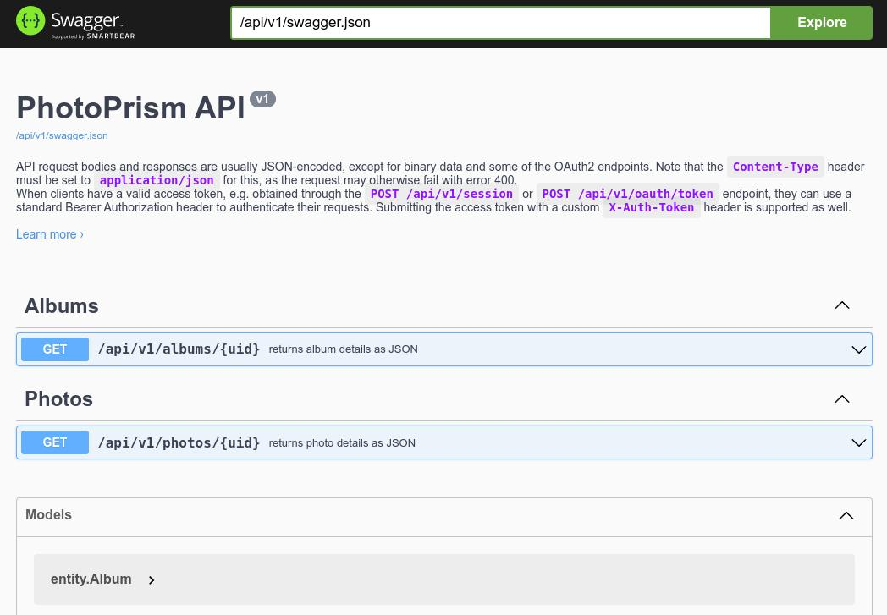

# Swagger API Documentation

Our [interactive API documentation](https://docs.photoprism.dev/), publicly available at [docs.photoprism.dev](https://docs.photoprism.dev/), is automatically generated from the [source code annotations](https://github.com/swaggo/swag) in the [`/internal/api`](https://github.com/photoprism/photoprism/tree/develop/internal/api) package.

Running the following command in your local [development environment](../setup.md) updates [`/internal/api/swagger.json`](https://github.com/photoprism/photoprism/blob/develop/internal/api/swagger.json), which contains the machine-readable API description:

```bash
make fmt-go swag-fmt swag
```

In local debug builds, you can also browse the embedded Swagger UI at `/api/v1/docs/index.html` and fetch the generated JSON from `/api/v1/swagger.json` after rebuilding and starting `photoprism`:



Any [help with adding annotations](https://github.com/photoprism/photoprism/issues/2132#issuecomment-2227337416) to improve our documentation is much appreciated!

!!! example ""
    The `/api/v1/docs` and `/api/v1/swagger.json` endpoints are only available in debug builds and are disabled in production builds.
