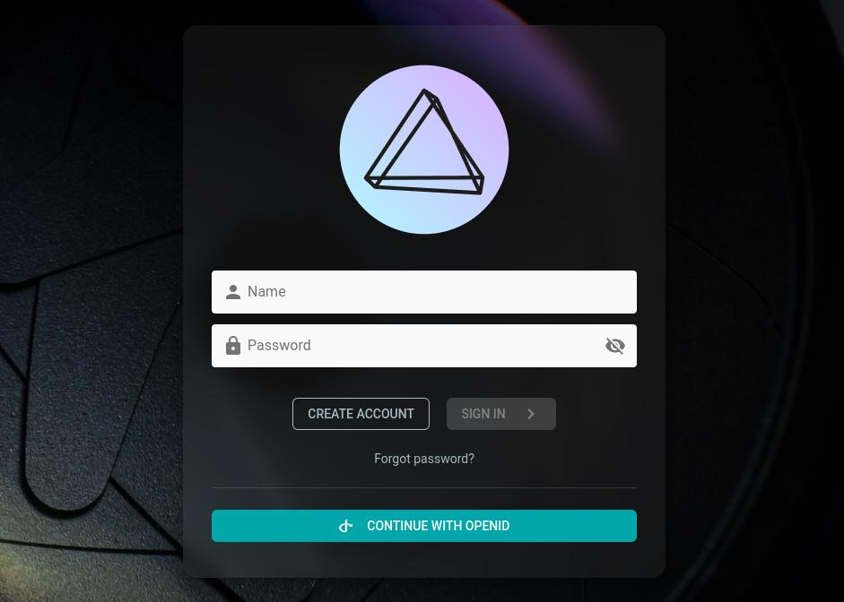

# Single Sign-On via OpenID Connect

[OpenID Connect (OIDC)](https://openid.net/developers/how-connect-works/) extends [OAuth 2.0](oauth2.md) to allow users to log in and optionally register through an external identity provider instead of manually entering a username and password:



## Authentication Flow


[Learn more ›](https://dl.photoprism.app/pdf/20220113-Volkmann_OpenID_Connect_Thesis.pdf)

## Config Options

| Environment              | CLI Flag        | Default            | Description                                                                                         |
|--------------------------|-----------------|--------------------|-----------------------------------------------------------------------------------------------------|
| PHOTOPRISM_OIDC_URI      | --oidc-uri      |                    | issuer `URI` for single sign-on via OpenID Connect, e.g. "https://accounts.google.com"              |
| PHOTOPRISM_OIDC_CLIENT   | --oidc-client   |                    | client `ID` for single sign-on via OpenID Connect                                                   |
| PHOTOPRISM_OIDC_SECRET   | --oidc-secret   |                    | client `SECRET` for single sign-on via OpenID Connect                                               |
| PHOTOPRISM_OIDC_PROVIDER | --oidc-provider |                    | custom identity provider `NAME`, e.g. "Google"                                                      |
| PHOTOPRISM_OIDC_ICON     | --oidc-icon     |                    | custom identity provider icon `URI`                                                                 |
| PHOTOPRISM_OIDC_REDIRECT | --oidc-redirect |                    | automatically redirect unauthenticated users to the configured identity provider                    |
| PHOTOPRISM_OIDC_REGISTER | --oidc-register |                    | allow new users to create an account when they sign in with OpenID Connect                          |
| PHOTOPRISM_OIDC_USERNAME | --oidc-username | preferred_username | preferred username `CLAIM` for new OpenID Connect users (preferred_username, name, nickname, email) |
| PHOTOPRISM_OIDC_WEBDAV   | --oidc-webdav   |                    | allow new OpenID Connect users to use WebDAV when they have a role that allows it                   |
| PHOTOPRISM_DISABLE_OIDC  | --disable-oidc  |                    | disable single sign-on via OpenID Connect, even if an identity provider has been configured         |

!!! example ""
    Your PhotoPrism instance and the [OpenID Connect Identity Provider (IdP)](#identity-providers) must be accessible **via HTTPS** and have valid TLS certificates configured for it. Please also make sure that the hostname in the [Redirect URL](#redirect-url) configured on the IdP matches the [Site URL](../../getting-started/config-options.md#site-information) used by PhotoPrism. Single sign-on via OIDC can otherwise not be enabled.

## Identity Providers

To authenticate users via OIDC, you can either set up and use a self-hosted identity provider such as [ZITADEL](https://zitadel.com/docs/self-hosting/deploy/compose) or [Keycloak](https://www.keycloak.org/), or configure e.g. one of the following public identity providers:

- [Google](https://developers.google.com/identity/openid-connect/openid-connect)
- [Microsoft](https://entra.microsoft.com/)
- [GitHub](https://docs.github.com/en/apps/oauth-apps/building-oauth-apps/creating-an-oauth-app)
- [Amazon](https://developer.amazon.com/apps-and-games/login-with-amazon)

Single sign-on can be configured automatically if [Identity Providers](#identity-providers) offer a standardized `/.well-known/openid-configuration` endpoint for [service discovery](https://developer.okta.com/docs/reference/api/oidc/#well-known-oauth-authorization-server), for example:

- <https://accounts.google.com/.well-known/openid-configuration>

### Local Development

Our [development environment](../setup.md) comes with a [pre-configured Keycloak](https://github.com/photoprism/photoprism/blob/develop/compose.yaml#L217-L243) OIDC Identity Provider running at <https://keycloak.localssl.dev/> for local testing:

- <https://keycloak.localssl.dev/realms/master/.well-known/openid-configuration>

An `admin` account for managing users and a `user` account for testing single sign-on are pre-registered. Both have the password `photoprism`.

!!! example ""
    Please do not use this test identity provider in a production environment as its configuration is not secure.

## Redirect URL

The Redirect URL that must be [specified when registering a new client](img/redirect-url-example.jpg) with an [Identity Provider](#identity-providers) is as follows, where `{hostname}` must be replaced by the hostname in the [Site URL](../../getting-started/config-options.md#site-information), e.g. configured via `PHOTOPRISM_SITE_URL`:

```
https://{hostname}/api/v1/oidc/redirect
```

Both URLs must begin with `https://` to use HTTPS, as otherwise single sign-on via OIDC cannot be enabled.

## Preferred Username

When a new user signs in with OpenID Connect[^1], their preferred username may already be registered. In this case, a random 6-digit number is appended to resolve the conflict.

The config option `PHOTOPRISM_OIDC_USERNAME` allows you to change the [preferred username](#config-options) for new accounts from `preferred_username` to `name`, `nickname`, or verified `email`. Names are changed to lowercase handles so that, for example, "Jens Mander" becomes "jens.mander".

!!! example ""
    Advanced users can connect an existing account by manually updating the `auth_id` column to match the subject ID of the OIDC provider and changing the value of the `auth_provider` column to `oidc` in the `auth_users` database table, and then deleting the duplicate account so only one user with a matching `auth_id` remains.

## Service Discovery

It is not yet possible to use PhotoPrism as an [Identity Provider](#identity-providers), since not all the required [endpoints](https://github.com/photoprism/photoprism/issues/4368) and [grant types](oauth2.md) have been fully implemented.

However, querying the `/.well-known/openid-configuration` endpoint shows what has already been implemented, so the missing capabilities can be identified and added over time:

- <https://demo.photoprism.app/.well-known/openid-configuration>

## Related Issues

- [Auth: Add support for single sign-on via OpenID Connect (OIDC) #782](https://github.com/photoprism/photoprism/issues/782)
- [Auth: Add `userinfo` API endpoint to get information about the logged in user #4369](https://github.com/photoprism/photoprism/issues/4369)
- [Auth: Add `authorize` API endpoint to implement the authorization code flow #4368](https://github.com/photoprism/photoprism/issues/4368)

## Software Libraries

- https://github.com/zitadel/oidc by https://zitadel.com/

## Protocol References

- https://openid.net/developers/how-connect-works/
- https://dl.photoprism.app/pdf/20220113-Volkmann_OpenID_Connect_Thesis.pdf
- https://oauth.net/openid-for-verifiable-credentials/
- https://developers.google.com/identity/openid-connect/openid-connect
- https://www.ory.sh/docs/oauth2-oidc/authorization-code-flow
- https://developer.okta.com/docs/concepts/oauth-openid/
- https://developer.okta.com/docs/reference/api/oidc/
- https://developer.okta.com/docs/reference/api/oauth-clients/
- https://auth0.com/docs/authenticate/protocols/openid-connect-protocol
- https://learn.microsoft.com/en-us/entra/identity-platform/scopes-oidc#openid-connect-scopes
- https://owncloud.dev/clients/rclone/webdav-sync-oidc/
- https://blog.cubieserver.de/2022/complete-guide-to-nextcloud-oidc-authentication-with-authentik/
- https://auth0.com/docs/get-started/applications/configure-applications-with-oidc-discovery
- https://connect2id.com/products/server/docs/api/authorization
- https://www.authlete.com/developers/definitive_guide/authorization_endpoint_spec/
- https://www.oauth.com/oauth2-servers/authorization/the-authorization-request/
- https://www.oauth.com/oauth2-servers/authorization/requiring-user-login/
- https://www.oauth.com/oauth2-servers/authorization/the-authorization-interface/
- https://www.oauth.com/oauth2-servers/authorization/the-authorization-response/

[^1]: `PHOTOPRISM_OIDC_REGISTER` must be set to `"true"` to allow new users to create an account