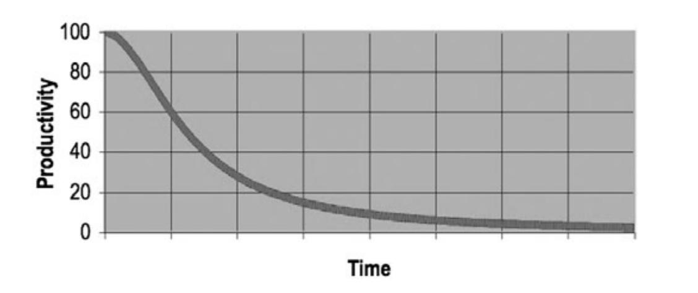

# Quality and Best Practices

**The quality of code has a practical impact on both your agility and the cost of development:**[^1]

- you can't change buggy and/or bloated code fast enough to be truly agile
- existing bugs can easily increase development costs (and time) by 10x
- the mess eventually becomes so big and so deep that you cannot clean it up anymore[^2]

<figure markdown>
  { width="500" }
  <figcaption>Productivity vs Time</figcaption>
</figure>

!!! example ""
    All developers with more than a few years experience know that previous messes slow them down. And yet all
    developers feel the pressure to make messes in order to meet deadlines. In short, they don’t take the time
    to go fast! You will not make the deadline by making a mess. Indeed, the mess will slow you down instantly, and
    will force you to miss the deadline. — <cite>Robert C. Martin</cite>

## Go Slow Before You Go Fast 🐰 ##

Read the docs, understand the context and constraints, and [talk to others](index.md#join-the-community) before you write code. Start by [writing tests](#test-automation-guidelines) (or at least a test plan), implement the [simplest working solution](#opportunistic-refactoring), and iterate in [small, reviewable steps](#bottom-up-development). Profile [before you optimize](#premature-optimization); measure after you change. Staying calm and methodical is the fastest—and only sustainable—way to deliver durable improvements:

* **Clarify intent:** List inputs/outputs, failure modes, and [success criteria](issues.md#acceptance-criteria) before coding
* **Tests first:** Write [unit tests](#test-automation-guidelines) (and a minimal benchmark if performance matters) so behavior is locked in [before optimization](#premature-optimization)
* **Small PRs:** Prefer focused changes with [clear commit messages](pull-requests.md#make-your-changes) over large “mixed” PRs
* **Spike, then build:** When uncertain, timebox a throwaway spike to learn, then implement the real solution cleanly
* **Measure, don’t guess:** Use profiling/metrics to identify bottlenecks; [optimize](#premature-optimization) only where data supports it

Add [caching](#be-careful-with-caching) only after correctness is proven and a bottleneck is measured; keep it optional and easy to disable. Introduce [concurrency](#use-safe-concurrency) only when it simplifies the design or removes a measured bottleneck—otherwise prefer simple, sequential code.

!!! example ""
    Simple, elegant solutions are [more effective](#effectiveness-efficiency), but they are harder to find than complex ones, and they require more
    time, which we too often believe to be unaffordable. — <cite>Niklaus Wirth, [Communications of the ACM](https://dl.acm.org/doi/10.1145/2786.2789), 1985</cite>

### Definition of Ready

- [ ] [User stories](issues.md#writing-user-stories), [success criteria](issues.md#acceptance-criteria), [context and constraints](#go-slow-before-you-go-fast) have been documented
- [ ] Key [test cases](#test-automation-guidelines) (happy path and key edge cases) are identified
- [ ] A rollout/rollback plan is in place if needed, e.g. via feature flag

### Definition of Done

- [ ] All of the [acceptance criteria](pull-requests.md#acceptance-criteria) have been met, so we can [merge your changes](pull-requests.md#how-to-create-and-submit-a-pull-request)
- [ ] All [tests pass](tests.md), and [coverage has been added](#test-automation-guidelines) for new logic
- [ ] Benchmarks/profile updated if performance was a goal
- [ ] [Docs](documentation.md) and comments reflect current behavior and trade-offs
- [ ] Change is observable (metrics/logs) and reversible (flag/config)

## Bottom-Up Development ##

Breaking a problem down into small, coherent fragments lends itself to organization. Start with the basic low-level
components and then proceed to higher-level abstractions.

Bottom-up development emphasizes coding and early testing, which can begin before having a detailed understanding of the final system. In practice, this may never be the case as requirements are constantly evolving.

Advantages of the bottom-up approach are component reusability, agility, and testability.

!!! example ""
    I compared Mel's hand-optimized programs with the same code massaged by the optimizing assembler program, and Mel's always ran faster.
    That was because the “top-down” method of program design hadn't been invented yet, and Mel wouldn't have used it anyway. 
    He wrote the innermost parts of his program loops first. — <cite>[The Story of Mel](http://www.catb.org/jargon/html/story-of-mel.html)</cite>

## Opportunistic Refactoring ##

We encourage developers to refactor existing code when they notice a specific issue, even though this may seem difficult when working with a distributed team, branches, and pull requests due to potential merge conflicts and delayed feedback.

It is best to do this while you are working on the same component anyway, for example to implement a feature or enhancement. This way you can easily validate if the proposed changes make sense and you avoid conflicts with others.

Releasing imperfect code is not a problem as long as it is [accompanied by automated tests](#test-automation-guidelines). This makes it easy to refactor later without breaking anything or requiring detailed knowledge of the requirements and a lot of time for manual testing. Be pragmatic. Done is better than perfect.

Potential [security issues](security/index.md) are an important exception. These should never be ignored. If you find a problem, please [report it to us](https://www.photoprism.app/security-policy) immediately so we can fix it.

!!! example ""
    Feel free to think ahead, just don't code ahead. But also, don't feel the need to decide so many
    details ahead. Learn enough to get started and build only what you need.
    — <cite>[J. B. Rainsberger](https://twitter.com/jbrains/status/1064212803542818816)</cite>

## Premature Optimization ##

One of the hardest parts of software development is knowing what to work on.
Don't get carried away implementing unnecessary abstractions and focusing on scalability optimization before you've even validated the functionality of a feature or component.

Instead of spending a lot of time on something you may not need, focus on user needs and [test automation](#test-automation-guidelines).
That way, you'll make sure you're developing the right functionality, and you can [refactor it later](https://martinfowler.com/bliki/DefinitionOfRefactoring.html) for scalability and other non-functional aspects without breaking anything.

Also keep in mind that it's much easier and less effort to maintain small amounts of duplicate code than to choose the wrong abstraction.

!!! example ""
    Premature optimization is the root of all evil. — <cite>Donald Knuth</cite>

## Use Safe Concurrency ##

Go makes it easy to run work concurrently with [goroutines](https://gobyexample.com/goroutines), but correctness still depends on *safely* accessing shared, mutable state. A mutex (`sync.Mutex` / `sync.RWMutex`) provides mutual exclusion so only one goroutine manipulates protected data at a time, and it also serves as a synchronization point that *publishes* changes according to the Go memory model. Use [mutexes](https://gobyexample.com/mutexes) when multiple goroutines must share the same data; prefer channels, immutability, or ownership transfer when you can avoid sharing altogether.

- Prefer simple `sync.Mutex` over `RWMutex` unless reads clearly dominate and profiles show contention; hold locks briefly and never across slow I/O or long computations.
- Document what the mutex protects (`// mu guards: …`), keep the mutex next to the protected fields in the same struct, and avoid exporting or copying types containing a mutex.
- Establish a consistent lock order to prevent deadlocks, don’t start goroutines while holding a lock, and consider `sync/atomic` or channels for simple counters or ownership transfer.
- Use `defer mu.Unlock()` for clarity in short functions, but in hot paths unlock explicitly to reduce overhead, and always run the race detector to catch misuse.

## Be Careful with Caching ##

In computer science, there are two hard problems: [naming things](#naming-things-is-hard) and [cache invalidation](https://msol.io/blog/tech/youre-probably-wrong-about-caching/). Delaying caching keeps the system simple and allows tests to focus on correctness. Once the behavior is specified and verified, the cache layer becomes an easily measurable, togglable, and maintainable optimization:

- **Do it last.** First make it correct and simple, add tests and benchmarks, then add caching only where profiling shows a clear win.
- **Keep it optional.** The app must work without the cache; never fail requests due to cache errors. Provide a build flag or env toggle to disable it during tests and troubleshooting.
- **Define scope & lifecycle.** Document what is cached, where (in-memory vs shared), and when entries expire (TTL/size limit/event-based invalidation).
- **Design stable keys.** Use deterministic, lower-cased keys; include a version/salt when formats change; namespace by resource type to avoid collisions.
- **Plan invalidation.** Purge or update entries on writes/updates; avoid caching mutable results unless you know how they’ll be refreshed.
- **Guard concurrency.** Prevent thundering herds (e.g., collapse duplicate loads), and [avoid holding locks](#use-safe-concurrency) around slow I/O.
- **Observe & tune.** Track hit/miss/eviction rates and latency; alert on high miss rates or stampedes; keep memory usage bounded.
- **Test both paths.** Unit tests should pass with the cache disabled; integration tests should cover cache hits, misses, expiry, and invalidation.

!!! example ""
    A cache with a bad policy is another name for a memory leak. — <cite>[Raymond Chen](https://devblogs.microsoft.com/oldnewthing/20060502-07/?p=31333)</cite>

## Naming Things Is Hard ##

Use [short, descriptive names](https://go.dev/doc/effective_go#names) with idiomatic casing:

- **lowerCamelCase** for locals/unexported, **MixedCaps** for exported, and [package names](https://go.dev/doc/effective_go#package-names) that are short, lower-case, *singular*, and underscore-free. We can make exceptions when there's a naming conflict, for example, with a reserved word.
- Avoid stutter (`bytes.Buffer` not `bytes.BytesBuffer`); prefer positive booleans (`is/has/can`), standard initialisms (`ID`, `URL`, `JSON`), `Err…` for error vars, and small behavior-based interfaces (use the `…er` suffix only when it adds clarity).
- Choose names that reflect behavior rather than types or frameworks; keep receiver names short and consistent (e.g., `db *DB`), use verbs for functions and nouns for types.

## Effectiveness > Efficiency ##

Optimize for effectiveness before efficiency when prioritizing tasks:

- **Effectiveness** is about achieving a specific outcome, such as providing the features that best help users solve their problems.
- **Efficiency** means doing things in an optimal way, for example, faster and cheaper. We all strive to be efficient, but that's worthless if it doesn't contribute to effectiveness.

In contrast, a feature factory focuses on the quantity of new features rather than their quality:

!!! example ""
    **It is fundamentally the confusion between effectiveness and efficiency that stands between doing the right things and doing things right.** There is surely nothing quite so useless as doing with great efficiency what should not be done at all. — <cite>[Peter Drucker](https://en.wikipedia.org/wiki/Peter_Drucker)</cite>

## Test Automation Guidelines ##

We strive for [complete test coverage](https://martinfowler.com/bliki/TestCoverage.html) as it is a useful tool for finding 
untested parts of our code base. Test coverage is of limited use as a numerical statement of how good our tests are.

The *F.I.R.S.T. Principle* includes five rules that good tests should follow:[^2]

- **Fast.** If tests are slow, you won't run them frequently, which makes them much less useful and increases the cost of development. 
- **Independent.** You should be able to run each test independently and run the tests in any order you like. When tests depend on each other, then the first one to fail causes a cascade of downstream failures, making diagnosis difficult and hiding downstream defects. 
- **Repeatable.** If your tests aren’t repeatable in any environment, then you’ll always have an excuse for why they fail. You’ll also find yourself unable to run the tests when the environment isn’t available. 
- **Self-Validating.** You should not have to read through a log file to tell whether the tests pass. If the tests aren’t
self-validating, then failure can become subjective and running the tests can require a long manual evaluation. 
- **Timely.** If you write the tests after the production code, you will generally find that the production code is difficult to test. Instead, add tests at implementation time to ensure that the code is testable, does what you expect it to do, and meets the requirements.

!!! example ""
    Code that cannot be tested is flawed. — <cite>Anonymous</cite>

## Code Quality Reports ##

[goreportcard.com][goreport] generates reports on the quality of Open Source Go projects. It uses several measures,
including `gofmt`, `go vet`, `go lint` and `gocyclo`. If you find this helpful and also use the tool for your own projects, you can support the developers on [Patreon](https://www.patreon.com/goreportcard).

[][goreport]

!!! example ""
    Take inspiration from quality reports, but keep in mind that not every reported issue must be fixed immediately.

## Security Best Practices ##

The [Open Source Security Foundation](https://www.bestpractices.dev/en/) (OpenSSF) maintains standardized security criteria and best practices for open-source projects:

[View Security Testing Guide ›](security/index.md)

[goreport]: https://goreportcard.com/report/github.com/photoprism/photoprism

[^1]: Allen Holub, [*twitter.com/allenholub/status/1073738216140791808*](https://twitter.com/allenholub/status/1073738216140791808), 2018
[^2]: Robert C. Martin, [*Clean Code: A Handbook of Agile Software Craftsmanship*](https://www.amazon.com/-/dp/0132350882/), 2009
