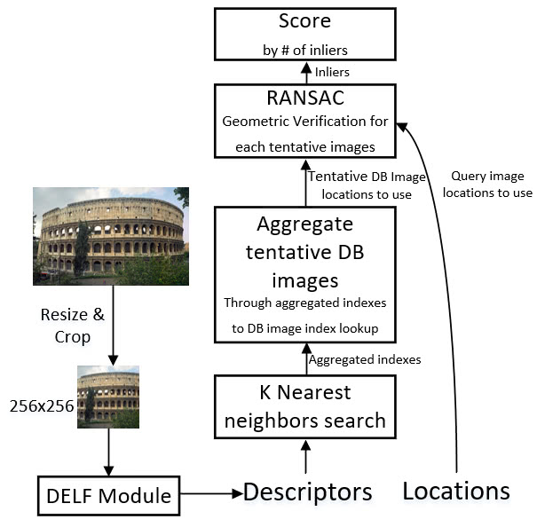

Image classification is performed using a [pre-trained model](https://dl.photoprism.org/tensorflow/), *NASNet Mobile 224*, that we have chosen because of its size, performance and accuracy. To get a basic understanding of how this works, you can read [Image Classification using Deep Neural Networks](https://medium.com/@tifa2up/image-classification-using-deep-neural-networks-a-beginner-friendly-approach-using-tensorflow-94b0a090ccd4).

In addition, we manually matched the model classification with the [labels](https://github.com/photoprism/photoprism/blob/develop/internal/classify/rules.yml) you see in our UI:

```
cat:
  label: cat
  threshold: 0.3
  priority: 5
  categories:
    - animal

tabby cat:
  see: cat
```
 

This was necessary because we didn't find a [taxonomy](https://wordnet.princeton.edu/) suitable for consumers (mainly just scientific ones) and needed a lot of control to fine tune terms and their probability thresholds. The raw results were [not useful](https://github.com/photoprism/photoprism/issues/160) to a typical user. Indexing too many words, categories and alternatives also negatively affects performance and [leads to noise](https://github.com/photoprism/photoprism/issues/160). 

It took us several months of testing until we were happy with the results and there are still labels to improve.

## Updating labels ##

After editing or adding labels in [rules.yml](https://github.com/photoprism/photoprism/blob/develop/internal/classify/rules.yml), you now have to run `make generate` in the main project directory to generate native Go source from this file.

## Pre-trained Models ##

See also: [TensorFlow Hub](https://tfhub.dev/)

Source: https://github.com/tensorflow/models/blob/master/research/slim/README.md

Neural nets work best when they have many parameters, making them powerful
function approximators.
However, this  means they must be trained on very large datasets. Because
training models from scratch can be a very computationally intensive process
requiring days or even weeks, there are various pre-trained models available. 
These CNNs have been trained on the
[ILSVRC-2012-CLS](http://www.image-net.org/challenges/LSVRC/2012/)
image classification dataset.

Note that the VGG and ResNet V1 parameters have been converted from their original
caffe formats
([here](https://github.com/BVLC/caffe/wiki/Model-Zoo#models-used-by-the-vgg-team-in-ilsvrc-2014)
and
[here](https://github.com/KaimingHe/deep-residual-networks)),
whereas the Inception and ResNet V2 parameters have been trained internally at
Google. Also be aware that these accuracies were computed by evaluating using a
single image crop. PhotoPrism uses three crops, except for square images.

Model | TF-Slim File | Checkpoint | Top-1 Accuracy| Top-5 Accuracy |
:----:|:------------:|:----------:|:-------:|:--------:|
[Inception V1](http://arxiv.org/abs/1409.4842v1)|[Code](https://github.com/tensorflow/models/blob/master/research/slim/nets/inception_v1.py)|[inception_v1_2016_08_28.tar.gz](http://download.tensorflow.org/models/inception_v1_2016_08_28.tar.gz)|69.8|89.6|
[Inception V2](http://arxiv.org/abs/1502.03167)|[Code](https://github.com/tensorflow/models/blob/master/research/slim/nets/inception_v2.py)|[inception_v2_2016_08_28.tar.gz](http://download.tensorflow.org/models/inception_v2_2016_08_28.tar.gz)|73.9|91.8|
[Inception V3](http://arxiv.org/abs/1512.00567)|[Code](https://github.com/tensorflow/models/blob/master/research/slim/nets/inception_v3.py)|[inception_v3_2016_08_28.tar.gz](http://download.tensorflow.org/models/inception_v3_2016_08_28.tar.gz)|78.0|93.9|
[Inception V4](http://arxiv.org/abs/1602.07261)|[Code](https://github.com/tensorflow/models/blob/master/research/slim/nets/inception_v4.py)|[inception_v4_2016_09_09.tar.gz](http://download.tensorflow.org/models/inception_v4_2016_09_09.tar.gz)|80.2|95.2|
[Inception-ResNet-v2](http://arxiv.org/abs/1602.07261)|[Code](https://github.com/tensorflow/models/blob/master/research/slim/nets/inception_resnet_v2.py)|[inception_resnet_v2_2016_08_30.tar.gz](http://download.tensorflow.org/models/inception_resnet_v2_2016_08_30.tar.gz)|80.4|95.3|
[ResNet V1 50](https://arxiv.org/abs/1512.03385)|[Code](https://github.com/tensorflow/models/blob/master/research/slim/nets/resnet_v1.py)|[resnet_v1_50_2016_08_28.tar.gz](http://download.tensorflow.org/models/resnet_v1_50_2016_08_28.tar.gz)|75.2|92.2|
[ResNet V1 101](https://arxiv.org/abs/1512.03385)|[Code](https://github.com/tensorflow/models/blob/master/research/slim/nets/resnet_v1.py)|[resnet_v1_101_2016_08_28.tar.gz](http://download.tensorflow.org/models/resnet_v1_101_2016_08_28.tar.gz)|76.4|92.9|
[ResNet V1 152](https://arxiv.org/abs/1512.03385)|[Code](https://github.com/tensorflow/models/blob/master/research/slim/nets/resnet_v1.py)|[resnet_v1_152_2016_08_28.tar.gz](http://download.tensorflow.org/models/resnet_v1_152_2016_08_28.tar.gz)|76.8|93.2|
[ResNet V2 50](https://arxiv.org/abs/1603.05027)^|[Code](https://github.com/tensorflow/models/blob/master/research/slim/nets/resnet_v2.py)|[resnet_v2_50_2017_04_14.tar.gz](http://download.tensorflow.org/models/resnet_v2_50_2017_04_14.tar.gz)|75.6|92.8|
[ResNet V2 101](https://arxiv.org/abs/1603.05027)^|[Code](https://github.com/tensorflow/models/blob/master/research/slim/nets/resnet_v2.py)|[resnet_v2_101_2017_04_14.tar.gz](http://download.tensorflow.org/models/resnet_v2_101_2017_04_14.tar.gz)|77.0|93.7|
[ResNet V2 152](https://arxiv.org/abs/1603.05027)^|[Code](https://github.com/tensorflow/models/blob/master/research/slim/nets/resnet_v2.py)|[resnet_v2_152_2017_04_14.tar.gz](http://download.tensorflow.org/models/resnet_v2_152_2017_04_14.tar.gz)|77.8|94.1|
[ResNet V2 200](https://arxiv.org/abs/1603.05027)|[Code](https://github.com/tensorflow/models/blob/master/research/slim/nets/resnet_v2.py)|[TBA]()|79.9\*|95.2\*|
[VGG 16](http://arxiv.org/abs/1409.1556.pdf)|[Code](https://github.com/tensorflow/models/blob/master/research/slim/nets/vgg.py)|[vgg_16_2016_08_28.tar.gz](http://download.tensorflow.org/models/vgg_16_2016_08_28.tar.gz)|71.5|89.8|
[VGG 19](http://arxiv.org/abs/1409.1556.pdf)|[Code](https://github.com/tensorflow/models/blob/master/research/slim/nets/vgg.py)|[vgg_19_2016_08_28.tar.gz](http://download.tensorflow.org/models/vgg_19_2016_08_28.tar.gz)|71.1|89.8|
[MobileNet_v1_1.0_224](https://arxiv.org/pdf/1704.04861.pdf)|[Code](https://github.com/tensorflow/models/blob/master/research/slim/nets/mobilenet_v1.py)|[mobilenet_v1_1.0_224.tgz](http://download.tensorflow.org/models/mobilenet_v1_2018_02_22/mobilenet_v1_1.0_224.tgz)|70.9|89.9|
[MobileNet_v1_0.50_160](https://arxiv.org/pdf/1704.04861.pdf)|[Code](https://github.com/tensorflow/models/blob/master/research/slim/nets/mobilenet_v1.py)|[mobilenet_v1_0.50_160.tgz](http://download.tensorflow.org/models/mobilenet_v1_2018_02_22/mobilenet_v1_0.5_160.tgz)|59.1|81.9|
[MobileNet_v1_0.25_128](https://arxiv.org/pdf/1704.04861.pdf)|[Code](https://github.com/tensorflow/models/blob/master/research/slim/nets/mobilenet_v1.py)|[mobilenet_v1_0.25_128.tgz](http://download.tensorflow.org/models/mobilenet_v1_2018_02_22/mobilenet_v1_0.25_128.tgz)|41.5|66.3|
[MobileNet_v2_1.4_224^*](https://arxiv.org/abs/1801.04381)|[Code](https://github.com/tensorflow/models/blob/master/research/slim/nets/mobilenet/mobilenet_v2.py)| [mobilenet_v2_1.4_224.tgz](https://storage.googleapis.com/mobilenet_v2/checkpoints/mobilenet_v2_1.4_224.tgz) | 74.9 | 92.5|
[MobileNet_v2_1.0_224^*](https://arxiv.org/abs/1801.04381)|[Code](https://github.com/tensorflow/models/blob/master/research/slim/nets/mobilenet/mobilenet_v2.py)| [mobilenet_v2_1.0_224.tgz](https://storage.googleapis.com/mobilenet_v2/checkpoints/mobilenet_v2_1.0_224.tgz) | 71.9 | 91.0
[NASNet-A_Mobile_224](https://arxiv.org/abs/1707.07012)#|[Code](https://github.com/tensorflow/models/blob/master/research/slim/nets/nasnet/nasnet.py)|[nasnet-a_mobile_04_10_2017.tar.gz](https://storage.googleapis.com/download.tensorflow.org/models/nasnet-a_mobile_04_10_2017.tar.gz)|74.0|91.6|
[NASNet-A_Large_331](https://arxiv.org/abs/1707.07012)#|[Code](https://github.com/tensorflow/models/blob/master/research/slim/nets/nasnet/nasnet.py)|[nasnet-a_large_04_10_2017.tar.gz](https://storage.googleapis.com/download.tensorflow.org/models/nasnet-a_large_04_10_2017.tar.gz)|82.7|96.2|
[PNASNet-5_Large_331](https://arxiv.org/abs/1712.00559)|[Code](https://github.com/tensorflow/models/blob/master/research/slim/nets/nasnet/pnasnet.py)|[pnasnet-5_large_2017_12_13.tar.gz](https://storage.googleapis.com/download.tensorflow.org/models/pnasnet-5_large_2017_12_13.tar.gz)|82.9|96.2|
[PNASNet-5_Mobile_224](https://arxiv.org/abs/1712.00559)|[Code](https://github.com/tensorflow/models/blob/master/research/slim/nets/nasnet/pnasnet.py)|[pnasnet-5_mobile_2017_12_13.tar.gz](https://storage.googleapis.com/download.tensorflow.org/models/pnasnet-5_mobile_2017_12_13.tar.gz)|74.2|91.9|

^ ResNet V2 models use Inception pre-processing and input image size of 299 (use
`--preprocessing_name inception --eval_image_size 299` when using
`eval_image_classifier.py`). Performance numbers for ResNet V2 models are
reported on the ImageNet validation set.

(#) More information and details about the NASNet architectures are available at this [README](https://github.com/tensorflow/models/blob/master/research/slim/nets/nasnet/README.md)

All 16 float MobileNet V1 models reported in the [MobileNet Paper](https://arxiv.org/abs/1704.04861) and all
16 quantized [TensorFlow Lite](https://www.tensorflow.org/mobile/tflite/) compatible MobileNet V1 models can be found
[here](https://github.com/tensorflow/models/tree/master/research/slim/nets/mobilenet_v1.md).

(^#) More details on MobileNetV2 models can be found [here](https://github.com/tensorflow/models/blob/master/research/slim/nets/mobilenet/README.md).

(\*): Results quoted from the [paper](https://arxiv.org/abs/1603.05027).

Here is an example of how to download the Inception V3 checkpoint:

```shell
$ CHECKPOINT_DIR=/tmp/checkpoints
$ mkdir ${CHECKPOINT_DIR}
$ wget http://download.tensorflow.org/models/inception_v3_2016_08_28.tar.gz
$ tar -xvf inception_v3_2016_08_28.tar.gz
$ mv inception_v3.ckpt ${CHECKPOINT_DIR}
$ rm inception_v3_2016_08_28.tar.gz
```

## Landmark detection ##
DELF: DEep Local Features
 - https://github.com/tensorflow/models/tree/master/research/delf - Tensorflow implementation



Source: https://gitcdn.xyz/cdn/Tony607/blog_statics/ce9c3391932e24655b78e27a54543f28f11f3af0/images/landmark/query.jpg

## Types of neural networks ##


Source: http://www.asimovinstitute.org/neural-network-zoo/

## Links ##
- https://ai.facebook.com/blog/roberta-an-optimized-method-for-pretraining-self-supervised-nlp-systems/ - An optimized method for pretraining self-supervised NLP systems
- https://github.com/zihangdai/xlnet - Generalized Autoregressive Pretraining for Language Understanding
- https://pjreddie.com/darknet/yolo/ - real time image detection
- https://pjreddie.com/darknet/imagenet/ - using use Darknet to classify images
- https://github.com/ZanLabs/go-yolo - Golang binding for YOLO/Darknet recognition framework
- https://itnext.io/implementing-yolo-v3-in-tensorflow-tf-slim-c3c55ff59dbe - Implementing YOLO v3 in Tensorflow (TF-Slim)
- https://github.com/chewxy/lingo - provides the data structures and algorithms required for natural language processing
- https://modelzoo.co/ - Discover open source deep learning code and pretrained models
- https://polarr.ai/ - Efficient and Immersive C.V. experiences on the edge
- https://github.com/gildasch/gildas-ai
- https://www.tensorflow.org/lite/guide/hosted_models
- https://github.com/tensorflow/models/tree/master/research/slim/nets/nasnet
- https://www.wikidata.org/wiki/Wikidata:Database_download
- https://github.com/ropensci/wikitaxa
- https://datahub.io/collections/yago - YAGO3 is a huge semantic knowledge base, derived from Wikipedia WordNet and GeoNames
- [Google AI Blog: Improving Inception and Image Classification in TensorFlow](https://ai.googleblog.com/2016/08/improving-inception-and-image.html)
- [CNN Architectures: LeNet, AlexNet, VGG, GoogLeNet, ResNet and more](https://medium.com/@sidereal/cnns-architectures-lenet-alexnet-vgg-googlenet-resnet-and-more-666091488df5)
- [Gildas Chabot - AI image search with Go & Tensorflow](https://dl.photoprism.org/slides/Image%20Search%20with%20Go%20and%20TensorFlow.pdf) (slides)
