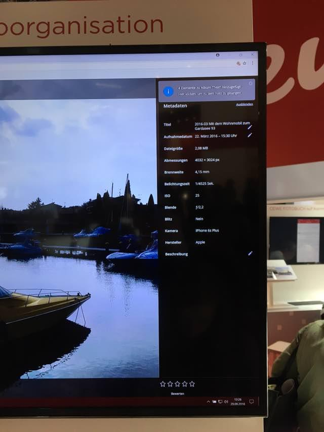
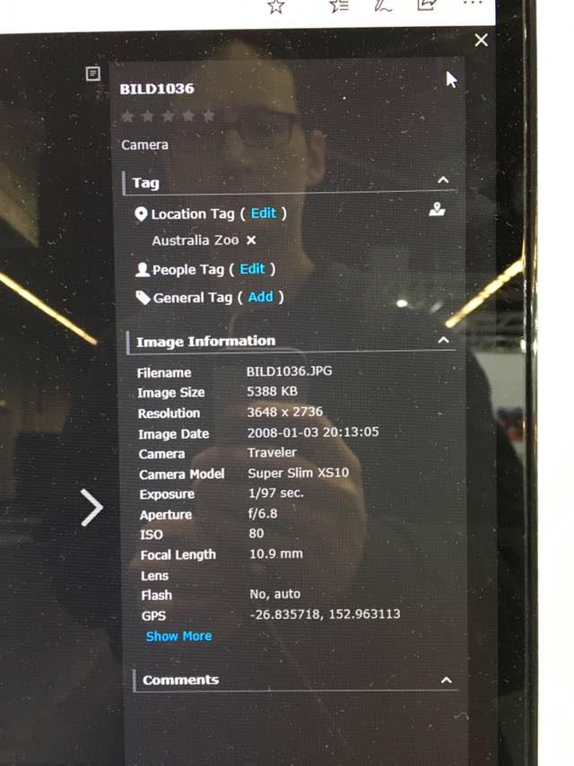

PhotoPrism uses the [dsoprea/go-exif](https://github.com/dsoprea/go-exif) package to natively extract EXIF information from images. Exiftool support can be optionally enabled to support a wider range of metadata formats and extraction from video files.

- see [internal/meta/exif.go](https://github.com/photoprism/photoprism/blob/master/internal/meta/exif.go) for which tags are integrated into PhotoPrism 
- see [official EXIF specification](https://dl.photoprism.app/pdf/20120101-Exif_v2.3.pdf) for more information about EXIF tags

## Using Exiftool

Assuming you have Docker installed and want to run `exiftool` with Debian 12 "Bookworm", you can simply run this command to open a terminal:

```bash
docker run --rm -v ${PWD}:/test -w /test -ti debian:bookworm bash
```

This will mount the current working directory as `/test`. Of course, you can also specify a full path instead of `${PWD}`.

The available Ubuntu, Debian and PhotoPrism images can be found on Docker Hub:

- https://hub.docker.com/_/ubuntu
- https://hub.docker.com/_/debian
- https://hub.docker.com/r/photoprism/photoprism/tags

Now install `exiftool` and any other packages you need, e.g. `libheif-examples` to convert HEIF images to JPEG, via `apt`:

```bash
apt update
apt install -y exiftool libheif-examples
```

To view the image metadata, run `exiftool -n <filename>`:

```
root@1ad9fb887a4f:/test# exiftool -n IMG_8437.HEIC.jpg | grep ation
File Modification Date/Time     : 2022:09:18 08:16:28+00:00
Orientation                     : 6
Exposure Compensation           : 0
root@1ad9fb887a4f:/test# exiftool -n IMG_8437.HEIC | grep ation
File Modification Date/Time     : 2022:09:17 16:57:40+00:00
Orientation                     : 6
Exposure Compensation           : 0
HEVC Configuration Version      : 1
Min Spatial Segmentation IDC    : 0
Rotation                        : 270
```

## Exiftool Parameters

- `-n` displays the raw values without changes
- `-j` will format the output as JSON
- `-g` groups the output by metadata source

## Screenshots ##

This is how other apps show metadata:





