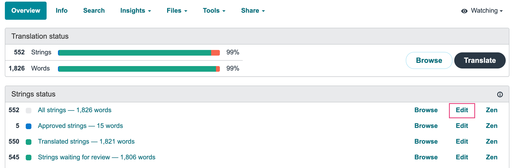

# Translations

PhotoPrism uses [Weblate](https://translate.photoprism.app) for frontend and backend localization.
You can easily register with your github account and edit translations.

=== "Sign up"

    1. Open our [translation page](https://translate.photoprism.app)

    2. Click *Register* and create an account

       

       

=== "Agree to CLA"
    
    1. Sign in 
    2. Select language you want translate to

       
    3. Open your *Dashboard* and click *Backend*

      
    4. Click on *View contributor agreement*

      
    5. Accept the contributor agreement and click *Submit*

      
    6. Go back to your Dashboard and repeat steps 3-5 for the *Frontend*

=== "Add missing translations"
    
    On your Dahsboard you see an overview of how many strings have no translation yet
      

    1. Click on the count
    2. Enter the translation and click *Save and continue*

      
    3. Repeat until all strings are translated
    
      Your translations will be reviewed and included in one of the next releases.

=== "Edit translations"

     If translations are missing, we pre-translate messages using services such as DeepL and Google Translate. This can lead to grammatical errors and misunderstandings. Native speakers should check existing translations and improve them if necessary.

     1. From your Dashboard open one of the components by clicking on the language

       
     2. Click *Edit* for all strings

       
     3. Now you can go trhough all strings and edit the ones that need to be improved

      
    
      Your translations will be reviewed and included in one of the next releases.

=== "Add new language"

    Please contact us at hello@photoprism.app and we will set up a new language for you to translate!
