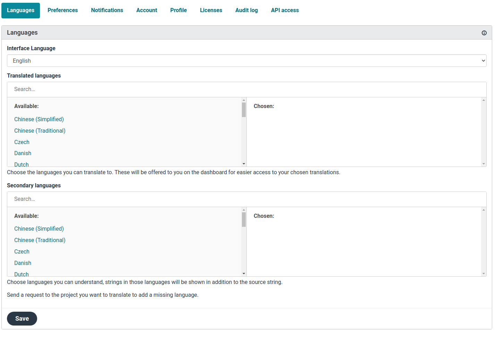
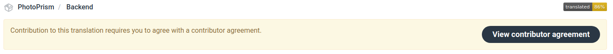
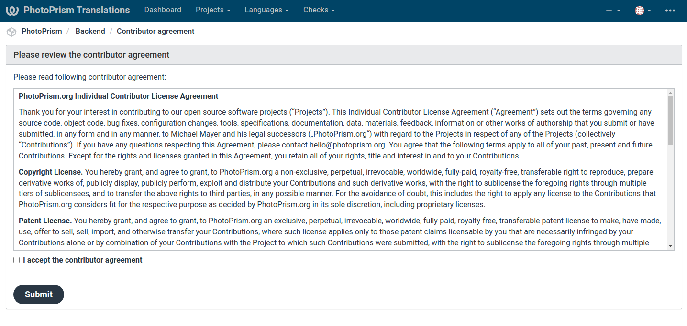
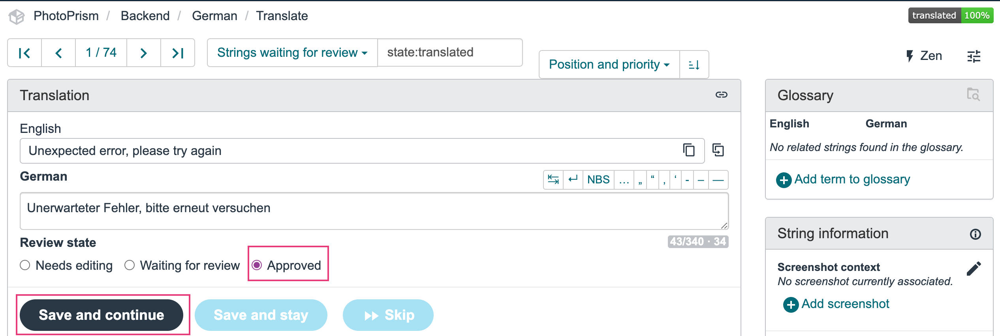

# Contributing Translations with Weblate

We operate [translate.photoprism.app](https://translate.photoprism.app/) so that you can easily add and update user interface translations without having any development skills.

You can either sign in with your GitHub account or create a new account with an email account you have access to:

- Provide an alternate address if you want your personal email to remain private as it may appear as authorship in commits, translation files, and pull requests.
- You are also not required to provide your full name if you do not wish to do so.
- Let us know privately that you have registered so that we can grant you permissions if needed.

When you sign up, you will be asked to accept our Contributor License Agreement (CLA). Visit [photoprism.app/cla](https://photoprism.app/cla) to learn more.

=== "Sign up"

    1. Navigate to <https://translate.photoprism.app/>

    2. Click *Register* and create an account

       

       

=== "Agree to CLA"
    
    1. Sign in 
    2. Select the language you want translate to

       
    3. Open your *Dashboard* and click *Backend* (or access to the Backend by clicking [here](https://translate.photoprism.app/projects/photoprism/backend/))

      
    4. Click on *View contributor agreement*

      
    5. Accept the contributor agreement and click *Submit*

      
    6. Go back to your *Dashboard* and repeat steps 3-5 for the *Frontend-Component*

=== "Add missing translations"
    
    Your *Dashboard* shows you how many strings have no translation yet.

      

    1. Click on the count
    2. Enter the translation and click *Save and continue*

      
    3. Repeat until all strings are translated
    
      Your translations will be reviewed and included in one of the next releases.

=== "Review translations"
    
    If translations are missing, we pre-translate messages using services such as DeepL and Google Translate. 
    This can lead to grammatical errors and misunderstandings. 
    Native speakers should check existing translations and improve them if necessary.

    If you are a native speaker and would like to support us by reviewing existing translations, please write to us at hello@photoprism.app so that we can grant you the rights to review.
    
    1. From your *Dashboard* open one of the components by clicking on the language

     
    2. Click on *Strings waiting for review*

     
    3. Review the translation - edit the string if needed. Then select *Approved* and click *Save and continue*

     
    4.  Repeat until all strings are reviewed
=== "Add new language"

    Please contact us at hello@photoprism.app and we will set up a new language for you to translate!
