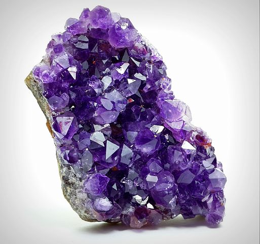

**We strive for a user interface that is clutter-free, well-organized, and doesn't behave in unexpected ways. It should work across a wide range of devices and be easy to use for everyone.**

## Theme Colors

Theme definitions live in [`frontend/src/options/themes.js`](https://github.com/photoprism/photoprism/blob/develop/frontend/src/options/themes.js), with the actual palette tokens mapped to Vuetify in [`frontend/src/css/themes.css`](https://github.com/photoprism/photoprism/blob/develop/frontend/src/css/themes.css) and [`frontend/src/css/root.css`](https://github.com/photoprism/photoprism/blob/develop/frontend/src/css/root.css). When you change default colors, update both the JSON structure (so new installs pick it up) and the CSS variables (so runtime theme switches keep working). Avoid editing Vuetify’s compiled CSS directly — always override via our [`vuetify.css`](https://github.com/photoprism/photoprism/blob/develop/frontend/src/css/vuetify.css) layer.

{ align=right class=w20 }

The colors we use should be consistent and functional, for example, provide sufficient contrast. For the included themes, the preferred primary colors are violet and cyan, but other colors can be used as well.

*To avoid distorting the visual impression of photos and videos, large background areas should generally be neutral or just slightly saturated.*

## Context Menu

The context menu at the bottom right should use a color spectrum for the individual actions to reflect the spectral colors of a prism:

## Icon Fonts

Vuetify is configured to use Material Design Icons (MDI) through [`frontend/src/app.js`](https://github.com/photoprism/photoprism/blob/develop/frontend/src/app.js) and [`frontend/src/options/themes.js`](https://github.com/photoprism/photoprism/blob/develop/frontend/src/options/themes.js). Stick to Google’s Material icon set unless a feature requires a bespoke pictogram; mixing icon packs makes the UI look inconsistent and adds extra font downloads.

- https://fonts.google.com/icons
- https://jossef.github.io/material-design-icons-iconfont/

## Inspirational Quotes

> Design is a funny word. Some people think design means how it looks. But of course, if you dig deeper, it's really how it works. — <cite>Steve Jobs</cite>

> Choice is the enemy of productivity. Put another way, if your solution does everything, and has no opinions about anything, then it solves nothing. — <cite>Asim Aslam</cite>

> Any fool can make something complicated. It takes a genius to make it simple. — <cite>Woody Guthrie</cite>

## External Resources

### Color Schemes

- https://www.nordtheme.com/#palettes-modularity
- [Scheme Color Finder](https://www.schemecolor.com/)
    - https://www.schemecolor.com/?s=colorful
    - https://www.schemecolor.com/?s=google
    - https://www.schemecolor.com/memories-of-the-garden.php
    - https://www.schemecolor.com/double-disclosure.php
    - https://www.schemecolor.com/true-lovers-color-scheme.php
    - https://www.schemecolor.com/sunset-painting.php
    - https://www.schemecolor.com/happy-with-self.php

### Web Color Tools

- [Adobe Color Wheel](https://color.adobe.com/create/color-wheel)
- [Artyclick Color Name Finder](https://colors.artyclick.com/color-name-finder/)
- [Coolors Color Palette Generator](https://coolors.co/?ref=63b6e9f24ca115000a992caa)
- [FFFuel HEX, RGB & HSL Color Picker](https://fffuel.co/cccolor/)
- [iColorpalette](https://icolorpalette.com/color)

### Related Content

- [Screenshots](screenshots.md) - development of our user interface in time lapse ⏱
- [The 7 pillars of design](https://dl.photoprism.app/pdf/slides/20181120-The_7_pillars_of_design.pdf) - slides by Raffaella Isidori (Codemotion Berlin 2018)
