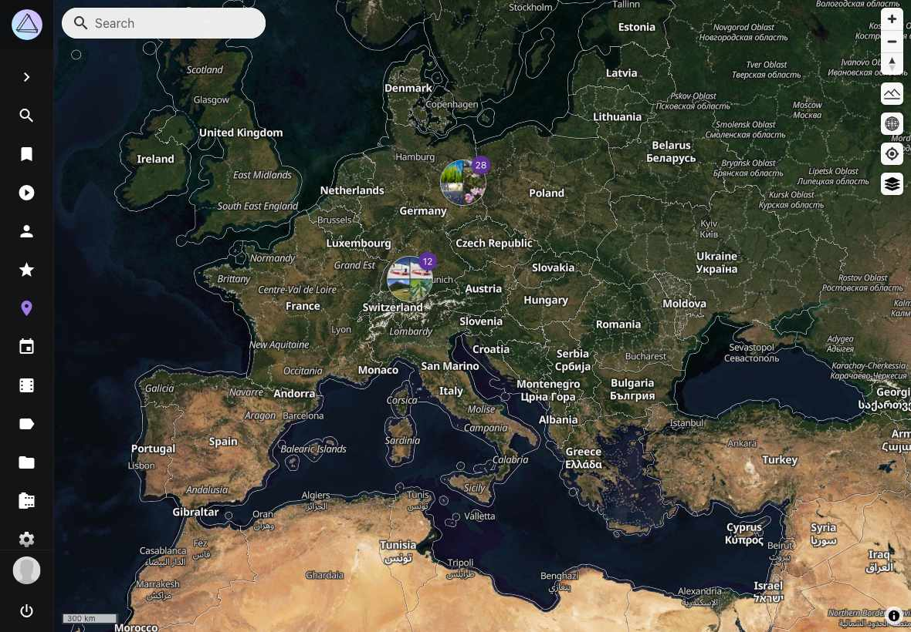

# Rendering Interactive Maps in the UI

PhotoPrism includes several [high-resolution world maps](https://try.photoprism.app/library/places) that allow you to browse photos by location. Visit [try.photoprism.app/library/places](https://try.photoprism.app/library/places) to try them on our demo.

The API keys required to use these maps are unfortunately not free for us due to the number of users we have, see [FAQ](../faq.md). Self-hosted users can configure their own map providers through the environment options documented on the configuration page.

## Rendering Stack

- The main Places page lives in [`frontend/src/page/places.vue`](https://github.com/photoprism/photoprism/blob/develop/frontend/src/page/places.vue). It bootstraps MapLibre GL, loads collections through the `/api/v1/places/*` endpoints, and manages marker clustering.
- General-purpose map widgets (for example, the location preview inside the edit dialog) reuse [`frontend/src/component/map.vue`](https://github.com/photoprism/photoprism/blob/develop/frontend/src/component/map.vue).
- [`frontend/src/common/map.js`](https://github.com/photoprism/photoprism/blob/develop/frontend/src/common/map.js) lazy-loads the MapLibre module from [`frontend/src/common/maplibregl.js`](https://github.com/photoprism/photoprism/blob/develop/frontend/src/common/maplibregl.js) so the bundle stays small until a user opens a map view.
- Custom UI controls, such as the map-style picker, are plain JavaScript classes under [`frontend/src/component/places/`](https://github.com/photoprism/photoprism/tree/develop/frontend/src/component/places) and are registered via the MapLibre control API.
- Styling for Place pages resides in [`frontend/src/css/places.css`](https://github.com/photoprism/photoprism/blob/develop/frontend/src/css/places.css); splash styles for the Places route live in [`frontend/src/css/app.css`](https://github.com/photoprism/photoprism/blob/develop/frontend/src/css/app.css) and [`frontend/src/css/views.css`](https://github.com/photoprism/photoprism/blob/develop/frontend/src/css/views.css).

## Mapbox/MapLibre GL JS ##

Because Mapbox GL JS is [no longer open-source](https://wptavern.com/mapbox-gl-js-is-no-longer-open-source),
we now [sponsor](https://github.com/orgs/photoprism/sponsoring) and use [MapLibre GL JS](https://github.com/maplibre/maplibre-gl-js)
for rendering maps in the UI. MapLibre GL is a fork from the last Mapbox GL version available under a permissive
[BSD license](https://github.com/mapbox/mapbox-gl-js/tree/v1.13.2).

Statement by former Mapbox engineer Tom MacWright:

> OSS, we hoped, was about enabling people and unlocking people’s ability to collaborate. It turns out that in 2020, it’s mostly helping companies and getting nothing in return. That’s not a dynamic you can build a sustainable business on.

## Styles and Configuration

The list of map styles exposed to users is defined in [`frontend/src/options/options.js`](https://github.com/photoprism/photoprism/blob/develop/frontend/src/options/options.js) (`MapsStyle(experimental)`), and the user’s selection is stored under `settings.maps.style`. Only sponsored styles (marked with `sponsor: true`) ship by default; experimental/offline styles are hidden unless the experimental flag is enabled. When you add a new style:

1. Update `MapsStyle()` with the `value`, display `title`, and the MapLibre style identifier (`style`).
2. If the style requires a different API endpoint or token, extend [`frontend/src/common/maplibregl.js`](https://github.com/photoprism/photoprism/blob/develop/frontend/src/common/maplibregl.js) to inject the correct URLs before creating the map instance.
3. Ship any additional CSS overrides in [`frontend/src/css/places.css`](https://github.com/photoprism/photoprism/blob/develop/frontend/src/css/places.css).

The Map settings page ([`frontend/src/page/settings/general.vue`](https://github.com/photoprism/photoprism/blob/develop/frontend/src/page/settings/general.vue)) reads from the same `MapsStyle()` list. Make sure the strings are localized using `$gettext()` so the selection labels get extracted into the `.po` catalogs.

## Sponsors and Tiles

Commercial map tiles that we sponsor (for example MapTiler terrain) remain optional. They are referenced via HTTPS endpoints inside [`frontend/src/common/maplibregl.js`](https://github.com/photoprism/photoprism/blob/develop/frontend/src/common/maplibregl.js). Always keep attribution up to date by editing the strings inserted into `map.addControl(new maplibregl.AttributionControl(...))` and the footer template in [`frontend/src/page/places.vue`](https://github.com/photoprism/photoprism/blob/develop/frontend/src/page/places.vue).

## Tips for Contributors

- Use [MapLibre GL JS 5.x docs](https://maplibre.org/maplibre-gl-js/docs/API/) as the canonical API reference. Be careful when copying Mapbox-specific snippets since some APIs diverged after the fork.
- Map styles can be edited or created with [Maputnik](https://maplibre.org/maputnik/). Store large JSON styles outside the bundle and reference them via CDN URLs instead of embedding them into Vue components.
- The Places page loads maplibre lazily. If you add code that references `maplibregl` globally, ensure it runs after `common/map.js` resolves.
- Keep performance in mind: clustering large marker sets happens on the worker thread, but tooltip/popover rendering is still on the main thread. Debounce expensive hover handlers and remove DOM nodes when a popup closes.
