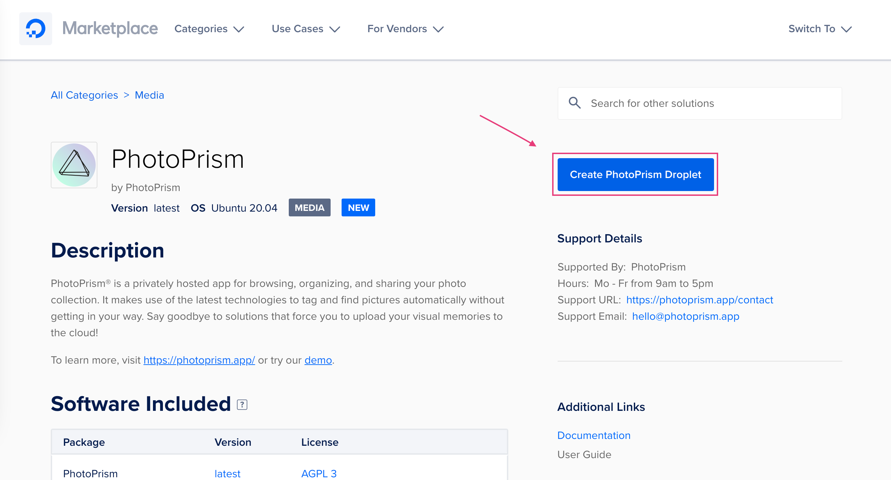
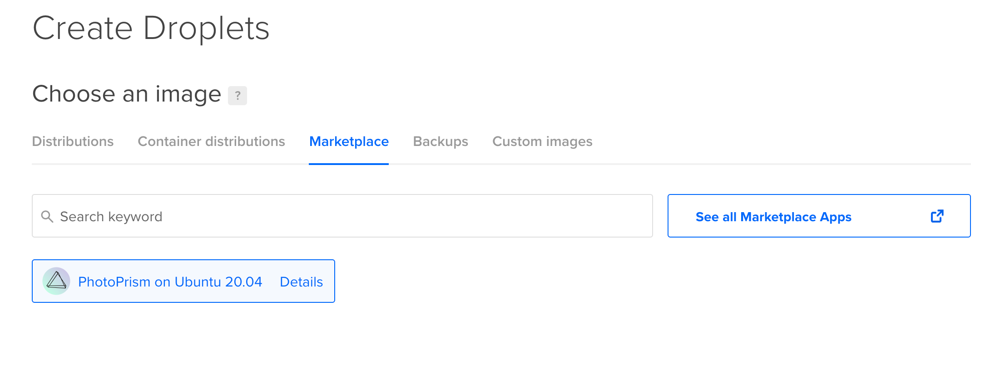
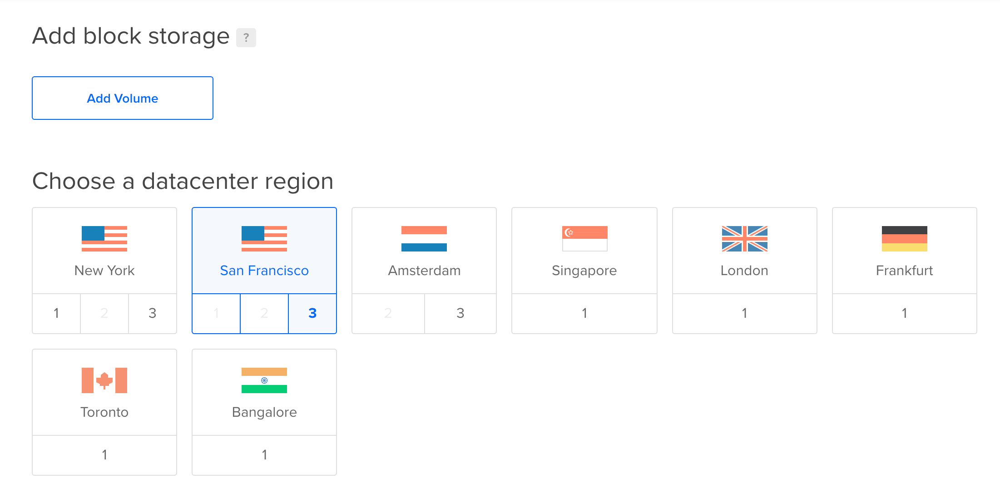
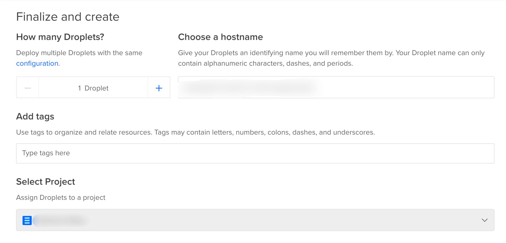

# Using our DigitalOcean 1-Click App #

PhotoPrism can be deployed at DigitalOcean with just a few clicks.
If you have no DigitalOcean account yet, you may use this sign-up link to receive a $100, 60-day account credit:

<p style="text-align: center; padding: 10px 4px 5px 4px;">
<a class="md-button shadow" style="background-color: #0052ff; font-size: 0.66rem; font-weight: normal; color: white" href="https://m.do.co/c/f9725a28bb6b">Sign up at DigitalOcean</a>
</p>

## Install PhotoPrism ##

- [Sign Up](https://m.do.co/c/f9725a28bb6b) or [Log In](https://cloud.digitalocean.com/login) at DigitalOcean
- Open the [PhotoPrism listing](https://marketplace.digitalocean.com/apps/photoprism) in the marketplace
- Click *Create PhotoPrism Droplet*

{ class="shadow indent" }

### Configure Your Droplet ###
#### Choose an Image ####

The PhotoPrism image will be pre-selected

{ class="shadow indent" }

#### Choose a Plan ####

We recommend hosting PhotoPrism on a server with at least 2 cores and 3 GB of physical memory. Indexing and searching can be slow on smaller Droplets, depending on how many and what types of files you upload.

!!! info ""
    While PhotoPrism has been reported to work on Droplets with less memory, we take no responsibility for instability or performance problems. RAW image conversion and TensorFlow are disabled on Droplets with 1 GB or less memory.

{ class="shadow indent" }

#### Choose a Datacenter Region ####

{ class="shadow indent" }

{ class="shadow indent" }

#### Choose an Authentication Mode ####

{ class="shadow indent" }

#### Finalize Your Droplet ####

Finalize your droplet and click *Create Droplet*
{ class="shadow indent" }

{ class="shadow indent" }

Your droplet is now being created.

## Admin Password ##

- Click *More*

{ class="shadow indent" }

- Click *Access console*

{ class="shadow indent" }

- Launch the console as root

{ class="shadow indent" }

- Within the console type ```cat /root/.initial-password.txt``` and click enter
- Copy your initial password

## Open PhotoPrism ##

- Click *Get started*

{ class="shadow indent" }

- Click *Quick access*

{ class="shadow indent" }

!!!info
    In case you have no domain and let's encrypt set up you will see the notice "Your connection is not private". 
    Click *Advanced* and click *Open page*.

- Use username "admin" and your initial password to sign in
- You may [change your password](../../user-guide/settings/account.md) using the Web UI

## Adding Files ##

- Decide whether you want to [index or import your files](../../user-guide/library/index.md)
- [Add files to your import or originals folder via WebDAV](../../user-guide/library/webdav.md), or upload via [Web UI](../../user-guide/library/upload.md)
- Set up [syncing automatically](../../user-guide/sync/mobile-devices.md) from mobile devices

