# Using our DigitalOcean 1-Click App #

PhotoPrism can be deployed at DigitalOcean with just a few clicks.
If you have no DigitalOcean account yet, you may use this sign-up link to receive a $100, 60-day account credit:

<p style="text-align: center; padding: 10px 4px 5px 4px;">
<a class="md-button" style="background-color: #0052ff; font-size: 0.66rem; font-weight: normal; color: white" href="https://m.do.co/c/f9725a28bb6b">Sign up at DigitalOcean</a>
</p>

## Install PhotoPrism ##

- [Sign Up](https://m.do.co/c/f9725a28bb6b) or [Log In](https://cloud.digitalocean.com/login) at DigitalOcean
- Open the [PhotoPrism listing](https://marketplace.digitalocean.com/apps/photoprism) in the marketplace
- Click *Create PhotoPrism Droplet*

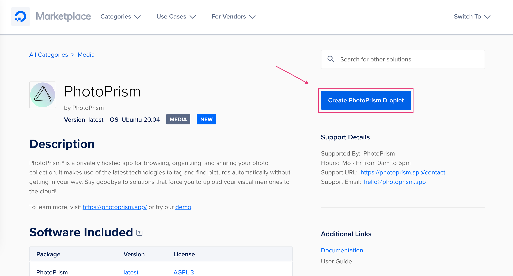{ class="shadow" }

### Configure Your Droplet ###
#### Choose an Image ####

The PhotoPrism image will be pre-selected

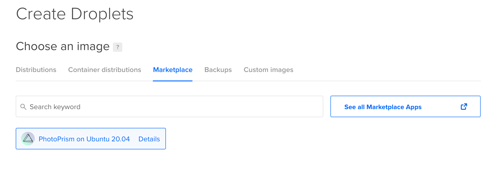{ class="shadow" }

#### Choose a Plan ####

We recommend hosting PhotoPrism on a server with at least 2 cores and 3 GB of physical memory. Indexing and searching can be slow on smaller Droplets, depending on how many and what types of files you upload.

!!! info ""
    While PhotoPrism has been reported to work on Droplets with less memory, we take no responsibility for instability or performance problems. RAW image conversion and TensorFlow are disabled on Droplets with 1 GB or less memory.

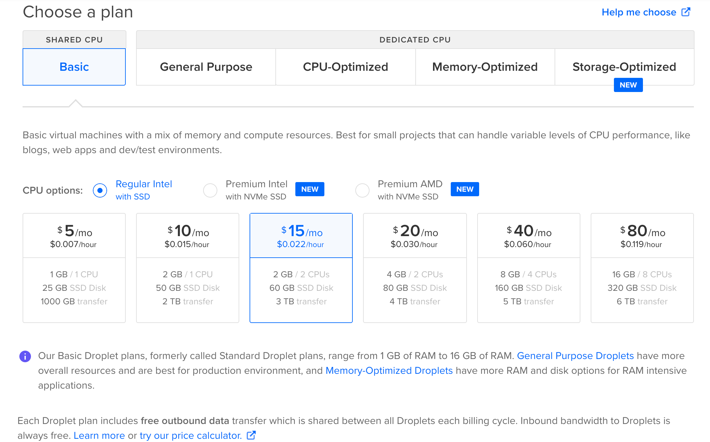{ class="shadow" }

#### Choose a Datacenter Region ####

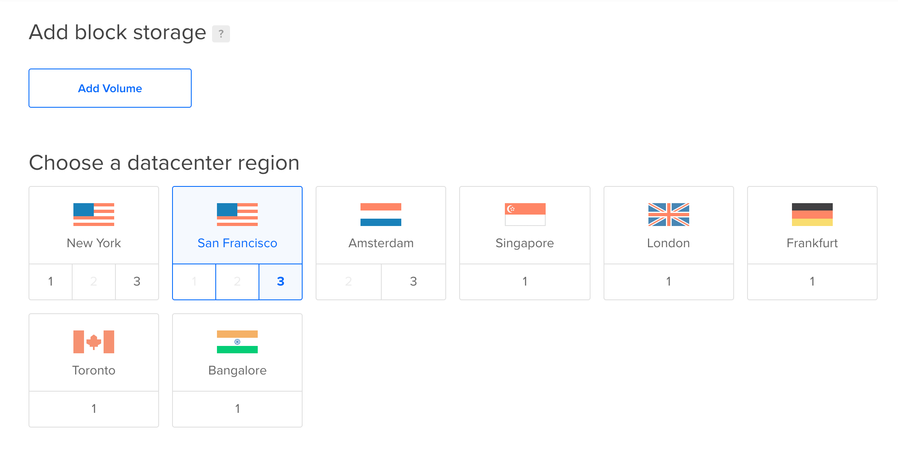{ class="shadow" }

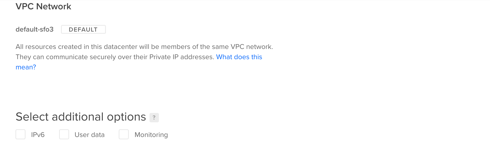{ class="shadow" }

#### Choose an Authentication Mode ####

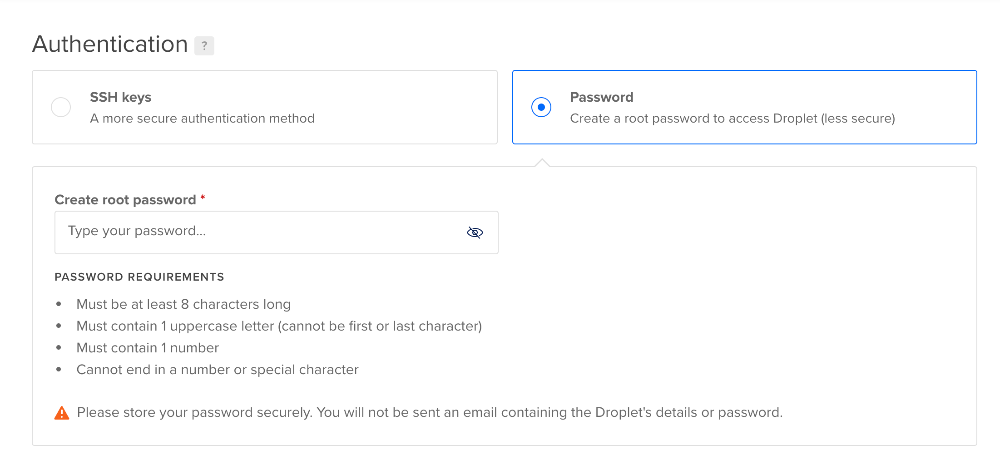{ class="shadow" }

#### Finalize Your Droplet ####

Finalize your droplet and click *Create Droplet*
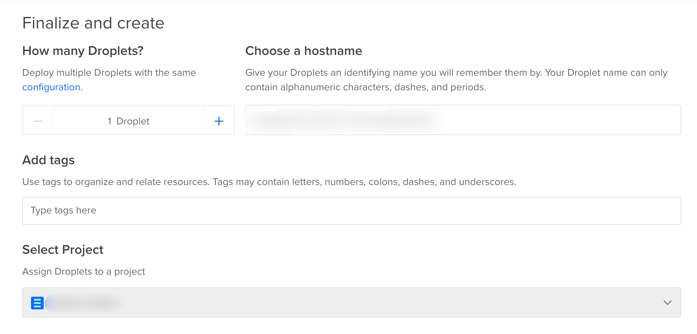{ class="shadow" }

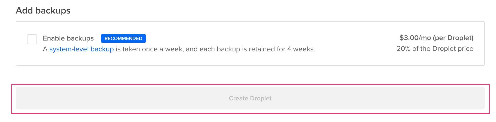{ class="shadow" }

Your droplet is now being created.

## Admin Password ##

- Click *More*

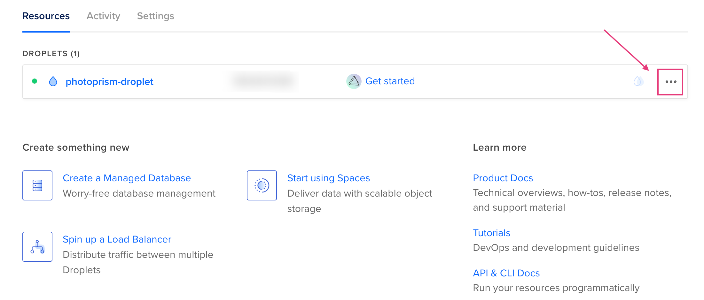{ class="shadow" }

- Click *Access console*

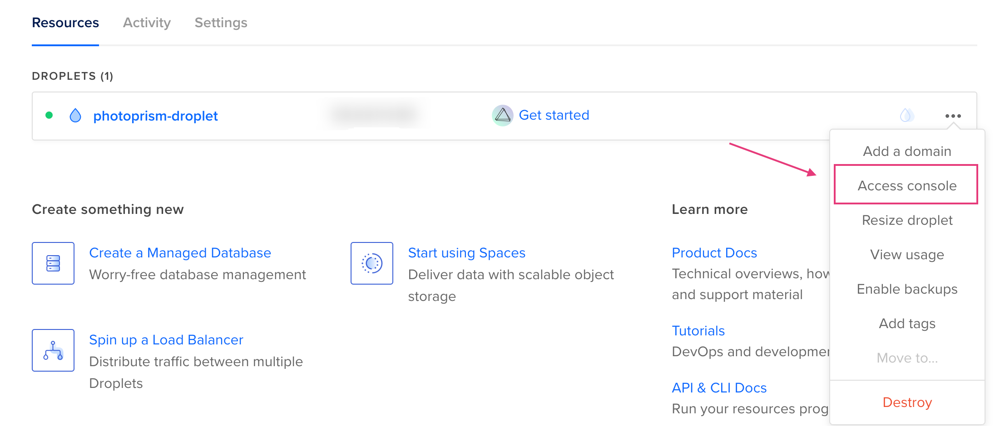{ class="shadow" }

- Launch the console as root

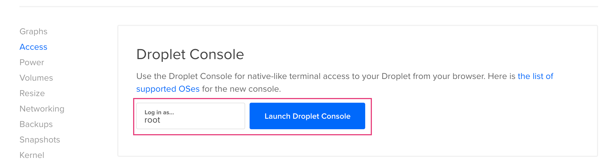{ class="shadow" }

- Within the console type ```cat /root/.initial-password.txt``` and click enter
- Copy your initial password

## Open PhotoPrism ##

- Click *Get started*

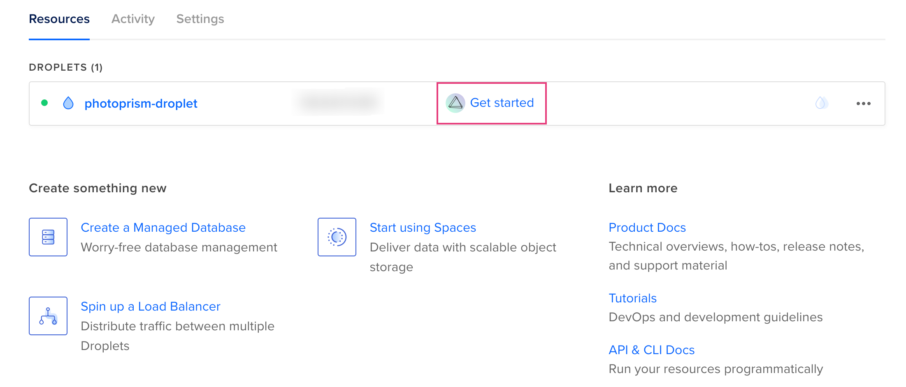{ class="shadow" }

- Click *Quick access*

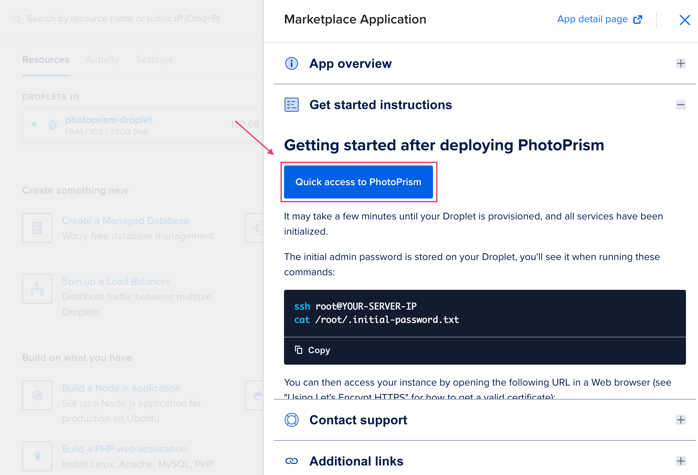{ class="shadow" }

!!!info
    In case you have no domain and let's encrypt set up you will see the notice "Your connection is not private".
    Click *Advanced* and click *Open page*.

- Use username "admin" and your initial password to sign in
- You may [change your password](../../user-guide/settings/account.md) using the Web UI

### First Steps 👣

Once you're logged in, only two more steps remain before you can start [browsing your pictures](../../user-guide/search/index.md):

1. Configure [your content](../../user-guide/settings/library.md) and [advanced settings](../../user-guide/settings/advanced.md) according to your individual preferences.
2. Choose [whether you want](../../user-guide/library/index.md) to [index your originals directly](../../user-guide/library/originals.md), leaving all file and folder names unchanged, or use the [optional import feature](../../user-guide/library/import.md), which automatically removes duplicates, gives files a unique name, and sorts them by year and month.

To add new pictures, you can either copy them to the *originals* or *import* folder, for example [via WebDAV](../../user-guide/sync/webdav.md), or [upload them using a browser](../../user-guide/library/upload.md), which will automatically import them once uploaded.

[Learn more ›](../../user-guide/first-steps.md)

## Traefik Reverse Proxy

[Traefik](https://traefik.io/traefik) is pre-installed as [a reverse proxy](../proxies/traefik.md) and can be configured in your `/opt/photoprism/compose.yaml` file, as well as through the config files located in `/opt/photoprism/traefik`.

[Learn more ›](../proxies/traefik.md)

### Getting Updates

Make sure to use the [latest version tag](https://hub.docker.com/_/traefik) for Traefik in your `compose.yaml` file, e.g.:

```yaml
services:
  traefik:
    image: traefik:v3.7
```

Then run the following command to pull the latest image and restart the service:

```bash
sudo docker compose up -d --pull always
```

This ensures you receive the latest security updates and prevents [errors when upgrading Docker](https://github.com/photoprism/photoprism/discussions/5314) to the latest version.

[Learn more ›](../updates.md)

### Certificate Warnings

Web browsers do not recognize the default TLS certificate as valid, so a warning will appear when connecting over HTTPS.

To avoid this issue, use a valid certificate e.g. obtained for free via Let's Encrypt.

[Learn more ›](../using-https.md)

!!! danger ""
    If you install PhotoPrism on a public server outside your home network, **always run it behind a secure HTTPS reverse proxy**. Your files and passwords will otherwise be transmitted in clear text and can be intercepted by anyone, including your provider, hackers, and governments. Backup tools and file sync apps may refuse to connect as well.
