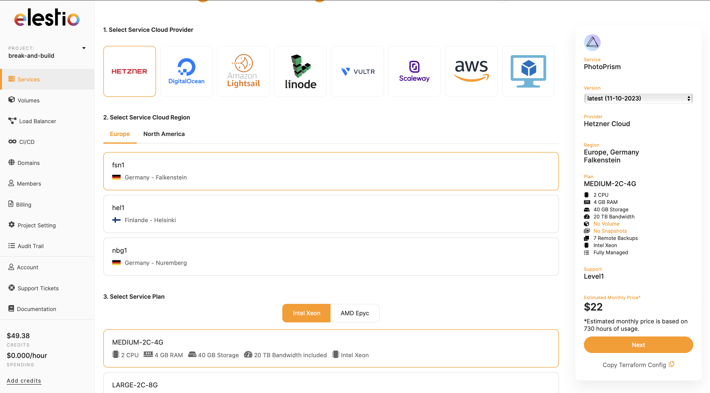
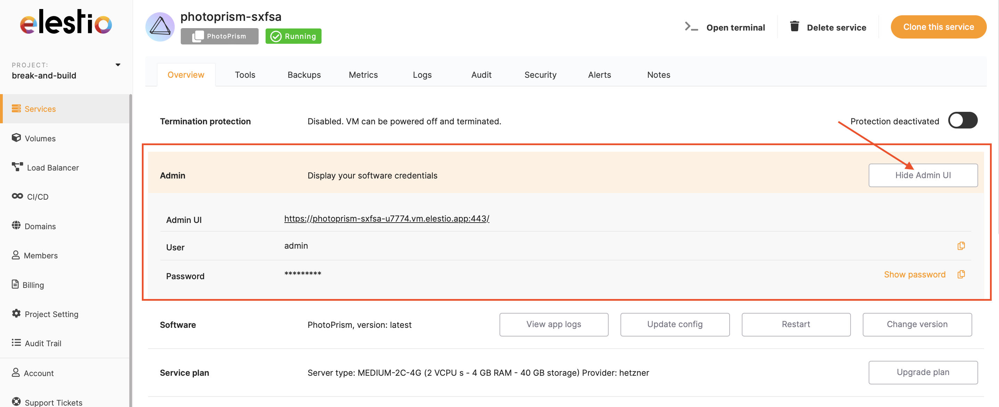
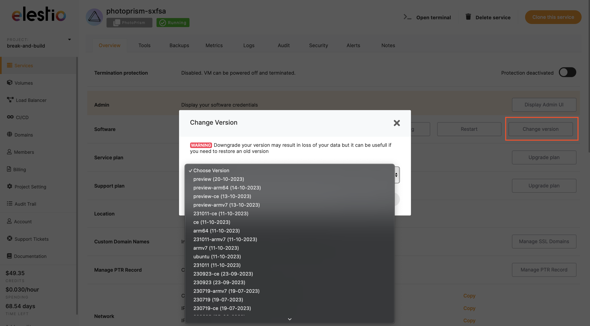

# Elestio

Welcome to Elestio! Follow these easy steps to deploy your Photoprism instance.

## Step 1: Deploy Photoprism

Click the "Deploy" button below to set up Photoprism on Elestio.

## Step 2: Choose Settings

1. **Cloud Provider:** Pick your preferred cloud service.
2. **Region:** Choose a region.
3. **Service Plan:** Select resources based on your needs.
4. **Confirm:** Click "Next" after confirming your choices.

## Step 3: Configure

1. **Support Level:** Choose your support level.
2. **Application Name:** Give your application a name.
3. **Admin Email:** Add an admin email.
4. **Create Service:** Click to set up the service.
5. **Optional:** Copy Terraform config for future use.

## Step 4: Use Photoprism

1. **Admin UI Access:** Click "Display Admin UI" to access it.
2. **Credentials:** Use the provided username and password.

## Step 5: Keep it Updated

1. **Overview Section:** Go to the Overview section.
2. **Change Version:** Click "Change version" in the Software section.
3. **Select Version:** Choose the latest or your preferred version.
4. **Optional:** Update configurations or restart with a click.

Congratulations! Your Photoprism instance on Elestio is ready to use. Explore its features and update as needed.