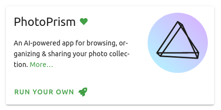

# **PikaPods** Open Source App Hosting

!!! verified "Trusted Partner"
    PhotoPrism has partnered [with PikaPods](https://prism.ws/pikapods-com) to offer you this **officially supported, cloud-hosted solution**. Your personal app instance is ready to use in just a few steps and [includes sponsor features](https://photoprism.app/membership) like interactive world maps and dark themes - at no additional cost! New customers also currently receive a **$5 welcome credit**.

## Setting Up Your Pod

This step-by-step guide explains how to set up a new PhotoPrism instance at PikaPods.

### 1. Create Account

Sign up at [www.pikapods.com/register](https://prism.ws/pikapods-register) with your contact details.
You will then receive a confirmation email with an activation link that you must click to continue.

Before proceeding, please also provide your credit card details to avoid usage restrictions.

### 2. Start PhotoPrism

- Go to [Available Apps](https://prism.ws/pikapods-apps) and select PhotoPrism 
- Click *Run Your Own*

- Enter a Pod Name and select a Region

{ class="shadow" }

- Specify the initial Password for the "admin" user account

{ class="shadow" }

- Configure the file storage space available to you and the computing resources that PhotoPrism can use, e.g. for indexing and face recognition

!!! info "Minimum Requirements"
    PhotoPrism currently requires **at least 2 CPUs and 8 GB of memory**. We are working to lower these requirements in the future.

- The approximate monthly pricing is displayed at the bottom of the page
- Click *Add Pod*

{ class="shadow" }

### 3. Sign In

PhotoPrism is now fully set up and ready to use. To log in, click *Open Pod*, enter the username "admin" and the password you have specified:

## Next Steps

1. [Choose](../../user-guide/library/index.md) whether you want to [index your originals](../../user-guide/library/originals.md) so that the existing file and folder names are preserved, or [import them](../../user-guide/library/import.md) so that they are automatically organized by year and month.
2. To add pictures, you can either copy them to the *import* or *originals* folder [using WebDAV](../../user-guide/sync/webdav.md), or [upload them with a browser](../../user-guide/library/upload.md), which will import them automatically after upload.
3. Finally, set up [automatic syncing](../../user-guide/sync/mobile-devices.md) from your mobile phone and install the [Progressive Web App (PWA)](../../user-guide/pwa.md) on your desktop, tablet, and phone home screens as needed.
