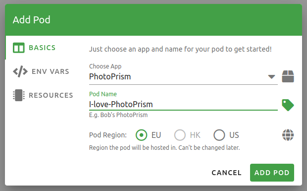
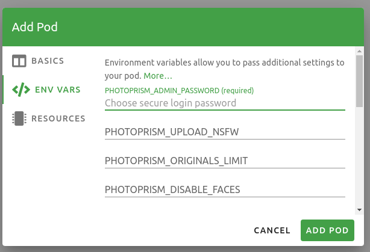
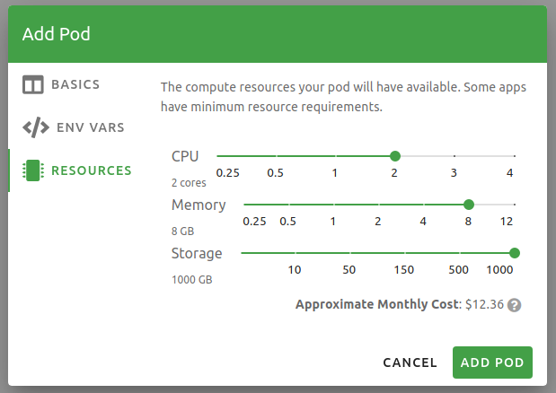

# PikaPods Open Source App Hosting

!!! check "Official Partner"
    PhotoPrism has partnered with [PikaPods](https://www.pikapods.com/) to offer the first official app hosting solution! This cloud version is pre-configured, requires virtually no technical knowledge to set up, and includes [sponsor features](https://photoprism.app/membership) like interactive world maps and dark themes - at no additional cost.

## Cloud Setup

The following step-by-step guide explains how to set up new PhotoPrism cloud instance at PikaPods:

### 1. Create a Customer Account

Sign up at [www.pikapods.com/register](https://www.pikapods.com/register) with your contact and payment details.

### 2. Deploy a New PhotoPrism Instance

- Go to [Available Apps](https://www.pikapods.com/apps) and select PhotoPrism 
- Click *Run your own*

- Enter a Pod Name and choose a Region

- Enter a secure admin password

- Configure the resources you need
  

!!! info "Minimum Requirements"
    PhotoPrism requires at least 2CPUs and 8GB memory. Those minimum requirements might be reduced in future versions.

- The approximate monthly pricing is displayed at the bottom of the page
- Click *Add Pod*

### 3. Enjoy

PhotoPrism is now fully set up and ready to use. To log in, click *Open Pod*, enter the username "admin" and the password you have specified.

## First Steps

1. Choose whether you want to [index your files](../../user-guide/library/index.md) so that the original file and folder names are preserved, or import them so that they are automatically sorted by year and month.
2. To add files, you can either copy them to your *Import* or *Originals* folder via [WebDAV](../../user-guide/sync/webdav.md), or [upload them using the Web UI](../../user-guide/library/upload.md) which will import them automatically after the upload is complete.
3. Finally, set up [automatic syncing](../../user-guide/sync/mobile-devices.md) from your phone and install the [Progressive Web App (PWA)](../../user-guide/pwa.md) on your desktop, tablet, and phone home screens as needed.
