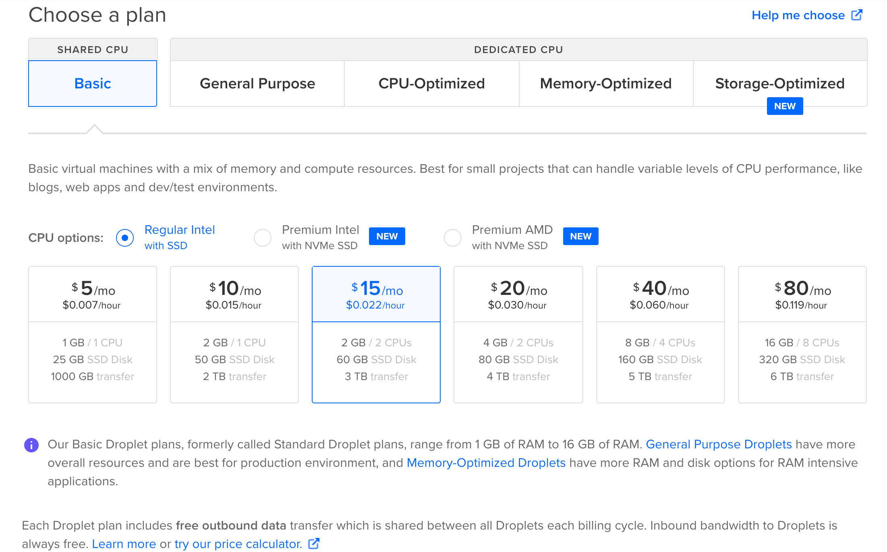
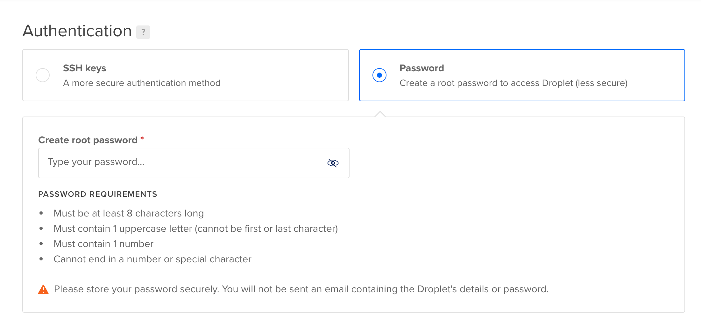
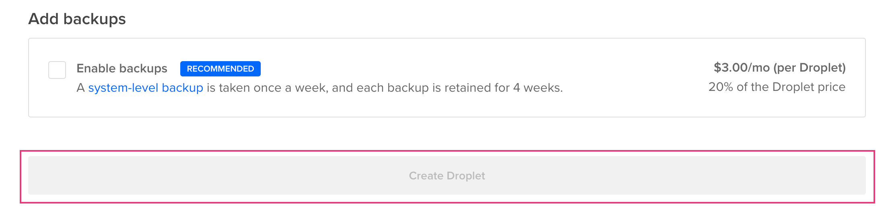
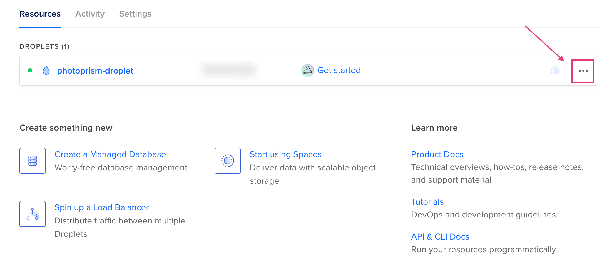
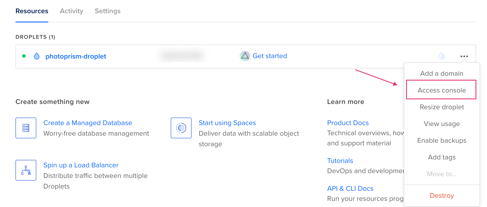
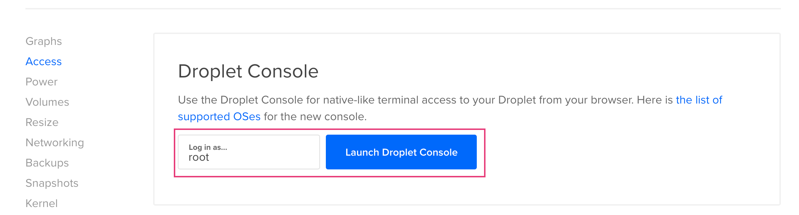
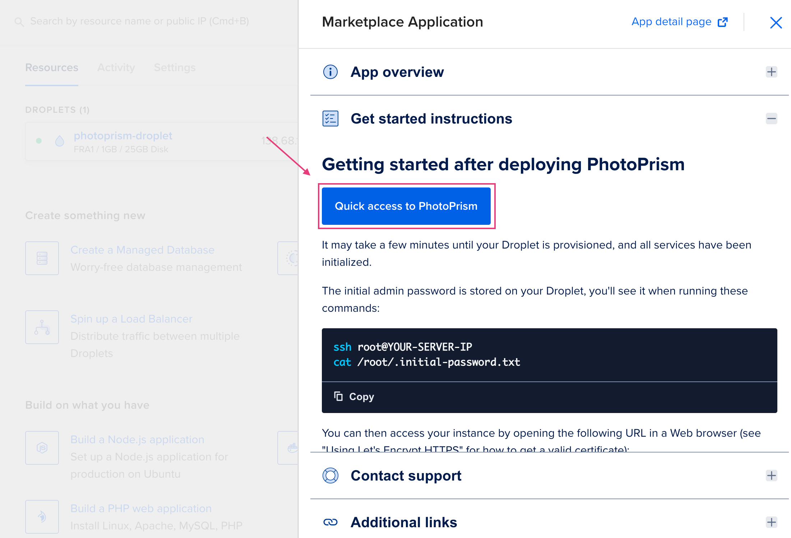

# Using our DigitalOcean 1-Click App #

PhotoPrism can be deployed at DigitalOcean with just a few clicks.
If you have no DigitalOcean account yet, you may use this sign-up link to receive a $100, 60-day account credit:

<p style="text-align: center; padding: 10px 4px 5px 4px;">
<a class="md-button" style="background-color: #0052ff; font-size: 0.66rem; font-weight: normal; color: white" href="https://m.do.co/c/ca260247b5c2">Sign up at DigitalOcean</a>
</p>

## Install PhotoPrism ##

- [Sign Up](https://m.do.co/c/ca260247b5c2) or [Log In](https://cloud.digitalocean.com/login) at DigitalOcean
- Open the [PhotoPrism listing](https://marketplace.digitalocean.com/apps/photoprism) in the marketplace
- Click *Create PhotoPrism Droplet*


### Configure Your Droplet ###
#### Choose an image ####

The PhotoPrism image will be pre-selected


#### Choose a plan ####

We recommend hosting PhotoPrism on a server with at least 2 cores and 4 GB of memory. 
Indexing and searching may be slow on smaller Droplets, depending on how many and what types of files you upload.



#### Choose a datacenter region ####


#### Choose an authentication mode ####



#### Finalize your droplet ####

Finalize your droplet and click *Create Droplet*




Your droplet is now being created.

## Admin Password ##

- Click *More*



- Click *Access console*



- Launch the console as root



- Within the console type ```cat /root/.initial-password.txt``` and click enter
- Copy your initial password

## Open PhotoPrism ##

- Click *Get started*


- Click *Quick access*



!!!info
    In case you have no domain and let's encrypt set up you will see the notice "Your connection is not private". 
    Click *Advanced* and click *Open page*.

- Use username "admin" and your initial password to sign in
- You may [change your password](../user-guide/settings/account.md) using the Web UI

## Adding Files ##

- Decide whether you want to [index or import your files](../user-guide/library/index.md)
- [Add files to your import or originals folder via WebDAV](../user-guide/library/webdav.md), or upload via [Web UI](../user-guide/library/upload.md)
- Set up [syncing automatically](../user-guide/sync/mobile-devices.md) from mobile devices

