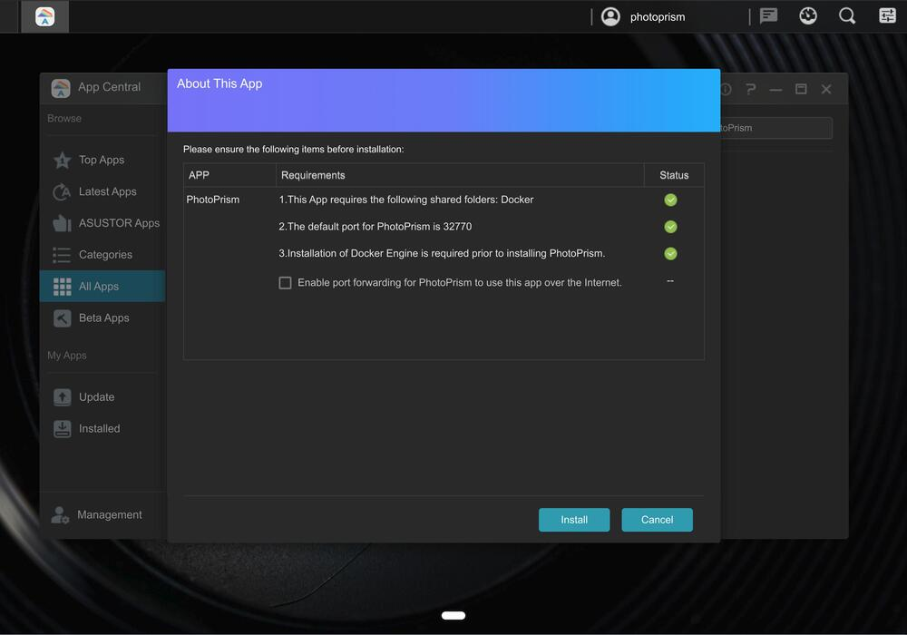
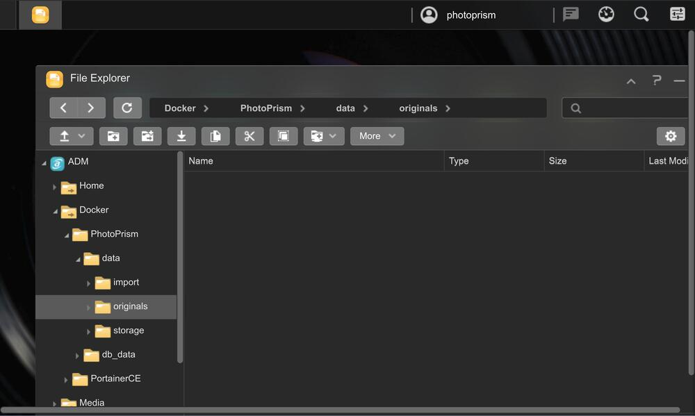

# Running PhotoPrism on an Asustor NAS

Before setting up PhotoPrism, we recommend that you visit the [Asustor product database](https://www.asustor.com/en/product/product_list) to learn about the CPU and memory of your NAS device.

For a good user experience, a 64-bit system with [at least 2 cores and 3 GB of physical memory](../index.md#system-requirements) is recommended. Note that RAW image conversion and TensorFlow are disabled on devices with 1 GB or less memory, and that high-resolution panoramic images may require additional swap space and/or physical memory above the recommended minimum.

## Setup

This step-by-step guide explains how to set up a new PhotoPrism instance through App Central, the built-in app store.

### Step 1: Open App Central

Log in to the user interface of your NAS. You can do this by navigating to *https://asustor:7001* if you replace *asustor* with the actual IP address or hostname of your device and change the port depending on your configuration.

Now open "App Central" on the home screen:

{ class="shadow" }

### Step 2: Install PhotoPrism

Type *PhotoPrism* in the search box in the upper right corner and press Enter to start the search. PhotoPrism should then be displayed so you can click "Install" to start the installation:

{ class="shadow" }

Next, you will be informed about dependencies like Docker that need to be installed, and you can decide if you want your instance to be accessible from the Internet (if you have set this up for your NAS and your Internet router is compatible):

{ class="shadow" }

If you want to [uninstall PhotoPrism](img/asustor/asustor-step-3.jpg) later, you can also do that in App Central.

### Step 3: Open PhotoPrism

Once the installation is complete, you will find PhotoPrism on your home screen, where you can open it in a new tab with one click:

{ class="shadow" }

You can also navigate to port 32770 on your device if you want to open PhotoPrism directly.
When you see the login screen, enter the username "admin" and password "admin321" to sign in:

{ class="shadow" }

Remember to change your password after the first login. You can do this in [Settings > Account](../../user-guide/settings/account.md#change-password).

### Step 4: Add Your Files

Our [First Steps 👣](../../user-guide/first-steps.md) tutorial guides you through the user interface and settings to ensure your library is indexed according to your individual preferences.

Depending on which strategy you choose, you can add your media files to the *originals* or *import* folder located in */volume1/Docker/PhotoPrism/data*:

{ class="shadow" }

The *storage* folder, which contains configuration, cache and sidecar files, can also be found there.

!!! tldr ""
    Note that the folders that PhotoPrism uses cannot be dynamically configured at the moment when using this app store version. However, we are working to make this possible.
