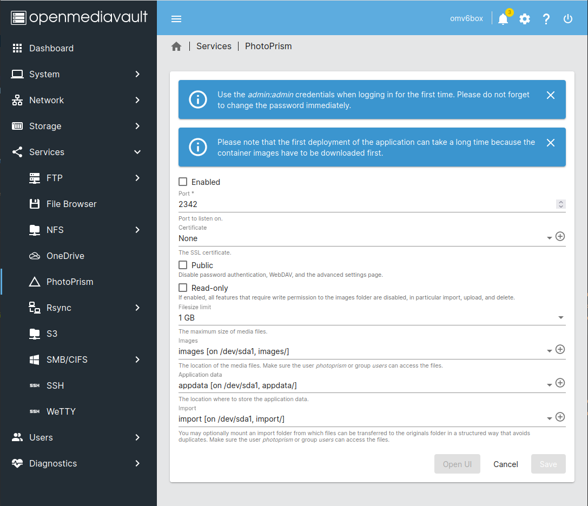

# Running PhotoPrism on openmediavault

!!! quote ""
    Help improve these docs! You can contribute by clicking :material-pencil: to send a pull request with your changes.

!!! info "Getting Support"
    Should you experience problems with the installation, we recommend that you ask the [openmediavault community](https://forum.openmediavault.org/) for advice, as we cannot provide support for third-party software.

PhotoPrism can be conveniently installed using the openmediavault [plugin](https://www.openmediavault.org/?p=3146).

{ class="shadow" }
