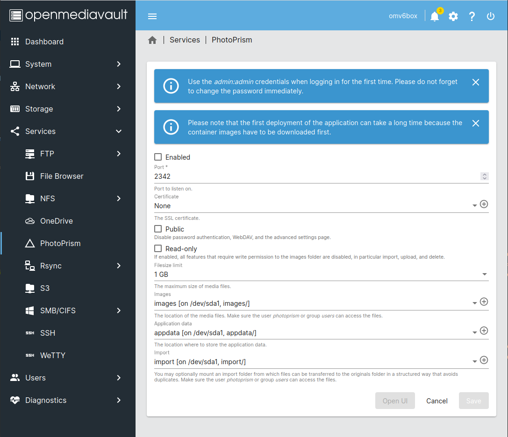

# Running PhotoPrism on OpenMediaVault

!!! tldr ""
    Should you experience problems with the installation, we recommend that you ask the [OpenMediaVault community](https://forum.openmediavault.org/) for advice, as we cannot provide support for third-party software and services. Also note that third-party integrations may not provide direct access to config files or the command line, so you might not be able to use all features and config options.

PhotoPrism can be conveniently installed using the OpenMediaVault [plugin](https://www.openmediavault.org/?p=3146).

{ class="shadow" }

## Getting Updates

To upgrade your instance, first connect to the server running OpenMediaVault via SSH or open a terminal from the web interface. Then stop the PhotoPrism service, download the newest image from [Docker Hub](https://hub.docker.com/r/photoprism/photoprism/tags) and start the service again:

```bash
sudo systemctl stop pod-photoprism.service
sudo podman pull docker.io/photoprism/photoprism:latest
sudo systemctl start pod-photoprism.service
```

## Opening a Terminal

OpenMediaVault runs PhotoPrism as a containerized service with Podman, which means you can use the [`podman` command](../troubleshooting/docker.md#podman-compose) to open a terminal session.

To do this, first connect to the server running OpenMediaVault via SSH or open a terminal from the web interface and then check if PhotoPrism is running (and if so, under what name):

```bash
sudo podman ps
```

In the output, you should see PhotoPrism running under a name like `photoprism-app`, which you can then use to open a terminal session:

```bash
sudo podman exec -ti photoprism-app /bin/bash
```

You should now be able to run terminal commands, such as those for [managing users](../../user-guide/users/cli.md). Running `photoprism help` will list all commands and [config options](../config-options.md) available in the current version:

```bash
photoprism help
```

Use the `--help` flag to see a detailed command description, for example:

```bash
photoprism backup --help
```

## Troubleshooting ##

If your device runs out of memory or other system resources:

- [ ] Try [reducing the number of workers](../config-options.md#indexing) by setting `PHOTOPRISM_WORKERS` to a reasonably small value in your `compose.yaml` file, depending on the performance of your device
- [ ] Make sure [your device has at least 4 GB of swap space](../troubleshooting/docker.md#adding-swap) so that indexing doesn't cause restarts when memory usage spikes; RAW image conversion and video transcoding are especially demanding
- [ ] If you are using SQLite, switch to MariaDB, which is [better optimized for high concurrency](../faq.md#should-i-use-sqlite-mariadb-or-mysql)
- [ ] As a last measure, you can [disable image classification and facial recognition](../config-options.md#feature-flags)

Other issues? Our [troubleshooting checklists](../troubleshooting/index.md) help you quickly diagnose and resolve them.

!!! example ""
    **Help improve these docs!** You can contribute by clicking :material-file-edit-outline: to send a pull request with your changes.
