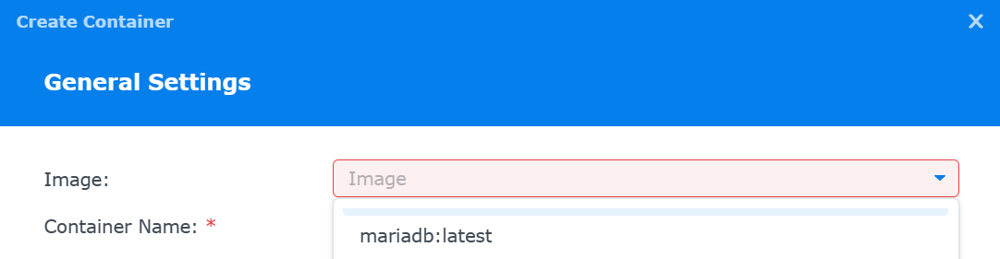

# Running PhotoPrism on a Synology NAS

Before setting up PhotoPrism on your NAS, we recommend that you check the [Synology Knowledge Base](https://kb.synology.com/en-us/DSM/tutorial/What_kind_of_CPU_does_my_NAS_have) for the CPU and memory configuration of your device.

For a good user experience, it should be a 64-bit system with [at least 2 cores and 3 GB of RAM](../index.md#system-requirements). Indexing large photo and video collections also benefits greatly from [using SSD storage](../troubleshooting/performance.md#storage), especially for the database and cache files.

!!! tldr ""
    Should you experience problems with the installation, we recommend that you ask the Synology community for advice, as we cannot provide support for third-party software and services.
    Also note that [RAW image conversion and TensorFlow are disabled](../../user-guide/settings/advanced.md) on devices with 1 GB or less memory, and that high-resolution panoramic images may require [additional swap space](../troubleshooting/docker.md#adding-swap) and/or physical memory above the recommended minimum.

### Will my device be fast enough?

This largely depends on your expectations and the number of files you have. Most users report that PhotoPrism runs
well on their Synology NAS. However, you should keep in mind:

- initial indexing may take longer than on standard desktop computers
- the hardware has no video transcoding support and software transcoding is generally slow

## Troubleshooting ##

If your device runs out of memory, the index is frequently locked, or other system resources are running low:

- [ ] Try [reducing the number of workers](../config-options.md#index-workers) by setting `PHOTOPRISM_WORKERS` to a reasonably small value in `docker-compose.yml`, depending on the performance of your device
- [ ] Make sure [your device has at least 4 GB of swap space](../troubleshooting/docker.md#adding-swap) so that indexing doesn't cause restarts when memory usage spikes; RAW image conversion and video transcoding are especially demanding
- [ ] If you are using SQLite, switch to MariaDB, which is [better optimized for high concurrency](../faq.md#should-i-use-sqlite-mariadb-or-mysql)
- [ ] As a last measure, you can [disable the use of TensorFlow](../config-options.md#feature-flags) for image classification and facial recognition

Other issues? Our [troubleshooting checklists](../troubleshooting/index.md) help you quickly diagnose and solve them.

<!--
## Setup using Docker & SQLite ##

!!! note ""
    [SQLite is not a good choice](../troubleshooting/sqlite.md) for users who require scalability and high performance. We therefore do not recommend following this contributed guide without changing the configuration to connect your instance to a MariaDB database.

!!! example ""
    A setup guide for Synology with [Docker and MariaDB](#setup-using-docker-and-mariadb) can be found below.

    
This guide describes how to set up PhotoPrism using the new Synology user interface.

### Prerequisites
- Docker is installed
- folders config and photos are created:

  { class="shadow" }

- for testing purposes, add some pictures to your photos folder
- later, if you're ok with your setup, you can link your pictures to the photos folder

### Get the image
- Launch Docker
- Search for photoprism/photoprism in the Registry
- Download and choose your flavor
- Wait until you get the message your image is downloaded. It is big, so this can take a while

### Set PhotoPrism up
- double-click the image you just downloaded
- Network: choose your network - next
- give your container a name and click on Advanced Settings

  { class="shadow" }

- Add Variable PHOTOPRISM_ADMIN_PASSWORD with your password

  { class="shadow" }

- enter values for PHOTPRISM_SITE_DESCRIPTION and PHOTOPRISM_SITE_AUTOR
- PHOTOPRISM_DATABASE_SERVER and PHOTOPRISM_DATABASE_PASSWORD are used for mariadb. It is recommended to use mariadb but not part of this guide
- Save

  { class="shadow" }

- Next
- enter the local port you want to use to connect to PhotoPrism

  { class="shadow" }

- in the Volume Settings we're adding the two folders (see prerequisites)
- choose config, add /photoprism/storage as Mount path
- choose photos, add /photoprism/originals as Mount path

  { class="shadow" }
  { class="shadow" }
  { class="shadow" }

- Done
- Run the container and give it some minutes to create
- connect to your instance of Photoprism with your browser ip-to-your-nas:port and login

### First Steps

Our [First Steps 👣](../../user-guide/first-steps.md) tutorial guides you through the user interface and settings to ensure your library is indexed according to your individual preferences.
-->

## Setup using Docker and MariaDB

### Prerequisites
- Docker is installed (called 'Container Manager' to Synology.)
- Create some folders for Photoprism to store configuration data and photos.
  
  { class="shadow" }

- For testing purposes, add some pictures to your photos folder.
- Later, if you're okay with your setup, you can link your pictures to the photos folder.

### Preparing MariaDB
- Launch `Container Manager` to access Docker
- In the Registry tab, search for MariaDB
  
   { class="shadow" }
- Download and choose the flavor. (You may also skip ahead and grab `phpmyadmin` and `photoprism` while you're here or come back later.)
  
   { class="shadow" }
- Wait until you get the message your image is downloaded.
- Switch to the `Container` tab and click `Create`
  
   { class="shadow" }
- Choose the `mariadb:latest` (or whatever tag you chose as your image) then continue
  
   { class="shadow" }
- It is not necessary to add an external port mapping here in the `Port Settings` section as you can have your other container talk "internally" to this one, but you may want to expose a port so you can get at it from other services or administration tools later.
  
  { class="shadow" }
- By default, when you scroll down, this will probably be attached to the `bridge` network with an IP address range of `172.17.0.0/16` or something similar. That's OK as long as you also attach the future Photoprism container to the same one.
  
  { class="shadow" }
- In the `Environment` section, click the `+ Add` button to add a new variable. Add `MYSQL_ROOT_PASSWORD` as the key and set the value to something secret. You can manipulate this later to eliminate or change this password, but you'll need it for now to get in there and make users.
  
  
- Then proceed through the wizard to create and start the container.

  { class="shadow" }
- You can double click on the new container in the list to see its status including its IP address which you may need if you did not add an external port mapping.

  { class="shadow" }
- You may also switch to the `Log` tab to see what the container printed out as it started up to validate that everything is okay. Note that this screenshot shows `mariadbd: ready for connections.` at the top suggesting that we're good to go.

  

### Preparing phpMyAdmin
- Grab `phpmyadmin`. Follow the first few steps of [Preparing MariaDB](#preparing-mariadb) to get to the registry and download `phpmyadmin` if you didn't already do so. Then hop back here.
- Back on the `Container` tab, click `Create`.
- Choose `phpmyadmin:latest` (or whichever tag you chose) then proceed.

  { class="shadow" }
- This time for sure, you need to add an external port in the `Local Port` field.

  { class="shadow" }
- I chose `3080` because it's very common for assorted web services to use `80`, `8080`, `8888`, `433` or some other similar variant. So I tried something vaguely memorable with the `80` in it but less likely to conflict. It can be any port you're not already using, but do remember that the Synology host OS is running on `5000` and `5001` for its web access and may also be using some of the other `8`s above for other services or proxies you're running.

  { class="shadow" }
- In the `Environment` section, click the `+ Add` button to add a new variable. Add `PMA_HOST` as the key and set the value to either the host name you gave the `mariadb` container when you created it (which defaults to `mariadb-1` unless you chose something else) **OR** enter the IP address of the `mariadb` container which you found when opening its details page (e.g. mine was `172.17.0.11`).
- Scroll to the bottom and establish a `Link` to the `mariadb` container by clicking `+ Add` and choosing the name you gave the `mariadb` container from the dropdown. This should make the new `phpmyadmin` container dependent on the `mariadb` container and relatively automatically tell each other about their networks/IP addresses.
- Also confirm while you're down here that the `Network` is the same as the `mariadb` container. Mine's on `bridge`.
- Finish the wizard and run the container.
- Open a new browser tab and navigate to `http://<synology-ip-or-domain-name>:<port-you-chose-above>` (e.g. `http://192.168.1.17:3080`). You should see the `phpMyAdmin` home page.

  { class="shadow" }
- Try logging in with the username `root` and whatever you set `MYSQL_ROOT_PASSWORD` to in the [Preparing MariaDB](#preparing-mariadb) section. When you succeed, it should look like this:

  { class="shadow" }

### Creating a SQL user for Photoprism
- From inside the phpMyAdmin panel, choose `User accounts` at the top, then click `Add user account`.

  { class="shadow" }
- Pick a user name and password combination that you will teach to the future `photoprism` container to be able to talk to the `mariadb` container. If you don't want to come up with a secure password, click `Generate password` and it will create a good one for you and fill the password fields.
- Before you go on, be sure you check the `Create database with the same name and grant all privileges.` checkbox to make your life easier. (Or you'll have to do this yourself later.)

  { class="shadow" }
- I recommend you leave the `Host name` as `Any host` which is a `%`. You could technically lock this down by putting in the name or IP address of the `photoprism` container, but as you're inside a private bridge network for docker already, it's really only your other containers that are in here and `%` is probably a reasonable balance between the security you already have in the private network and the potential headache you might have if the host name or IP address changes of the other container.
- Scroll to the bottom and click `Go` to make it happen.

  { class="shadow" }
- You should see a message that shows a successfully added user and the matching database should appear in the tree on the left.

  { class="shadow" }

### Preparing Photoprism
- Just like in [Preparing MariaDB](#preparing-mariadb), go get yourself the `photoprism/photoprism` container image. It's big so it can take a bit of time. Then come back here.
- Back again on the `Container` tab, click `Create`.
- Choose the `photoprism/photoprism:latest` (or whichever tag you chose) image and set a name for the container then click `Next`

  { class="shadow" }
- Under `Port Settings`, be sure you map `2342` to an external port so you can log in. You can leave the other two unmapped for now. They can be edited later if you determine you need them.
- Scroll down and under `Volume Settings`, add two or three volumes.
  - Choose the `/docker/Photoprism/config` folder you made earlier (or wherever you are keeping your other Docker config files) and mount it to `/photoprism/storage` with `Read/Write` permission
  - Choose the `/photos/Library` folder that is the Synology Shared Folder for all of your photo originals (or wherever you intend to keep your photo library accessible on the NAS)
  - _OPTIONAL_: Choose the `/photos/Import` folder that is the Synology Shared Folder where you intend to offload digital cameras for indexing and storage (or wherever you intend to want those to be ingested to the NAS.)
  
    { class="shadow" }
- Scroll down and under `Environment`, find the ones that start with `PHOTOPRISM_DATABASE`. Then set them accordingly:
  - `PHOTOPRISM_DATABASE_DRIVER` is set to `mysql` (MariaDB is a fork of MySQL and they speak the same language.)
  - `PHOTOPRISM_DATABASE_SERVER` is set to either the host name (`mariadb-1` or whatever you named it) or the IP address that you found in the container details (e.g. `172.17.0.11` for me) just like you did for [phpMyAdmin](#preparing-phpmyadmin).
  - `PHOTOPRISM_DATABASE_NAME` is `photoprism` if you followed what I did but otherwise should match the user name you chose for photoprism in the [creating a user](#creating-a-sql-user-for-photoprism) step.
  - `PHOTOPRISM_DATABASE_USER` is also `photoprism`. Of course if you made your own different user name and/or database names... substitute those here.
  - `PHOTOPRISM_DATABASE_PASSWORD` is also from the [SQL setup step](#creating-a-sql-user-for-photoprism) so carry it over.

    { class="shadow" }
- Still under `Environment`, scroll until you find the `PHOTOPRISM_SITE` options and set them accordingly with the author and description and caption to be displayed on the web pages.

  { class="shadow" }
- Finally (and still) under `Environment`, scroll to the bottom and `+ Add` one for `PHOTOPRISM_ADMIN_PASSWORD` if it's not there already and set it to something secret so you can log in the first time and make real users.

  { class="shadow" }
- Scroll down to `Network` and double check it's still the same one (e.g. `bridge` if you're following along with me... or at least all the same as the other two containers).
- Then scroll down to `Links` and click `+ Add` to ensure you're linked to the `mariadb` container as it will be needed for `photoprism` to run. (The link really just makes sure the other container is started and/or starts first before this one.)
- Finish the wizard and start the container.

### Connecting to Photoprism
- Open a new browser tab and navigate to `http://<synology-ip-or-domain-name>:<port-you-chose-above>` (e.g. `http://192.168.1.17:2342`). You should see the `Photoprism` home page within a few minutes. It might give you an error if you're too quick (within seconds). Give it some time to start up (like a minute or two).

  { class="shadow" }
- Try logging in with the username `admin` and whatever you set `PHOTOPRISM_ADMIN_PASSWORD` to in the [Preparing Photoprism](#preparing-photoprism) section. When you succeed, it should look like this:

  { class="shadow" }
- All done; have fun!

### First Steps

Our [First Steps 👣](../../user-guide/first-steps.md) tutorial guides you through the user interface and settings to ensure your library is indexed according to your individual preferences.

<!---

## Setup using Portainer ##

!!! missing ""
    This community-maintained guide is currently out of date. Updating it to work with the latest Portainer 
    version is a great way to contribute! 🌷

    Click the [edit link](https://github.com/photoprism/photoprism-docs/tree/master/docs/getting-started/nas/synology.md)
    to perform changes and send a pull request.

This guide will help you install PhotoPrism in your Synology NAS using [Portainer](https://www.portainer.io/),
an open-source container manager system. The guide will cover the following steps:

- install Portainer in your Synology NAS using Task Manager;
- configure Portainer to use your Synology's docker endpoint;
- install PhotoPrism in your Synology NAS using Portainer, accessible over http / direct IP;
- (TO-DO) configure a reverse proxy in your Synology NAS to access PhotoPrism over https / custom domain name.

#### Step 1: Install Portainer in your Synology NAS using Task Manager ####

Synology's official docker app is quite limited in terms of functionality and that is the reason why we will install Portainer first. It will make managing docker containers inside Synology much more easier and functional while sharing the same local docker endpoint (i.e. the same docker images / containers / volumes / etc. will be manageable in both Synology's app and Portainer). We could install it using the terminal / SSH connection to the NAS but in this way everything can be done using Synology's Diskstation Manager UI.

To install Portainer:

1. install Synology's Docker app from the official package center;
2. open Synology's File Station app and browse to the newly created _docker_ shared folder;
3. create a folder named _portainer_ inside _docker_, which will persist relevant Portainer's data in our local filesystem.
4. open Synology's Control Panel > Task Scheduler and create a new Scheduled Task > User-defined script; you'll then need to fill in some details in the _General_, _Schedule_ and _Task Settings_ sections.

    4.1. in _General_ fill in:
    
      4.1.1. Task: use a meaningful name, for e.g. _Install Portainer_;
      
      4.1.2. User: keep this as _root_.

    4.2. in _Schedule_ fill in:
    
      4.2.1. Date: set the task to run on a specific date (for eg. today) and choose _Do not repeat_. This task will be used just once to install Portainer, we don't want to run it afterwards;
      
      4.2.2. Time: leave the default settings, they have no relevance;

    4.3. in _Task Settings_ fill in:
    
      4.3.1. Run command: copy/paste the user defined script below. Check if the ports are available on your NAS and that the path to the volume is correct (it should point to the folder created in step 3 above):
      ```
      docker run -d -p 8000:8000 -p 9000:9000 --name=portainer --restart=always -v /var/run/docker.sock:/var/run/docker.sock -v /volume1/docker/portainer:/data portainer/portainer-ce
      ```
      
5. click _OK_; then, on the list of scheduled tasks, select the newly created task and hit _Run_; follow the prompts to install Portainer; in the end you can delete the task or keep it – just uncheck the _enabled_ checkbox to disable the task.

6. Portainer should now be acessible in your local network in http://[YOUR-LOCAL-IP]:9000/.

#### Step 2: Configure Portainer to use your Synology's docker endpoint ####

7. Open Portainer by visiting http://[YOUR-LOCAL-IP]:9000/;
8. Choose and confirm a strong password; you will manage Portainer using this password and the _admin_ username;
9. Select _Docker - Manage the local Docker environment_ to link Portainer to your Synology's local docker endpoint and hit _Connect_; Portainer's admin page should open;
10. Click _Environment_ in the left menu, then _local_ and under _Public IP_ place your local NAS IP (it should be the same [YOUR-LOCAL-IP] of step 6.

#### Step 3: Install PhotoPrism in your Synology NAS using Portainer, accessible over http / direct IP ####

With Portainer installed we can use a docker-compose.yml file to deploy a stack composed by PhotoPrism and MariaDB to quickly get PhotoPrism running in our NAS. We can use [PhotoPrism's default docker compose yml file](https://dl.photoprism.app/docker/docker-compose.yml).

11. open Synology's File Station app and browse to the _docker_ shared folder;
12. create a folder named _photoprism_ inside _docker_, which will persist relevant Photoprism's data in our local filesystem;
13. inside _photoprism_ folder, create three more folders: _storage_, _originals_ and _database_.
14. Open Portainer by visiting http://[YOUR-LOCAL-IP]:9000/;
15. Click _Stacks_ in the left menu, then _Add stack_, give it a meaningful name (for eg. Photoprism) and in the Web Editor place the content of [PhotoPrism's default docker compose yml file](https://dl.photoprism.app/docker/docker-compose.yml).

**BE SURE TO USE YOUR OWN PHOTOPRISM_ADMIN_PASSWORD, PHOTOPRISM_DATABASE_PASSWORD, MYSQL_ROOT_PASSWORD, AND MYSQL_PASSWORD BY CHANGING THE VALUES ACCORDINGLY, AND CHECK THE LOCAL VOLUMES PATHS TO MATCH THOSE DEFINED IN STEP 13**.

16. Click _Deploy the stack_. Give it a few minutes and PhotoPrism should be accessible in http://[YOUR-LOCAL-IP]:[LOCAL-PORT]/.

!!! info
    Synology automatically creates thumbnail files inside a special `@eaDir` folder when uploading 
    media files such as images.
    PhotoPrism now ignores folders starting with `@` so that you don't need to manually exclude
    them in a `.ppignore` file anymore.

#### Step 4: Configure a reverse proxy in your Synology NAS to access PhotoPrism over https / custom domain name ####

Synology allows you to configure a nginx reverse proxy to serve your applications over HTTPS. Configurations can be made in Diskstation manager _Control Panel_, _Application Portal_, _Reverse proxy_.:
Click create. [Description] give it a meaningful name (for eg. PhotoPrism) [Protocol]=HTTPS [Hostname]=[YOUR-HOSTNAME] [Port]=[YOUR-PORT] (for eg. 2343) check Enable HSTS and HTTP/2 . under Destination [Protocol]=HTTP [Hostname]=[YOUR-LOCAL-IP][PORT]=[YOUR-PORT] (default is 2342)
Last step under _Custom Header_.:
Click create [Websocket] and hit OK (this step makes that your browser receive photo counts, log messages, or metadata updates).

**IMPORTANT: make sure that you have forwarded the selected port (for eg. 2343) in your router:**

-->
