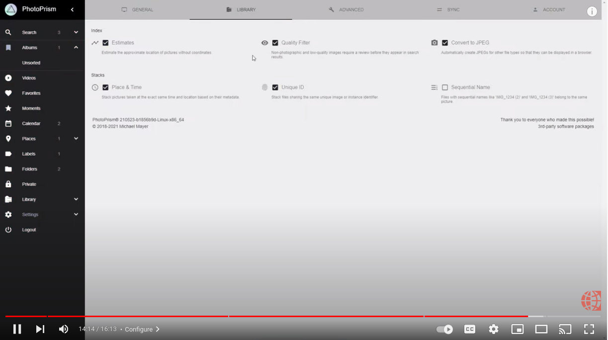

# Setting Up PhotoPrism on Unraid

!!! tldr ""
    Should you experience problems with the installation, we recommend that you ask the Unraid community for advice, as we cannot provide support for third-party software and services. Also note that third-party integrations may not provide direct access to config files or the command line, so you might not be able to use all features and config options.

!!! note ""
    [SQLite is not a good choice](../troubleshooting/sqlite.md) for users who require scalability and high performance. If it is used in a configuration template, change it to use MariaDB instead before importing any media.

## Using Docker Compose Manager

Unraid does not ship with Docker Compose, but the Community Apps plugin offers **Docker Compose Manager**, which lets you paste a standard compose file, store it on your array, and control the stack from the Docker tab.

### 1. Prerequisites

1. Update Unraid OS (v6.12 or later) and reboot so Docker Engine is current.
2. Install **Community Apps** (Apps ▸ Install if it is missing) and search for **Docker Compose Manager**. Click *Install Plugin*; it adds a *Compose* section to the Docker tab plus a settings page under *Plugins ▸ Compose.Manager*.
3. Create a protected share for PhotoPrism data, for example `appdata` (default on most systems). Inside it, make folders for `photoprism/storage`, `photoprism/database`, and `photoprism/import`. You can use the terminal:

    ```sh
    mkdir -p /mnt/user/appdata/photoprism/{storage,database,import}
    ```

4. Decide which share already holds your originals (many users point to `/mnt/user/photos` or `/mnt/user/Multimedia`). PhotoPrism will read and write there, so ensure the share is included in your parity-backed array or cache pool.
5. Enable SSH or open the web terminal so you can troubleshoot with `docker compose` if needed.

### 2. Create the stack

1. Navigate to **Docker ▸ Add New Stack**.
2. Enter a name such as `photoprism`, click the **Advanced** toggle, and set the stack path to `/mnt/user/appdata/photoprism` (keeps compose files off the USB thumb drive).
3. After the stack is created, select the gear icon ▸ **Edit Stack**, paste the compose file below, and edit the passwords and host paths before saving:

    ```yaml
    services:
      mariadb:
        image: mariadb:11
        restart: unless-stopped
        environment:
          MARIADB_AUTO_UPGRADE: "1"
          MARIADB_INITDB_SKIP_TZINFO: "1"
          MARIADB_ROOT_PASSWORD: "supersecret"
          MARIADB_DATABASE: photoprism
          MARIADB_USER: photoprism
          MARIADB_PASSWORD: "change-me"
        volumes:
          - /mnt/user/appdata/photoprism/database:/var/lib/mysql

      photoprism:
        image: photoprism/photoprism:latest
        depends_on:
          - mariadb
        restart: unless-stopped
        ports:
          - "2342:2342"
        environment:
          # initial admin password (8-72 characters)
          PHOTOPRISM_ADMIN_PASSWORD: "choose-a-strong-password"
          # canonical URL used to generate links
          PHOTOPRISM_SITE_URL: "http://YOUR_UNRAID_IP:2342/"
          # disables built-in HTTPS/TLS when set to "true"
          PHOTOPRISM_DISABLE_TLS: "false"
          # uses a self-signed certificate if the site URL starts with https://
          PHOTOPRISM_DEFAULT_TLS: "true"
          PHOTOPRISM_DEFAULT_LOCALE: "en"
          PHOTOPRISM_PLACES_LOCALE: "local"
          PHOTOPRISM_SIDECAR_YAML: "true"
          PHOTOPRISM_BACKUP_ALBUMS: "true"
          PHOTOPRISM_BACKUP_DATABASE: "true"
          PHOTOPRISM_BACKUP_SCHEDULE: "daily"
          PHOTOPRISM_INDEX_SCHEDULE: ""
          PHOTOPRISM_AUTO_INDEX: 300
          PHOTOPRISM_AUTO_IMPORT: -1
          PHOTOPRISM_DETECT_NSFW: "false"
          PHOTOPRISM_UPLOAD_NSFW: "true"
          PHOTOPRISM_UPLOAD_ALLOW: ""
          PHOTOPRISM_UPLOAD_ARCHIVES: "true"
          PHOTOPRISM_UPLOAD_LIMIT: 5000
          PHOTOPRISM_ORIGINALS_LIMIT: 5000
          PHOTOPRISM_HTTP_COMPRESSION: "zstd,gzip"
          PHOTOPRISM_DATABASE_DRIVER: "mysql"
          PHOTOPRISM_DATABASE_SERVER: "mariadb:3306"
          PHOTOPRISM_DATABASE_NAME: "photoprism"
          PHOTOPRISM_DATABASE_USER: "photoprism"
          PHOTOPRISM_DATABASE_PASSWORD: "change-me"
        volumes:
          # config, cache, and backups (SSD cache preferred)
          - /mnt/user/appdata/photoprism/storage:/photoprism/storage
          # existing originals share; replace with your path
          - /mnt/user/photos:/photoprism/originals
          # optional staging area for the Import tool
          - /mnt/user/appdata/photoprism/import:/photoprism/import
    ```
    
    By default, our Docker images use the volume mount paths `/photoprism/storage` and `/photoprism/originals`, so no [additional variables](../config-options.md#storage) are required to configure them.

4. (Optional) Use the **Edit Env** tab if you prefer to keep secrets (passwords, tokens) outside the compose file.

    If you want HTTPS on your NAS, we recommend using a [reverse proxy](../proxies/traefik.md) and then changing `PHOTOPRISM_SITE_URL` to the external `https://` address.

### 3. Start and verify

1. Back on the Docker tab, scroll to the **Compose** section and click **Compose Up** (or **Start**) for the `photoprism` stack. The plugin saves compose files on your array and runs `docker compose up -d` under the hood.
2. Open the stack’s **Logs** to confirm MariaDB finishes initialization and PhotoPrism prints `Starting PhotoPrism…`.
3. Visit `http://YOUR_UNRAID_IP:2342/`, sign in with the admin password you set, and follow the welcome wizard. When prompted for originals, choose the same path you mounted (for example `/photoprism/originals`).
4. Start an initial index via **Library ▸ Index ▸ Start**; keep the browser open until the queue completes.

### 4. Updates and maintenance

- To update, stop the stack, click **Update Stack** (Compose Manager pulls new images), then start it again. Ignore the “Update ready” label in Unraid’s standard Docker UI; Compose-managed containers always show that status.
- Keep the `/mnt/user/appdata/photoprism/storage/backups` folder in your parity-backed backup routine.
- If you ever edit the compose file outside the UI, place it in `/mnt/user/appdata/photoprism/docker-compose.yml` and click **Reload Stack** so the plugin re-reads it.
- Our [First Steps 👣](../../user-guide/first-steps.md) tutorial guides you through the user interface and settings to ensure your library is indexed according to your individual preferences.

## Manual Installation

If you prefer full terminal control, you can install Docker Compose manually or via the plugin, store `docker-compose.yml` inside `/mnt/user/appdata/photoprism`, and run `docker compose up -d`. This mirrors the workflow shown in [the IBRACORP video tutorial](https://youtu.be/WMNsO-0BuG8), which walks through backing up appdata and updating stacks from the Unraid shell.

[](https://youtu.be/WMNsO-0BuG8)

## Troubleshooting ##

If your device runs out of memory or other system resources:

- [ ] Try [reducing the number of workers](../config-options.md#indexing) by setting `PHOTOPRISM_WORKERS` to a reasonably small value in your `compose.yaml` file, depending on the performance of your device
- [ ] Make sure [your device has at least 4 GB of swap space](../troubleshooting/docker.md#adding-swap) so that indexing doesn't cause restarts when memory usage spikes; RAW image conversion and video transcoding are especially demanding
- [ ] If you are using SQLite, switch to MariaDB, which is [better optimized for high concurrency](../faq.md#should-i-use-sqlite-mariadb-or-mysql)
- [ ] As a last measure, you can [disable image classification and facial recognition](../config-options.md#feature-flags) 

Other issues? Our [troubleshooting checklists](../troubleshooting/index.md) help you quickly diagnose and resolve them.

!!! example ""
    **Help improve these docs!** You can contribute by clicking :material-file-edit-outline: to send a pull request with your changes.
