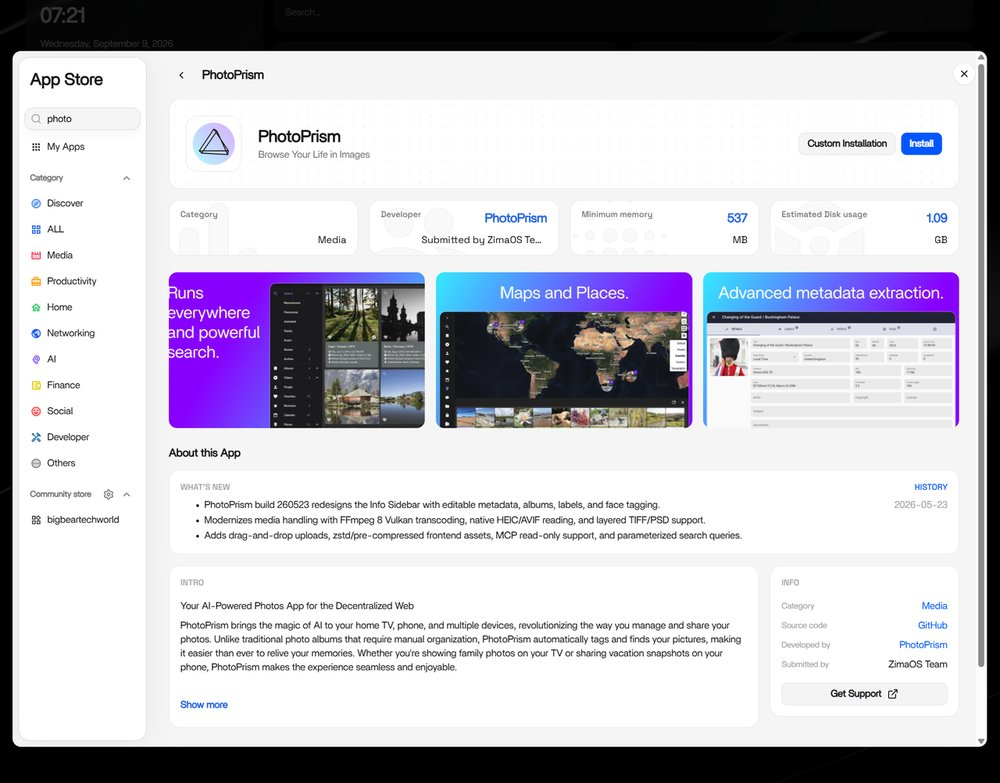
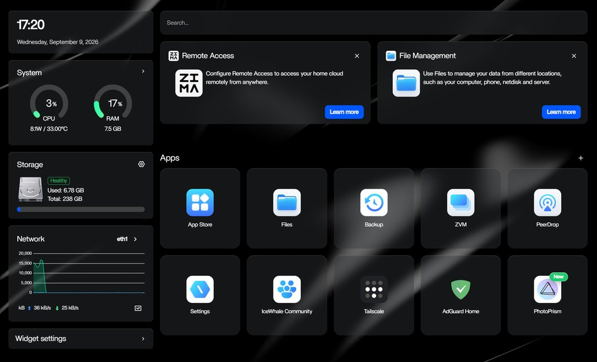
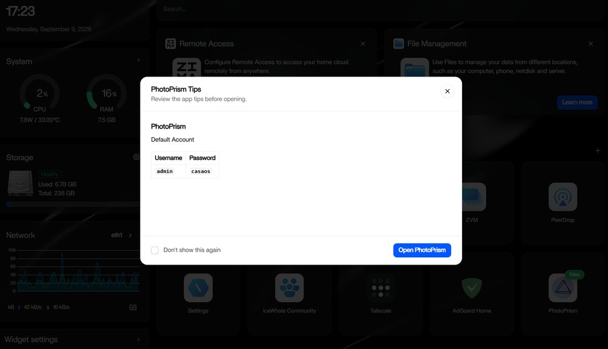
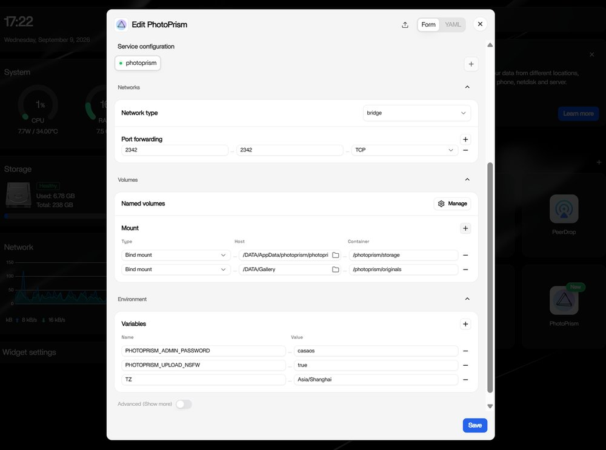

# Running PhotoPrism on ZimaOS

[ZimaOS](https://www.zimaspace.com/) is the operating system of Zima home server devices such as the ZimaBoard, ZimaBlade, and ZimaCube. PhotoPrism is part of its App Store, where it is published and maintained by the ZimaOS team, so you can install it with a single click.

Before setting up PhotoPrism on your device, we recommend that you check its CPU and memory configuration. For a good user experience, it should be a 64-bit system with [at least 2 cores and 3 GB of RAM](../index.md#system-requirements). Indexing large photo and video collections also benefits greatly from [using SSD storage](../troubleshooting/performance.md#storage), especially for the database and cache files.

!!! tldr ""
    Should you experience problems with the installation, we recommend that you ask the [ZimaSpace community](https://discord.gg/f9nzbmpMtU) for advice, as we cannot provide support for third-party software and services. Also note that third-party integrations may not provide direct access to config files or the command line, so you might not be able to use all features and config options.

!!! note ""
    The App Store installs PhotoPrism as a single container without a separate database server, so your index is stored in an [SQLite](../troubleshooting/sqlite.md) database file. Since [SQLite is not a good choice](../faq.md#should-i-use-sqlite-mariadb-or-mysql) for users who require scalability and high performance, we recommend using MariaDB before indexing a large library. MariaDB is not included in the app, so it must be installed separately and then [configured manually](../advanced/databases.md#configuration).

## Setup ##

### Step 1: Install PhotoPrism ###

Open the App Store on your ZimaOS home screen, type *PhotoPrism* in the search box, and then click "Install":

{ class="shadow" }

No further input is required, as the app ships with a default configuration. Should you want to review the volumes, port, and environment variables before the app is created, choose "Custom Installation" instead and see [Configuration](#configuration) below.

### Step 2: Open PhotoPrism ###

Once the installation is complete, you will find PhotoPrism on your home screen, where you can open it with one click:

{ class="shadow" }

Before the app opens in a new tab, a dialog shows the credentials of the default account:

{ class="shadow" }

Enter the username `admin` and the password shown in the dialog to sign in. You can also navigate directly to port `2342` on your device.

Remember to change your password after the first login. You can do this in [Settings > Account](../../user-guide/settings/account.md#change-password).

### Step 3: Add Your Files ###

Your picture library is the *Gallery* folder of your device, which is located at */DATA/Gallery* and mounted as the [*originals* folder](../advanced/docker-volumes.md) inside the app. You can add files to it with the ZimaOS *Files* app, over the network, or by uploading them in the PhotoPrism web interface.

To add new pictures to your index, open the *Library* tab and click "Start".

Our [First Steps 👣](../../user-guide/first-steps.md) tutorial guides you through the user interface and settings to ensure your library is indexed according to your individual preferences.

## Configuration ##

The following steps are optional, as you can get started right away with the default configuration.

To change the settings of an installed app, open its menu on the home screen and select "Settings". ZimaOS lets you edit the values in a form or, if you prefer, directly as YAML:

{ class="shadow" }

The values you may want to adjust are:

| Setting                                               | Default                                     |
|-------------------------------------------------------|---------------------------------------------|
| Port of the web interface                             | `2342`                                      |
| Folder mounted as `/photoprism/originals`             | `/DATA/Gallery`                             |
| Folder mounted as `/photoprism/storage`               | a *photoprism* subfolder of */DATA/AppData* |
| [Admin password](../config-options.md#authentication) | set at installation time                    |

The *storage* folder holds the database, cache, thumbnail, and sidecar files. It must never be placed inside the *originals* folder, as that would cause PhotoPrism to index its own cache files.

Any [config option](../config-options.md) can be set by adding it to the environment variables of the app, for example `PHOTOPRISM_SITE_URL` to specify the [canonical site URL](../config-options.md#site-information) or `PHOTOPRISM_DETECT_NSFW` to [flag potentially offensive content](../config-options.md#feature-flags).

## Getting Updates ##

The App Store installs a specific PhotoPrism build instead of the `latest` tag, so you will receive new releases when the app is updated by the ZimaOS team. They typically do this about every two months, after testing a new stable release for compatibility and stability. The version and release notes are shown on the app's page in the App Store.

If you prefer to update independently of the App Store, you can change the image tag to `photoprism/photoprism:latest` in the YAML editor and then recreate the app. Note that you will then receive releases before they have been tested by the ZimaOS team.

## Troubleshooting ##

If your device runs out of memory or other system resources:

- [ ] Try [reducing the number of workers](../config-options.md#indexing) by setting `PHOTOPRISM_WORKERS` to a reasonably small value, depending on the performance of your device
- [ ] Make sure [your device has at least 4 GB of swap space](../troubleshooting/docker.md#adding-swap) so that indexing doesn't cause restarts when memory usage spikes; RAW image conversion and video transcoding are especially demanding
- [ ] If you are using SQLite, [switch to MariaDB](../advanced/databases.md#change-database), which is [better optimized for high concurrency](../faq.md#should-i-use-sqlite-mariadb-or-mysql)
- [ ] As a last measure, you can [disable image classification and facial recognition](../config-options.md#feature-flags)

Other issues? Our [troubleshooting checklists](../troubleshooting/index.md) help you quickly diagnose and resolve them.

!!! example ""
    **Help improve these docs!** You can contribute by clicking :material-file-edit-outline: to send a pull request with your changes.
