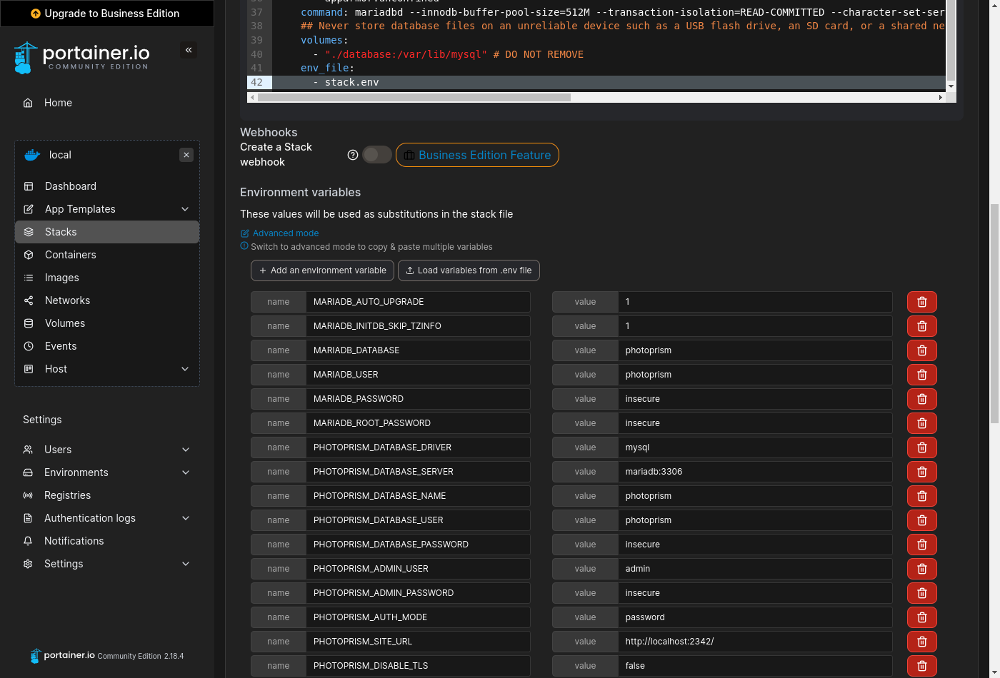

# Portainer Setup Guide

[Portainer](https://www.portainer.io/) can be used to manage Docker containers through a web interface. On many [NAS devices](../nas/synology.md), it either comes pre-installed or you can simply install it from the vendor's app store. If you are installing PhotoPrism on a regular home or cloud server, you may instead want to follow our [Docker Compose Setup Guide](../docker-compose.md), which only uses standard Docker tools and commands.

### Step 1: Create Stack ###

Navigate to "Stacks", click "Add stack" and paste the [contents of our *stack.yml* config template](https://dl.photoprism.app/docker/portainer/stack.yml){:target="_blank"} (opens in a new tab) into the *Web editor* so that you can change the storage folder locations in the `volumes` sections as needed:

{ class="shadow" }

When using the *Web editor*, please make sure that related values remain on the [same indentation level](../../developer-guide/technologies/yaml.md) and that lists start with a dash as shown in our template.

#### Volumes ####

You need to explicitly [specify the directories](https://docs.docker.com/compose/compose-file/compose-file-v3/#volumes) you want to use on your NAS device, since PhotoPrism can't see files in folders that have not been shared. This is an important security feature and allows for a flexible configuration without having to change any other variables.

!!! tldr ""
    The volume mount paths to configure depend on your NAS device and its configuration. As on most operating systems, `.` can be used to specify a path relative to the application directory. So if you keep the default settings, all files will be in the internal application folder that Portainer creates when you add a new stack.

##### Database #####

Our [stack template](https://dl.photoprism.app/docker/portainer/stack.yml){:target="_blank"} includes a pre-configured [MariaDB](https://mariadb.com/) database server that stores its data in the internal application folder by default:

```yaml
services:
  mariadb:
    volumes:
      - "./database:/var/lib/mysql"
```

If your NAS device has a mixed drive configuration with solid-state drives (SSDs) and traditional hard disks, we recommend that you change `./database` to an absolute path located on an SSD as this [significantly improves performance](../troubleshooting/performance.md#storage), for example:

```yaml
      - "/mnt/ssd/database:/var/lib/mysql"
```

!!! tldr ""
    Database files should [never be located on an unreliable device](../troubleshooting/mariadb.md#corrupted-files) such as a USB flash drive, SD card, or network folder.

##### /photoprism/originals #####

The *originals* folder contains your original photo and video files:

```yaml
services:
  photoprism:
    volumes:
      - "./originals:/photoprism/originals"
```

We recommend that you change `./originals` to the directory on your NAS where your existing media files are, for example:

```yaml
      - "/mnt/photos:/photoprism/originals"
```

Additional directories can be mounted as sub folders of `/photoprism/originals` (depending on [overlay filesystem support](../troubleshooting/docker.md#overlay-volumes)):

```yaml
    volumes:
      - "/mnt/photos:/photoprism/originals"
      - "/mnt/videos:/photoprism/originals/videos"
```

!!! tldr ""
    If you want to start with an empty library, make sure the volume has enough free space for your needs.

##### /photoprism/storage #####

The *storage* folder is used to save config, cache, thumbnail, and sidecar files. It must always be specified so that you do not lose these files after a restart or upgrade.
If available, we recommend that you put the *storage* folder on a [local SSD drive](../troubleshooting/performance.md#storage) for best performance. You can otherwise keep the default to store the files in the internal application folder:

```yaml
services:
  photoprism:
    volumes:
      - "./storage:/photoprism/storage"
```

!!! tldr ""
    Never configure the *storage* folder to be inside the *originals* folder unless the name starts with a `.` to indicate that it is hidden.
    Should you later want to move your instance to another NAS, the easiest and most time-saving way is to copy the entire *storage* folder along with your *originals* and *database*.

##### /photoprism/import #####

You can optionally mount an *import* folder from which files can be transferred to the *originals* folder in a structured way that avoids duplicates, for example:

```yaml
services:
  photoprism:
    volumes:
      - "/mnt/media/usb:/photoprism/import"
```

[Imported files](../../user-guide/library/import.md) receive a canonical filename and will be organized by year and month. You should never configure the *import* folder to be inside the *originals* folder, as this will cause a loop by importing already indexed files.

!!! tldr ""
    Even if you don't specify an *import* folder, adding files via [Web Upload](../../user-guide/library/upload.md) and [WebDAV](../../user-guide/sync/webdav.md) remains possible unless [read-only mode](../config-options.md) is enabled or the [features have been disabled](../../user-guide/settings/general.md).

### Step 2: Finalize Setup ###

To complete the setup, [download the *stack.env* file from our server](https://dl.photoprism.app/docker/portainer/stack.env) (right click and *Save Link As...*), click "Load variables from .env file", upload it to Portainer, and then [change the values according to your needs](../config-options.md):

{ class="shadow" }

!!! danger ""
    Always change `PHOTOPRISM_ADMIN_PASSWORD` so that the app **starts with a secure initial password**.
    Never use easy-to-guess passwords or default values like `insecure` on publicly accessible instances.
    There is no default in case no password was provided. A minimum length of 8 characters is required.


!!! tldr ""
    It is **not possible to change the database password** with `MARIADB_PASSWORD` after MariaDB has been started for the first time. However, choosing a secure password is not essential if you don't [expose the database to other apps or hosts](../troubleshooting/mariadb.md#cannot-connect). To enable [automatic schema updates](../troubleshooting/mariadb.md#auto-upgrade) after upgrading to a new major version, make sure that  `MARIADB_AUTO_UPGRADE` is set to a non-empty value.

When you're done, scroll down and click "Deploy the stack" without changing any of the other options:

{ class="shadow" }

After waiting a few moments, you should be able to log in as `admin` with the password specified in `PHOTOPRISM_ADMIN_PASSWORD` when you navigate to <http://localhost:2342/>.

!!! tldr ""
    If you have modified the server hostname, port, or protocol in your configuration, the URL to use changes accordingly. 

### Step 3: Index Your Library ###

Our [First Steps 👣](../../user-guide/first-steps.md) tutorial guides you through the user interface and settings to ensure your library is indexed according to your individual preferences.

!!! tldr ""
    The config options and container image you want to use can be changed at any time by navigating to "Stacks", selecting your existing PhotoPrism stack, clicking "Editor", updating the [configuration to your needs](../config-options.md), and then clicking "Update the stack" to apply the changes.

### PhotoPrism® Plus ###

Our members can activate [additional features](https://link.photoprism.app/membership) by logging in with the [admin user created during setup](../config-options.md#authentication) and then following the steps [described in our activation guide](https://www.photoprism.app/kb/activation). Thank you for your support, which has been and continues to be essential to the success of the project! :octicons-heart-fill-24:{ .heart .purple }

[Compare Memberships ›](https://link.photoprism.app/membership){ class="pr-3 block-xs" } [View Membership FAQ ›](https://www.photoprism.app/membership/faq) 

!!! example ""
    We recommend that new users install our free Community Edition before [signing up for a membership](https://link.photoprism.app/membership).

### Troubleshooting ###

If your device runs out of memory, the index is frequently locked, or other system resources are running low:

- [ ] Try [reducing the number of workers](../config-options.md#index-workers) by setting `PHOTOPRISM_WORKERS` to a reasonably small value, depending on the CPU performance and number of cores
- [ ] Make sure [your device has at least 4 GB of swap space](../troubleshooting/docker.md#adding-swap) so that indexing doesn't cause restarts when memory usage spikes; RAW image conversion and video transcoding are especially demanding
- [ ] If you are using SQLite, switch to MariaDB, which is [better optimized for high concurrency](../faq.md#should-i-use-sqlite-mariadb-or-mysql)
- [ ] As a last measure, you can [disable the use of TensorFlow](../config-options.md#feature-flags) for image classification and facial recognition

Other issues? Our [troubleshooting checklists](../troubleshooting/index.md) help you quickly diagnose and solve them.

!!! info ""
    You are welcome to ask for help in our [community chat](https://link.photoprism.app/chat).
    [Sponsors](https://www.photoprism.app/membership) receive direct [technical support](https://www.photoprism.app/contact) via email.
    Before [submitting a support request](../index.md#getting-support), try to [determine the cause of your problem](../troubleshooting/index.md).

### Command-Line Interface ###

#### Opening a Terminal

Navigate to "Stacks", select the PhotoPrism stack and scroll down to the list of containers:

{ class="shadow" }

Now click the :fontawesome-solid-terminal: button belonging to the *photoprism-photoprism-1* container and [accept the default settings](console-settings.png) to open a terminal:

{ class="shadow" }

Running `photoprism help` lists all commands and [options](../config-options.md) available in the current version:

```bash
photoprism help
```

Use the `--help` flag to see a detailed command description, for example:

```bash
photoprism backup --help
```

The command-line interface is also well suited for job automation using a [scheduler](https://dl.photoprism.app/docker/scheduler/).

#### Examples

| Action                                                    | Command                        |
|-----------------------------------------------------------|--------------------------------|
| *Display Config Values*                                   | `photoprism show config`       |
| *Show Migration Status*                                   | `photoprism migrations ls`     |
| *Repeat Failed Migrations*                                | `photoprism migrations run -f` |
| *Reset Database*                                          | `photoprism reset -y`          |
| *Backup Database*                                         | `photoprism backup -a -i`      |                      
| *Restore Database*                                        | `photoprism restore -a -i`     |                   
| *Change Admin Password*                                   | `photoprism passwd [username]` |
| *Show User Management Commands*                           | `photoprism users help`        |
| *Reset Users*                                             | `photoprism users reset -y`    |
| *Show Face Recognition Commands*                          | `photoprism faces help`        |
| *Index Faces*                                             | `photoprism faces index`       |
| *Reset People & Faces*                                    | `photoprism faces reset -f`    |
| *Transcode Videos to AVC*                                 | `photoprism convert`           |
| *Regenerate Thumbnails*                                   | `photoprism thumbs -f`         |
| [*Update Index*](../../user-guide/library/originals.md)   | `photoprism index --cleanup`   |                  
| [*Move to Originals*](../../user-guide/library/import.md) | `photoprism import [path]`     |                  
| [*Copy to Originals*](../../user-guide/library/import.md) | `photoprism cp [path]`         |                  

*[home directory]: /home/username on Linux and many NAS devices
*[host]: Computer, Cloud Server, or VM that runs PhotoPrism
*[swap]: substitute for physical memory
*[HEIF]: High Efficiency Image File Format
*[RAW]: image format that contains unprocessed sensor data
*[SSD]: Solid-State Drive
*[CDN]: Content Delivery Network
*[UI]: User Interface
*[CLI]: Command-Line Interface
*[AVC]: MPEG-4 / H.264
*[FFmpeg]: transcodes video files
*[SQLite]: self-contained, serverless SQL database
*[read-only]: write protected
*[filesystem]: contains your files and folders
