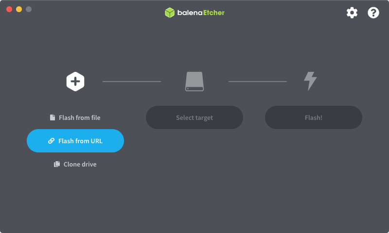

# MicroSD Image for the Raspberry Pi 

{ class="w25 right" }
The easiest way to run PhotoPrism on a Raspberry Pi is with [PhotoPrismPi](https://dl.photoprism.app/raspberrypi/).[^1]
Simply flash the image to an SD card and boot your device with it.

We recommend using a fast MicroSD card with at least 64 GB so that you don't run out of storage space later on. These are usually sold with an adapter that fits into normal SD card slots.

## Step 1: Install balenaEtcher

Etcher is a powerful OS image flasher that makes flashing an SD card a pleasant and safe experience. You can download it from the official website or GitHub:

- <https://www.balena.io/etcher/>
- <https://github.com/balena-io/etcher/releases>

## Step 2: Flash from URL

Open balenaEtcher and enter the following URL as image source:

```url
https://dl.photoprism.app/live/photoprismpi/latest.zip
```



When you have selected the image and inserted a suitable card into your computer, press **Flash!**.

## Step 3: Boot Your Device

Insert the MicroSD card into the Pi, make sure your device is connected to a wired network, and turn it on. After a few minutes,[^2] our latest release should be ready to use when you navigate to <http://photoprismpi.local/>![^3]

### User Accounts

The default password for the `admin` user is `photoprismpi`. You can also [connect via SSH](https://www.howtogeek.com/311287/how-to-connect-to-an-ssh-server-from-windows-macos-or-linux/) with the user and password `ubuntu`.

!!! danger ""
    Be sure to change both passwords immediately if your Pi is connected to a public network.

### Storage Folders

Uploads, sidecar and cache files are stored in `/srv/photoprism`. External drives can be connected via USB and accessed as folders `/mnt/a` to `/mnt/d` without further configuration.

Should you want to make changes to the [default settings](../config-options.md), you can find the `docker-compose.yml` file in `/boot/firmware/docker-compose/photoprism`.
After [connecting via SSH](https://www.howtogeek.com/311287/how-to-connect-to-an-ssh-server-from-windows-macos-or-linux/) with the credentials provided above, you can obtain root privileges by running `sudo -i`.

### HTTPS Proxy

[Caddy](https://caddyserver.com/docs/) is installed as a [reverse proxy](../proxies/caddy-2.md) that can be configured in `/etc/caddy/Caddyfile`. By default, the automatically generated certificates are not recognized as valid by browsers, so you will see a warning when connecting over HTTPS.

[^1]: Based on [Ubuntu Server 22.04](https://cdimage.ubuntu.com/releases/22.04/release/) and [CustomPiOS](https://github.com/guysoft/CustomPiOS) by [Guy Sheffer](https://github.com/guysoft).
[^2]: Download and installation time depends on the speed of your Internet connection.
[^3]: If you can't connect, try using the existing hostname or IP address instead.
