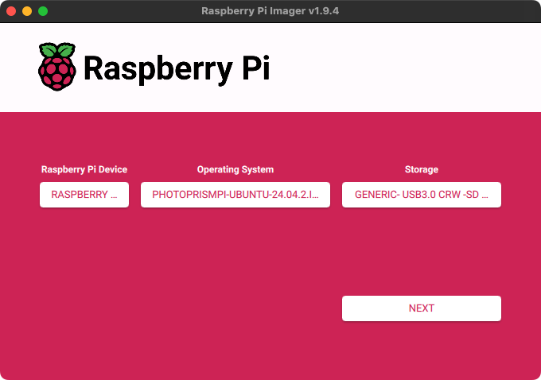

# MicroSD Image for the Raspberry Pi 

{ class="w25 right" }
The easiest way to run PhotoPrism on a Raspberry Pi is with [PhotoPrismPi](https://dl.photoprism.app/nas/raspberry-pi/).[^1]
Simply flash the image to an SD card and boot your device with it.

We recommend using a fast MicroSD card with at least 64 GB so that you don't run out of storage space later on. These are usually sold with an adapter that fits into normal SD card slots.

## Step 1: Install Imager

With the [Raspberry Pi Imager](https://www.raspberrypi.com/software/), installing the image we provide to a microSD card is quick and easy. The card is then ready to use with your Raspberry Pi.

It is available for Ubuntu, Windows, and macOS, and can be downloaded for free at [raspberrypi.com/software/](https://www.raspberrypi.com/software/).

## Step 2: Download and Flash

After installing [Raspberry Pi Imager](https://www.raspberrypi.com/software/) or another SD card flash tool, you can download the latest version of [PhotoPrismPi](https://dl.photoprism.app/nas/raspberry-pi/) from [dl.photoprism.app/nas/raspberry-pi/latest.img.xz](https://dl.photoprism.app/nas/raspberry-pi/latest.img.xz). 

Then, use the Imager to write the file to an inserted SD card:

Once you have selected the downloaded image under "Operating System" and your SD card storage device, click "Next" to begin flashing the image. Depending on the speed of your SD card, this may take a few minutes.

## Step 3: Boot Your Device

Insert the SD card into your Raspberry Pi and ensure that it is connected to a wired network. Then, turn it on. After a few minutes, the operating system will update and download the latest release to your device.[^2] You should then be able to access the web interface by navigating to `http://<IP address>:2342/` or <https://photoprism-pi.local/>![^3]

### User Accounts

When you first log in to PhotoPrism, the username for the initial super admin account is `admin` and the password is `photoprismpi`.

You can also [connect to the server via SSH](https://www.howtogeek.com/311287/how-to-connect-to-an-ssh-server-from-windows-macos-or-linux/) on standard port 22 using the username `pi` and password `raspberry`.

!!! danger "Danger"
    Since they can be easily guessed, **both passwords should be changed immediately**. This is especially important if your device is connected to the Internet or any other shared network.

### Storage Folders

Your pictures, uploads, sidecar files, and cache files are stored in subfolders of `/opt/photoprism`. You can also connect external drives via USB and access them as folders from `/mnt/a` to `/mnt/d` without further configuration.

Should you want to make changes to the [default settings](../config-options.md), you can find your `compose.yaml` file in `/opt/photoprism`.
After [connecting via SSH](https://www.howtogeek.com/311287/how-to-connect-to-an-ssh-server-from-windows-macos-or-linux/) with the credentials provided above, you can obtain root privileges by running `sudo -i`.

### Reverse Proxy

[Traefik](https://traefik.io/traefik)  is installed as [a reverse proxy](../proxies/traefik.md) and can be configured in `/opt/photoprism/compose.yml`, as well as through the config files located in `/opt/photoprism/traefik`.

Note that browsers do not recognize the automatically generated default certificate as valid, so you will see a warning when connecting over HTTPS.

[^1]: [PhotoPrismPi](https://dl.photoprism.app/nas/raspberry-pi/) is based on [Ubuntu Server](https://cdimage.ubuntu.com/releases/24.04.2/release/).
[^2]: Download and installation time depends on the speed of your Internet connection.
[^3]: If you can't connect, try using the existing hostname or IP address instead.
