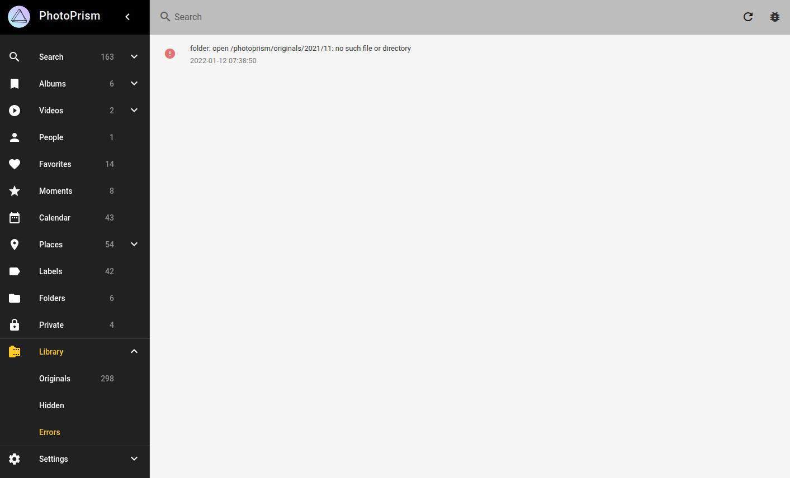

# Collecting Debug Information

=== "Web App"

    Make sure *Logs* is enabled under *Settings* > *General* so you can see log messages in the Web UI.

    **Live Logs**

    The continuously updated live logs in *Library* > *Logs* are especially useful for diagnosing indexing and import issues,
    but also display other types of logs (depending on the [log level](../config-options.md#basic-settings)):

    1. Navigate to *Library*
    2. Open the *Logs* tab
   
    !!! note ""
        Only a limited number of messages are visible in the Web App to reduce memory usage. You can see all messages
        in the [Docker Logs](docker.md#viewing-logs). This may be more convenient if you are looking for information
        on a specific file or want to attach your full logs to a [support request](../../user-guide/index.md#getting-support).

    **Errors and Warnings**

    1. Expand the main navigation
    2. Open the *Library* sub navigation
    3. Navigate to *Library* > *Errors*

    

=== "Browser"
    
    If you [have a frontend issue](browsers.md), it is often helpful to check the browser console for errors and warnings.
    A console is available in all modern browsers and can be activated via keyboard shortcuts or the browser menu.

    Problems with the user interface can be caused by a bug or an [incompatible browser](browsers.md#try-another-browser):
    Some [features may not be supported](https://caniuse.com/) by non-standard browsers, as well as nightly, unofficial,
    or outdated versions.

    *In case you don't see any log messages, try reloading the page, as the problem may occur while the page is loading.*
    
    **Chrome, Chromium, and Edge**

    - press ⌘+Option+J (Mac) or Ctrl+Shift+J (Windows, Linux, Chrome OS) to go directly to the Developer Tools
    - or, navigate to *More tools* > *Developer tools* in the browser menu and open the *Console* tab

    **Firefox**

    - press ⌘+Option+K (Mac) or Ctrl+Shift+K (Windows) to go directly to the Firefox Web Console panel
    - or, navigate to *Web Development* > *Web Console* in the menu and open the *Console* panel

    **Safari**

    Before you can access the console in Safari on MacOS, you first need to enable the *Develop* menu:

    1. Choose Safari *Menu* > *Preferences* and select the *Advanced Tab*
    2. Select "Show Develop menu in menu bar"

    Once the *Develop* menu is enabled:

    - press Option+⌘+C to go directly to the *Javascript Console*
    - or, navigate to *Develop* > *Show Javascript Console* in the browser menu
    
    **Mobile Safari**

    Browser logs on Apple mobile devices running iOS or iPadOS can be viewed when you connect them to a Mac.
    Before you can connect your device to a Mac, you must allow your device to be inspected:
    
    1. Open the Settings app
    2. Go to Safari
    3. Scroll down to Advanced
    4. Enable the Web Inspector toggle

    If you now connect the device to your Mac with a cable, websites opened in Safari on iOS and iPadOS will appear in a submenu for the connected device in the Develop menu of the Safari desktop browser.
    Note that when prompted, you may need to confirm that you trust the Mac you are connecting your device to.
    
    Web pages (and other content) are separated by app, making it easier for you to find the web page you are looking for.
    Once you have found and selected the site you want to inspect, a Web Inspector window will open.
    See [Apple's Developer Guide](https://developer.apple.com/documentation/safari-developer-tools/inspecting-ios) for additional help and information. 

=== "Docker Logs"

    You can run this command to watch the Docker service logs, including the last 100 messages (omit `--tail=100` to see them all, and `-f` to output only the last logs without watching them):
    
    ```bash
    docker compose logs -f --tail=100 
    ```
    
    A good way to troubleshoot configuration issues is to increase the log level. To enable [trace log mode](../config-options.md), set `PHOTOPRISM_LOG_LEVEL` to `"trace"` in the `environment:` section of the `photoprism` service (or use the `--trace` flag when running the `photoprism` command directly):
    
    
    ```yaml
    services:
      photoprism:
        environment:
          PHOTOPRISM_LOG_LEVEL: "trace"
          ...
    ```
    
    Now [restart all services](../docker-compose.md#step-2-start-the-server) for your changes to take effect:
    
    ```bash
    docker compose stop
    docker compose up -d
    ```
    
    It can also be helpful to keep Docker running in the foreground while debugging, so that log messages are displayed directly. To do this, omit the `-d` parameter when (re)starting:
    
    ```bash
    docker compose stop
    docker compose up
    ```
    
    !!! note ""
        If you see no errors or no logs at all, you may have started the server on a different host
        and/or port. There could also be an [issue with your browser](browsers.md), browser plugins, firewall settings,
        or other tools you may have installed.
    
    !!! tldr ""
        The default [Docker Compose](https://docs.docker.com/compose/) config filename is `docker-compose.yml`. For simplicity, it doesn't need to be specified when running `docker compose` or `docker-compose` in the same directory. Config files for other apps or instances should be placed in separate folders.

!!! info ""
    **We kindly ask you not to report bugs via *GitHub Issues* unless you are certain to have found a fully reproducible and previously unreported issue that must be fixed directly in the app.**
    [Ask for technical support](../../user-guide/index.md#getting-support) if you need help, it could be a local
    configuration problem, or a misunderstanding in how the software works.
