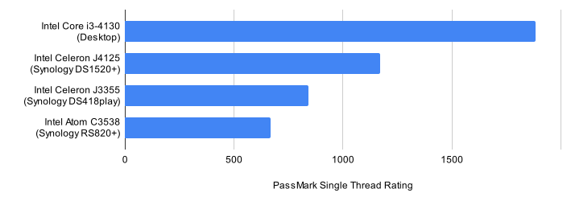

# Performance Tips

## MariaDB ##

The [InnoDB buffer pool](https://mariadb.com/kb/en/innodb-buffer-pool/) serves as a cache for data and indexes.
It is a key component for optimizing MariaDB performance. Its size should be as large as possible to keep frequently
used data in memory and reduce disk I/O - typically the biggest bottleneck.

By default, the buffer pool size is [between 128 MB and 512 MB](https://github.com/photoprism/photoprism/issues/2390), depending on which configuration example you use. You can change it with the `--innodb-buffer-pool-size` command parameter in the `mariadb:` section of your `docker-compose.yml`. `M` stands for Megabyte, `G` for Gigabyte. Do not use spaces.

If your server has plenty of physical memory, we recommend increasing the size to 1 or 2 GB:

```yaml
services:
  mariadb:
    command: mysqld --innodb-buffer-pool-size=1G ...
```

As a rule of thumb, [`Innodb_buffer_pool_pages_free`](https://mariadb.com/kb/en/innodb-status-variables/#innodb_buffer_pool_pages_free) should never be [less than 5% of the total pages](https://vettabase.com/blog/is-innodb-buffer-pool-big-enough/).
You can run the following SQL statement, for example using the [`mariadb` command](https://mariadb.com/kb/en/mysql-command-line-client/) in a terminal, to display the number of free pages and other InnoDB-related status information:

```SQL
SHOW GLOBAL STATUS LIKE 'Innodb_buffer%';
```

Advanced users may adjust [additional parameters](https://github.com/photoprism/photoprism-docs/issues/102) to further improve performance. Tools such as the [mysqltuner.pl](https://github.com/major/MySQLTuner-perl) script can provide helpful recommendations for this.

!!! info "Windows and macOS"
    If you are using *Docker Desktop* on Windows or macOS, remember to increase the [total memory available](../img/docker-resources-advanced.jpg) for Docker services. Otherwise, they may run out of resources and cannot benefit from a larger cache size. In case PhotoPrism and MariaDB are running in a virtual machine, its memory size should be increased as well. Restart for changes to take effect.

### Migration from SQLite ###

After [migrating from SQLite](../advanced/migrations/sqlite-to-mariadb.md), it is possible that columns do not have exactly the data type they should have or that indexes are missing. This can lead to poor performance. For example, MariaDB cannot process rows with `text` columns in memory and always uses temporary tables on disk if there are any.

The instructions for these migrations were provided by a contributor and are not part of the original software distribution. As such, they have not been officially released, recommended, or extensively tested by us.

If this is the case, please make sure that your migrated database schema matches that of a [fresh, non-migrated installation](../../developer-guide/database/index.md) . It may help to [run the migrations manually](../advanced/migrations/index.md) in a terminal using the *migrations* subcommands. However, this does not guarantee that all issues such as missing indexes are resolved.

[View Database Schema ›](../../developer-guide/database/index.md)

## Windows ##

[Solve Windows-Specific Issues ›](windows.md)

## Storage ##

Local Solid-State Drives (SSDs) are [best for databases](https://mariadb.com/de/resources/blog/how-to-tune-mariadb-write-performance/)
of any kind:

- database performance extremely benefits from high throughput which HDDs can't provide
- SSDs have more predictable performance and can handle more concurrent requests
- due to the HDD seek time, HDDs only support 5% of the reads per second of SSDs
- the cost savings from using slow hard disks are minimal

Switching to SSDs makes a big difference, especially for write operations and when the read cache is not
big enough or can't be used.

!!! note ""
    Never store database files on an unreliable device such as a USB flash drive, SD card, or shared network folder. These may also have [unexpected file size limitations](https://thegeekpage.com/fix-the-file-size-exceeds-the-limit-allowed-and-cannot-be-saved/), which is especially problematic for databases that do not split data into smaller files.

## Memory ##

Indexing large photo and video collections benefits from plenty of memory for [caching](#mariadb) and processing large media files.
Ideally, the amount of RAM should match the number of physical CPU cores. If not, reduce the number of workers 
as [explained below](#troubleshooting).

Also be aware that running PhotoPrism with [less than 4 GB of swap space](docker.md#adding-swap) or [setting a memory/swap limit](../faq.md#why-is-my-configured-memory-limit-exceeded-when-indexing-even-though-photoprism-doesnt-actually-seem-to-use-that-much-memory) can lead to unexpected restarts ("crashes"), for example when the indexer temporarily needs more memory to process large files.

Especially the conversion of RAW images and the transcoding of videos are very demanding. High-resolution panoramic images may require [additional swap space](docker.md#adding-swap) and/or physical memory above the [recommended minimum](../index.md#system-requirements).

!!! note ""
    RAW image conversion and TensorFlow are disabled on systems with 1 GB or less memory. We take no responsibility
    for instability or performance problems if your device does not meet the requirements.

## Server CPU ##

Last but not least, performance can be limited by your server CPU. If you've tried everything else, then only moving
your instance to a more powerful device or cloud server may help.

Be aware that most [NAS devices](https://kb.synology.com/en-us/DSM/tutorial/What_kind_of_CPU_does_my_NAS_have) are
optimized for minimal power consumption and low production costs. Although their hardware gets faster with each generation,
[benchmarks](https://www.google.com/search?q=cpu+benchmarks) show that even 8-year-old standard desktop CPUs like the [Intel Core i3-4130](https://www.cpubenchmark.net/compare/Intel-Pentium-J3710-vs-Intel-i3-4130/2784vs2015) are often many times faster:



## Legacy Hardware ##

It is a known issue that the user interface and backend operations, especially face recognition, can be slow or even crash on older hardware due to a lack of resources. Like most applications, PhotoPrism has certain requirements and our development process does not include testing on unsupported or unusual hardware.

In many cases, performance can be improved through optimizations. Since these can prove to be very time-consuming and cost-intensive in practice, users and developers must decide on a case-by-case basis whether this provides sufficient benefit in relation to the costs or whether the use of more powerful hardware is faster and cheaper overall.

We kindly ask you not to open a problem report on GitHub Issues for poor performance on older hardware until a full cause and feasibility analysis has been performed. [GitHub Discussions](https://github.com/photoprism/photoprism/discussions) or any of our other public forums and communities are great places to start a discussion.

That being said, one of the advantages of [open-source software](https://docs.photoprism.app/developer-guide/) is that users can submit [pull requests](https://docs.photoprism.app/developer-guide/pull-requests/) with performance and other enhancements they would like to see implemented. This will result in a much faster solution than waiting for a core team member to remotely analyze your problem and then provide a fix.

## Troubleshooting ##

If your server runs out of memory, the index is frequently locked, or other system resources are running low:

- [ ] Try [reducing the number of workers](../config-options.md#index-workers) by setting `PHOTOPRISM_WORKERS` to a reasonably small value in `docker-compose.yml`, depending on the CPU performance and number of cores
- [ ] Make sure [your server has at least 4 GB of swap space](docker.md#adding-swap) so that indexing doesn't cause restarts when memory usage spikes; RAW image conversion and video transcoding are especially demanding 
- [ ] If you are using SQLite, switch to MariaDB, which is [better optimized for high concurrency](../faq.md#should-i-use-sqlite-mariadb-or-mysql)
- [ ] As a last measure, you can [disable the use of TensorFlow](../config-options.md#feature-flags) for image classification and facial recognition

Other issues? Our [troubleshooting checklists](index.md) help you quickly diagnose and solve them.

!!! info ""
    You are welcome to ask for help in our [community chat](https://link.photoprism.app/chat).
    [Sponsors](https://www.photoprism.app/membership) receive direct [technical support](https://www.photoprism.app/contact) via email.
    Before [submitting a support request](../../user-guide/index.md#getting-support), try to [determine the cause of your problem](index.md).

*[SQLite]: self-contained, serverless SQL database 
