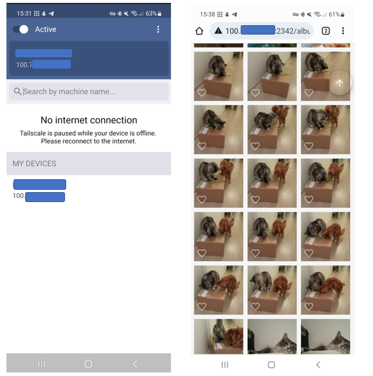
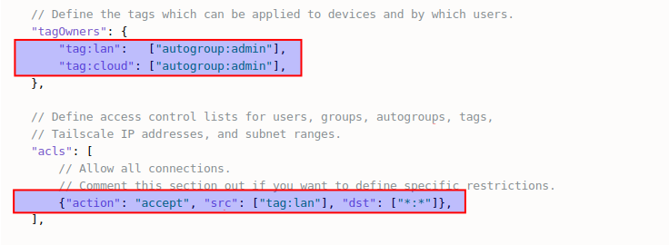
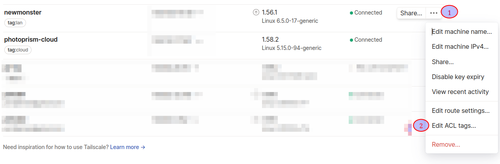

# Tailscale VPN

!!! tldr ""
    Should you experience problems with Tailscale, we recommend that you ask the Tailscale community for advice, as we cannot provide support for third-party software and services.

1. Open the [Tailscale website](https://tailscale.com/) and Select Use Tailscale button. 

2. Sign up with an email address or using any of your other accounts and install Tailscale on all the relevant devices. Detailed and clear instructions are available to guide your through the process depending on the operating system.

    { class="shadow" }

    For example below the instruction for [**Linux**](https://tailscale.com/download/linux) and [**Android**](https://tailscale.com/download/android)

    {: style="width:50%" class="shadow" }{: style="width:50%" class="shadow" }

3. When the devices have Tailscale installed (and logged in via the same account) they all appear in the overview as in the printscreen below.

    { class="shadow" }

4. Each device gets an IP address allocated (100.xxx.xxx.xxx), which can be used to reach them via the VPN network. This IP address with addition of the port number where Photoprism is run on can be used to reach Photoprism outside the home network. 

   { class="shadow" }

5. Deny incoming vpn traffic from cloud server

If you have a Photoprism instance running on a cloud server, you might want to be able to connect from your desktop computer to the cloud server and deny connections from the cloud server. Denying connections from the cloud server is useful if it is compromised.

That can be achieved by setting up ACL's (Access Control Lists). Read about ACL's and tags [in the tailscale documentation](https://tailscale.com/kb/1018/acls)

This example shows how to:

- Create two tags "lan" and "cloud"
- Create an ACL that allows machines tagged "lan" to connect to every machine in the tailnet.
- Tags a desktop machine with "lan" and a cloud server with "cloud"

As the cloud server is not specifically allowed to connect anywhere on the tailnet, it cannot connect to machines tagged "lan"

**Step 1**

Goto your [tailscale acl admin console](https://login.tailscale.com/admin/acls/file)

Add the two tags as marked on the screenshot below:

{ class="shadow" }

**Step 2**

Goto your [tailscale machines admin console](https://login.tailscale.com/admin/machines)

Add the "tag:lan" and "tag:cloud" to your desktop and cloud machines as demonstrated:

Open the ACL tags dialog window:
{ class="shadow" }

Add/remove tags as needed and click on "Save"
{ class="shadow" }

**Step 3**

Verify the changes work as intended.

- Connect to your cloud based PhotoPrism instance and make sure it works. You could try to do this:

  - Create an album
  - Tag some photos
  - Add the tagged photos to the new album

- ssh into the cloud server from your desktop machine, that should work.

- From the cloud server, ping your desktop which should fail.

!!! example ""
    **Help improve these docs!** You can contribute by clicking :material-file-edit-outline: to send a pull request with your changes.
