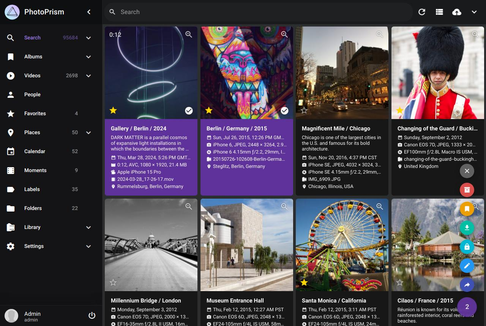

# PhotoPrism: Browse Your Life in Pictures

PhotoPrism® is an AI-powered app for browsing, organizing & sharing your photo collection. It makes use of the latest technologies to tag and find pictures automatically without getting in your way. You can run it at home, on a private server, or in the cloud.

## Feature Overview ##

* Browse all your :material-image-frame: [Photos](https://docs.photoprism.org/user-guide/organize/browse/) and :material-play-circle-outline: [Videos](https://demo.photoprism.org/videos) without worrying about [RAW conversion, duplicates or video formats](https://docs.photoprism.org/user-guide/settings/library/)
* Easily find specific pictures using powerful :material-filter-variant: [Search Filters](https://demo.photoprism.org/browse?view=cards&q=flower%20color%3Ared)
* Privacy-friendly: No data is ever sent to Google, Amazon, Facebook, or Apple unless you explicitly upload files to one of their services :closed_lock_with_key:
* Recognizes the :material-account-supervisor: [Faces](https://demo.photoprism.org/people) of your family and friends
* :material-tag-outline: [Automatic Classification](https://demo.photoprism.org/labels) of pictures based on their content and location 
* Play :custom-live-photo: [Live Photos](https://demo.photoprism.org/browse?view=cards&q=type%3Alive) by hovering over them in :material-bookmark-multiple-outline: [Albums](https://demo.photoprism.org/albums) and search results
* Since the [User Interface](https://demo.photoprism.org/) is a :material-language-html5: [Progressive Web App](https://developer.mozilla.org/en-US/docs/Web/Progressive_web_apps),
  it provides a native app-like experience, and you can conveniently install it on the home screen of all major operating systems and mobile devices
* Includes 4 high-resolution :material-map-marker-outline: [World Maps](https://demo.photoprism.org/places) to bring back the memories of your favorite trips
* Metadata is extracted and merged from Exif, XMP, and other sources such as Google Photos
* Many more image properties like [Colors](https://demo.photoprism.org/browse?view=cards&q=color:red), [Chroma](https://demo.photoprism.org/browse?view=cards&q=mono%3Atrue), and [Quality](https://demo.photoprism.org/review) can be searched as well
* Use :material-sync: [PhotoSync](https://www.photosync-app.com/) to securely backup iOS and Android phones in the background
* WebDAV clients such as Microsoft's Windows Explorer and Apple's Finder can :material-cloud-outline: [Connect](https://docs.photoprism.org/user-guide/sync/webdav/) directly to PhotoPrism, allowing you to open, edit, and delete files from your computer as if they were local

  <a class="action-button" href="https://demo.photoprism.org/" target="_blank">TRY OUR DEMO</a>
  <a class="action-button" href="getting-started/">GET STARTED</a>

!!! example ""
    Step-by-step installation instructions for our self-hosted community edition can be found 
    in [Getting Started](getting-started/index.md). All you need is a Web browser and 
    [Docker](https://store.docker.com/search?type=edition&offering=community) to run the server.
    It is available for Mac, Linux, and Windows. PhotoPrism also runs on [DigitalOcean](getting-started/cloud/digitalocean.md), 
    [Raspberry Pi](getting-started/raspberry-pi.md), [FreeBSD](getting-started/freebsd.md), and many 
    [NAS devices](getting-started/nas/synology.md).

