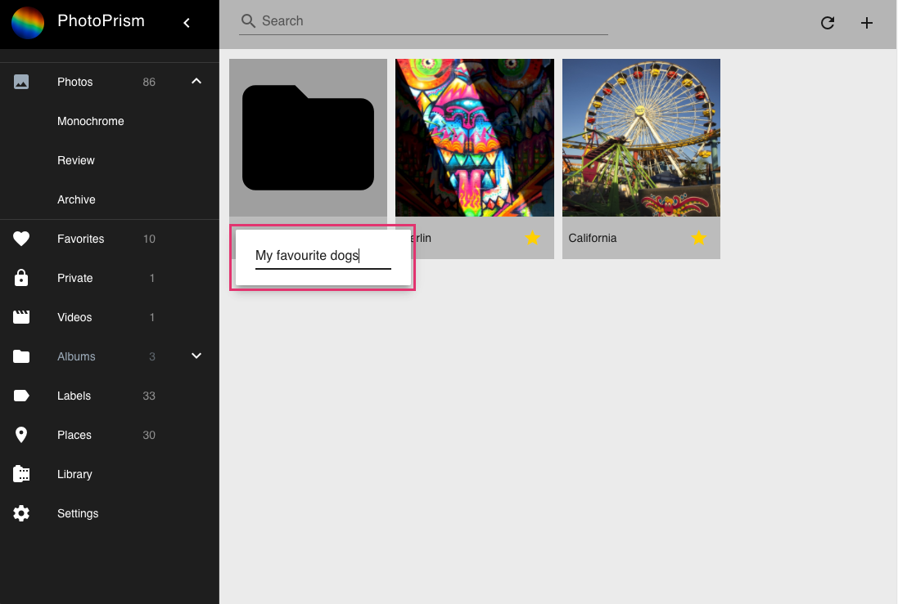
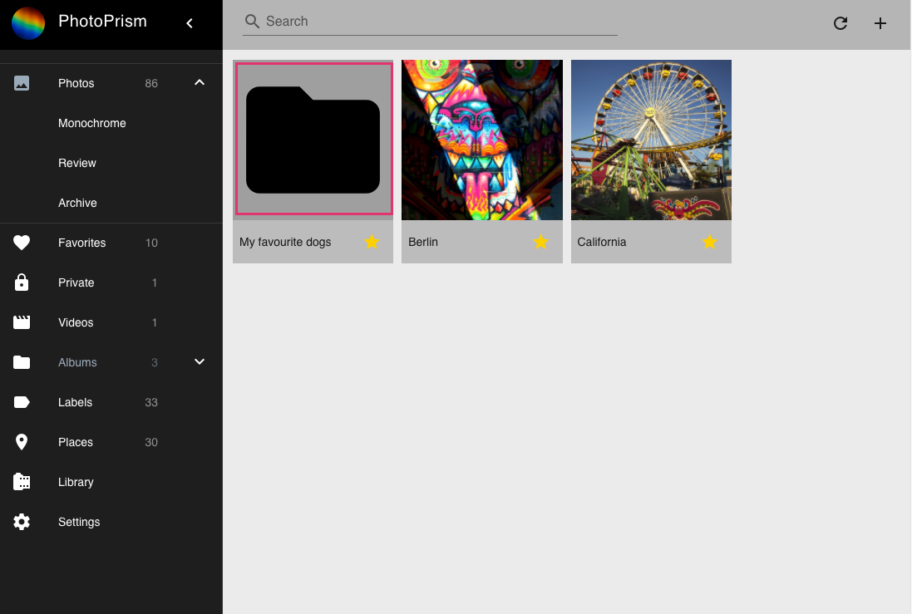
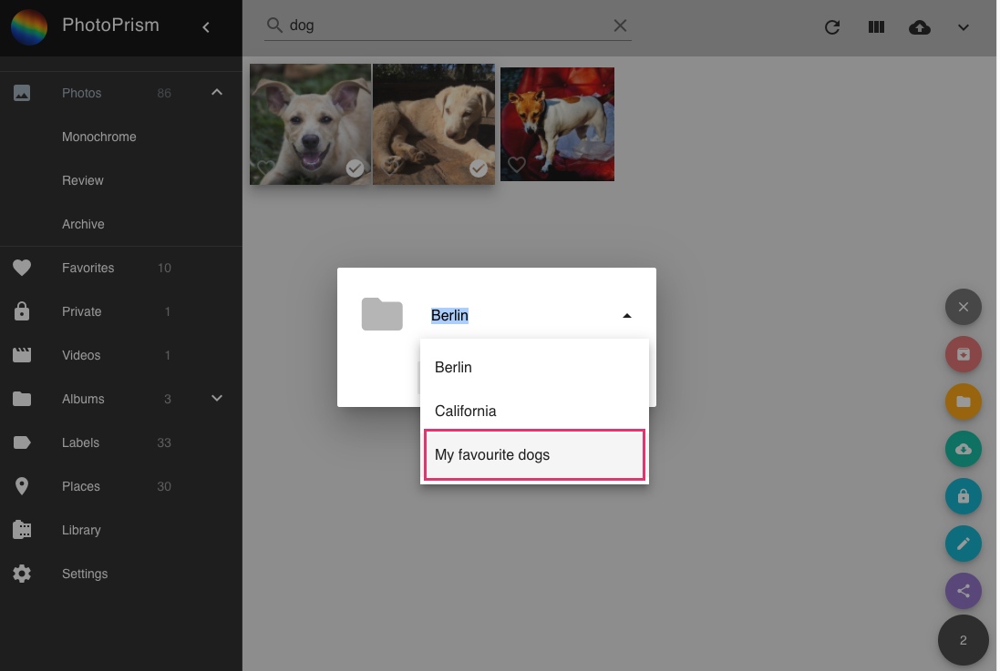
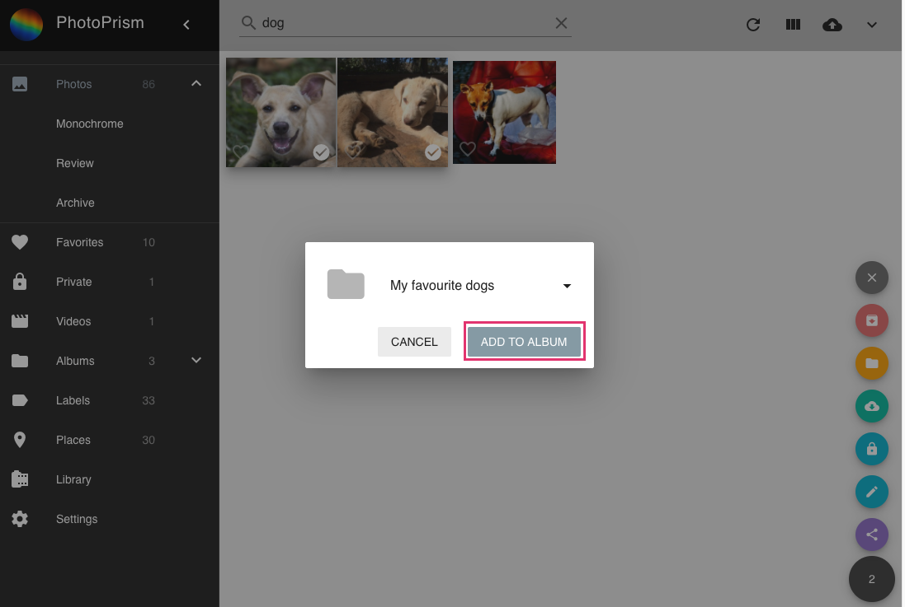
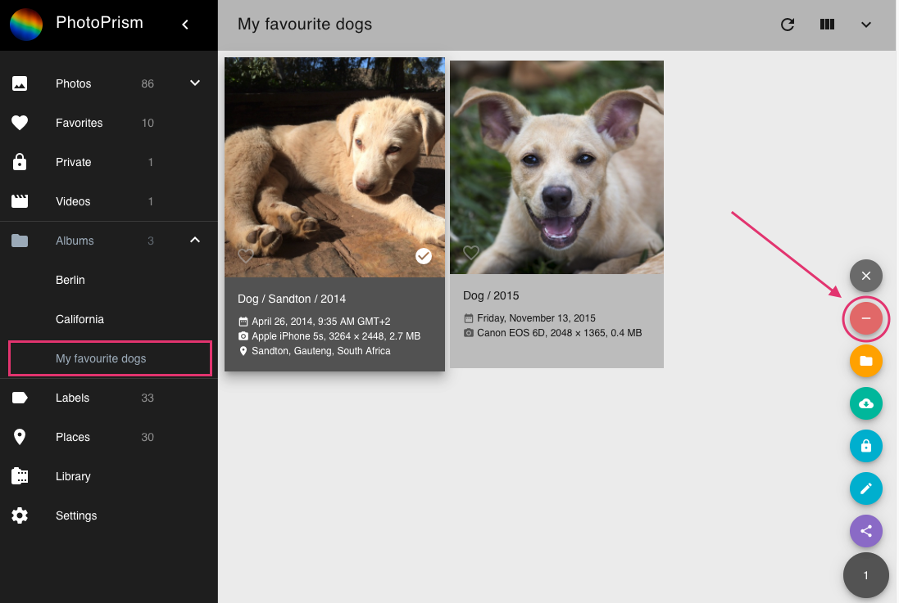

### Create a new album

1. Go to Albums.
2. In the upper right corner click add.

    
    
3. A new album with name "Month Year" is created.
4. Click on the name to edit it.

    
    
5. Press enter to save the new name.

### Add description to album

1. Go to Albums.
2. Click on the album you want to edit.

    
    
3. Click on downward arrow to expand album details.
4. Enter description.

    
    
5. Press enter to save new description.

### Add photos to album

1. Select photos and videos.
2. Click context menu.
3. Click add to album.

    
    
4. Select album.

    
    
5. Click add to album.

    

!!! tip
    You can select many photos at once using shift.

### Remove photos from album

1. Go to your album.
3. Select photos/videos you want to remove.
4. Click context menu.
5. Click remove.

    

### Share album

XXX
