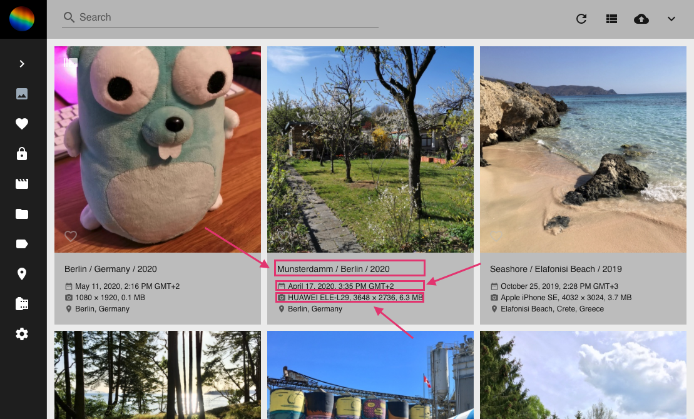
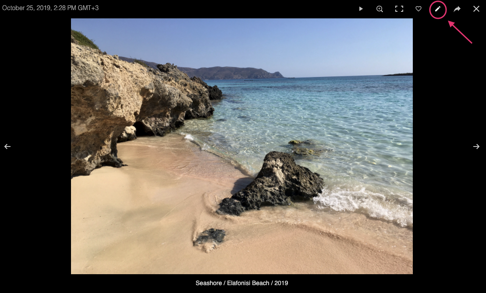
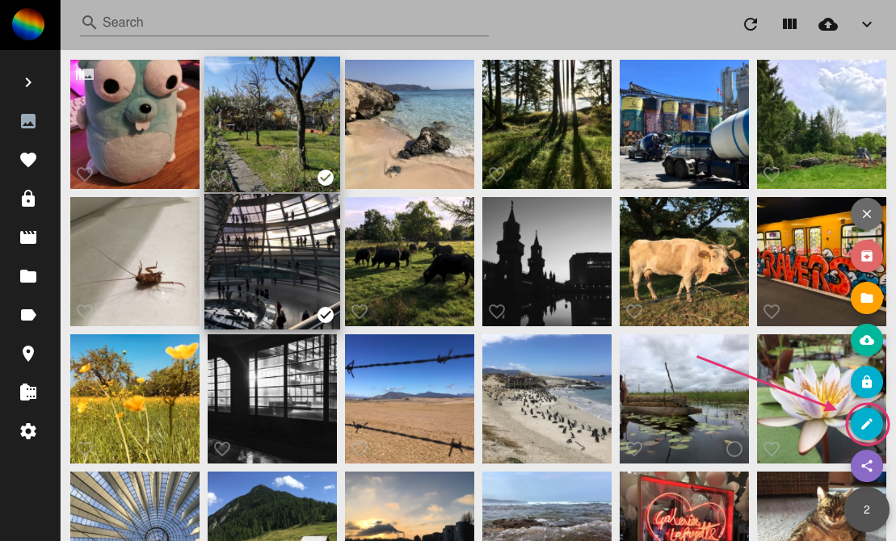
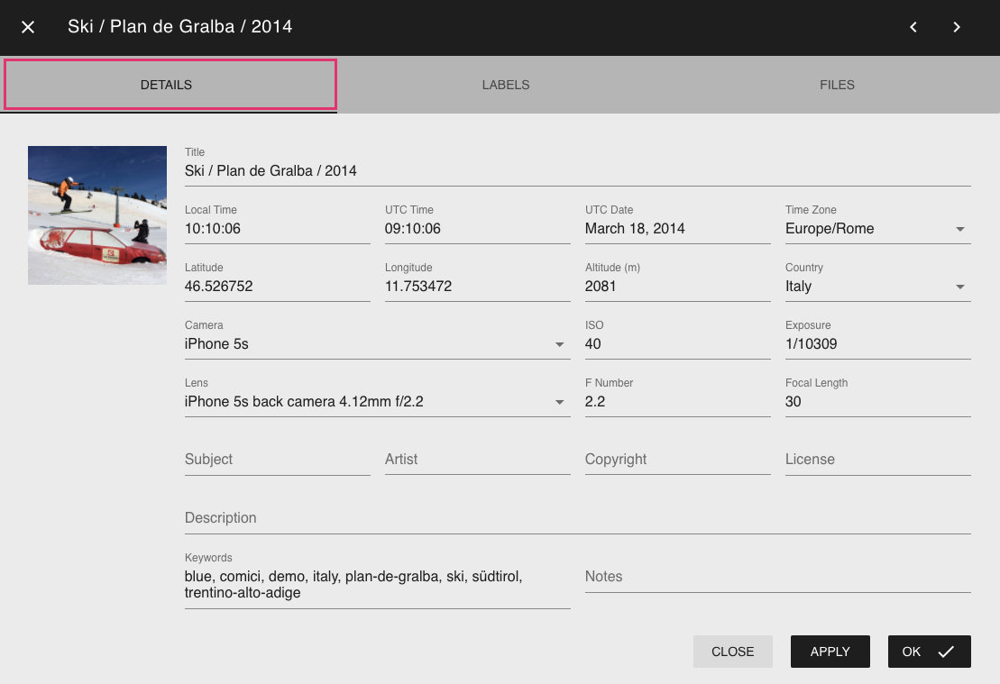
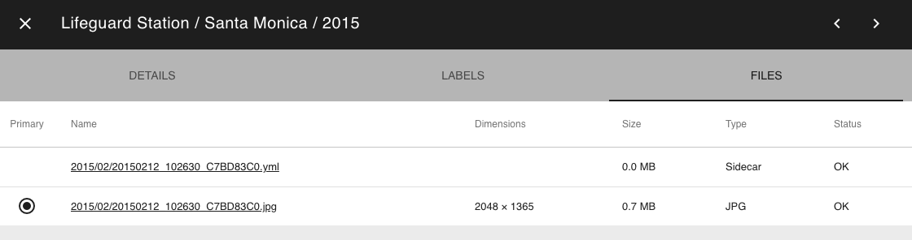
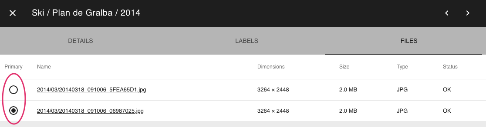

PhotoPrisms edit dialogue enables you to add/edit various types of metadata related to your photos/videos.

During [indexing](index.md) PhotoPrism collects as much data as possible from sidecar files and the photo itself.

**To open the edit dialogue from card view:**

1. Click on the photos title, time or camera information.

    

**To open the edit dialogue from full screen mode:**

1. In the upper right corner click edit.

    

**To open the edit dialogue from any view:**

1. Select one or multiple photos.
2. Click on context menu.
3. Click on edit.

### Details
In the edit dialogue's Detail tab you can view and edit the following data:

* Title
* Local time
* UTC time
* UTC date
* Time zone
* Latitude
* Longitude
* Altitude
* Country
* Camera
* ISO
* Exposure
* Lens
* F Number
* Focal Length
* Subject
* Artist
* Copyright
* License
* Description
* Keywords
* Notes

"Apply" saves changes. "Ok" saves changes and closes edit dialogue.

!!! info
    Lots of metadata like labels, keywords, title, location, camera details are generated by PhotoPrism itself during indexing. 
    Once you change data manually PhotoPrism always keeps your data even if you index again.
    
!!! tip
    Every keyword can be used in PhotoPrisms search to find photos or videos.
    
### Labels
In the edit dialogue's Label tab you can view and edit [labels](labels.md).

### Files
In the edit dialogue's Files tab you see all files that belong to a photo.

In PhotoPrism a photo can consist of multiple files like a raw file + a jpeg version of this raw file + a related xmp or json file.

In case you have "Grouped Sequentials" enabled in [settings](settings.md) you might have photos that consist of more than one JPEG file.
In this case you can decide which one to use as primary by clicking the radio button in the files table.
The primary JPEG file is used in our views.

