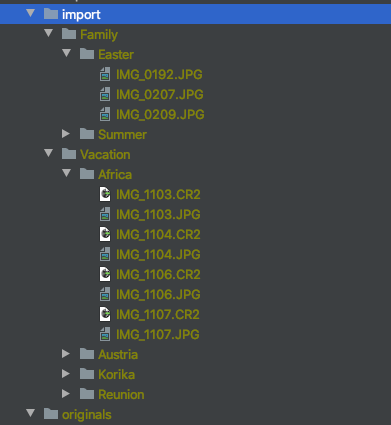
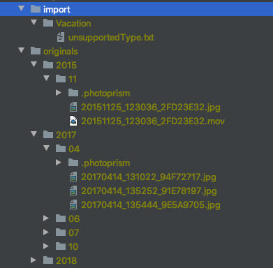

PhotoPrism provides two ways of adding photos:

The following comparison helps you decide which one is most suitable for your needs.

### Index
* You need to add your files directly to the originals folder.

It could look like this:

   
     
**During indexing:**

* Files are not renamed or moved.
* Your existing folder structure remains. You might decide to have your folders displayed as albums in PhotoPrism.
* Metadata from your files is read to create labels, titles and locations for your photos.
* Thumbnails are rendered for JPEGs.
* Optionally json and or yml files containing metadata are created

After indexing your originals folder might look like this:

  

    

#### Advantages
* You keep your existing folder structure.
* You can display your existing folder structure in PhotoPrism.

### Import and Index
* You need to add your files to the import folder. 

It could look like this:

   
   
**During import:**
 
* Files are moved or copied from import directory to originals directory.
* In the originals directory files are renamed and get a new folder structure. The original name is saved as property of the file.
* All imported files are indexed.

After import using "copy" (this is the default) your folders could look like this:

   

After import using "move" your folders could look like this:

   

#### Advantages
* You will not have duplicates or files with an unsupported type in you Originals folder. Duplicates or unsupported files stay untouched in the import directory. 

!!! info
    Original file and folder names are used to create keywords. 
    In case you import and index or only index a directory with the path "Vacation/Africa". All files from this folder get the keywords "vacation" and "africa".

### Conclusion
In case you have no organization in your existing photo collection and you assume you have many duplicates on various hard drives.
Import is the way to go. It will organize all your photos and videos due to time taken and it will avoid duplicates.

In case you have your photo collection organized nicely in folders and you prefer to keep this organization displayed in the filesystem. Index will be the right option for you.