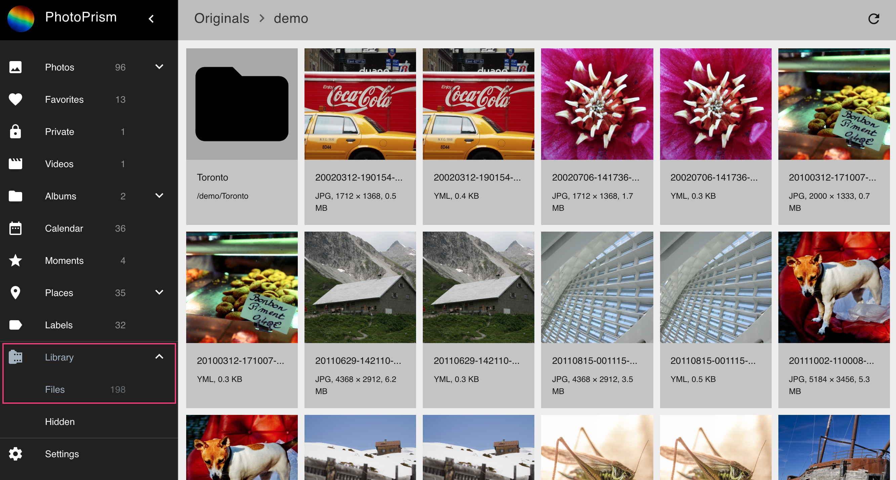

# Files #

The Files section displays the structure of your `originals` directory.

Clicking on a JPEG file opens it in fullscreen mode. 
Clicking on files other than JPEG downloads the file. 

The context menu allows you to perform the following actions:

## Download files ##
1. Select files.
2. Open context menu.
3. Click :material-download:.

## Create album from files ##
1. Select file.
2. Open context menu.
3. Click :material-folder:.
4. Select existing album or enter new album name.
5. Click Add to album.