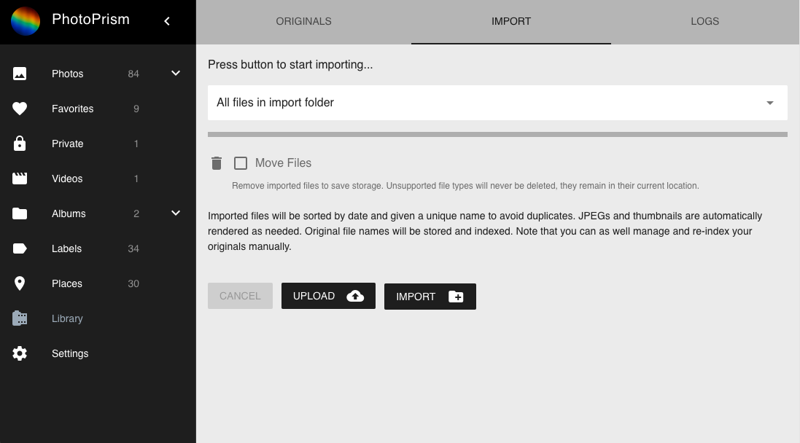

# Importing files to your library #

1. Add files to the *import* folder if not done already

2. Go to *Library* using the main navigation, and open the *Import* tab

3. Select a sub-folder or keep the default to import all files

4. Select *Move Files* if you want imported files to be removed from the *import* folder

5. Click on *Import*

!!! tip
    You may also use [WebDAV](webdav.md) for adding files to the *import* folder.
    This is especially helpful if PhotoPrism is running on a remote server.

!!! attention
    Importing is not possible in [read-only mode](../settings/library.md) as it requires
    write permissions for the *originals* folder.
    
#### When should I select "Move Files"? ####

If selected, files that have been moved to the *originals* folder, or that already exist,
will automatically be deleted from the *import* folder.
This will save storage if you don't want to keep them as backup, or for any other reason.

