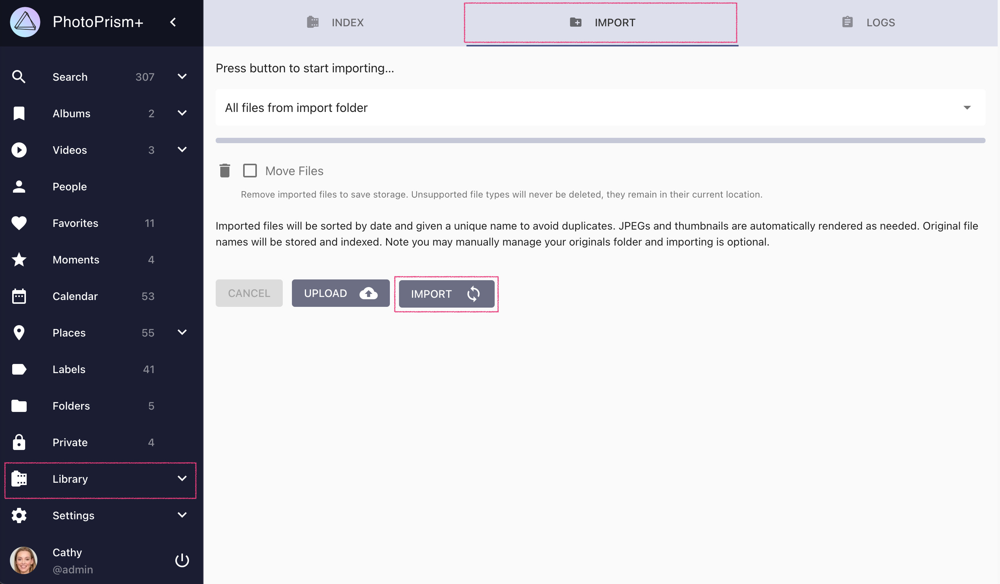

# Importing Files to Originals #

!!! tldr ""
    Most users with an existing library will want to [index their originals](originals.md) directly without using the optional import feature, leaving the file and folder names unchanged. Importing first copies or moves from their source directory to the *originals* folder, which is optional.

1. Add files to the *import* folder if not done already

2. Go to *Library* using the main navigation, and open the *Import* tab

3. Select a sub-folder or keep the default to import all files

4. Select *Move Files* if you want imported files to be removed from the *import* folder

5. Click on *Import*

{ class="shadow" }

!!! tip ""
    You may use [WebDAV](webdav.md) for adding files to the *import* folder.
    This is especially helpful if PhotoPrism is running on a remote server.

!!! attention ""
    Import is not possible in [read-only mode](../settings/library.md) because it requires [write permissions](../../getting-started/troubleshooting/docker.md#file-permissions) to the folder of *originals*.
    
#### When should "Move Files" be selected? ####

If you select this option, files that have been moved to the *originals* folder, or that already exist, will be automatically deleted from the *import* folder.
This way you save disk space if you don't want to keep them as backup or for other reasons.

#### Automatic Import ####

An import is triggered automatically when files are synced to the *import* folder [via WebDAV](../sync/webdav.md).

The default safety delay for automatic import is 3 minutes. You can change it using the [PHOTOPRISM_AUTO_IMPORT](../../getting-started/config-options.md#indexing) config option.

!!! info "Can I use PhotoPrism to sort files into a configurable folder structure?"
    You have complete freedom in how you organize your originals. If you don't like the unique names and
    folders used by the import function, you can resort to external batch renaming tools, for example:

    * [ExifTool](https://ninedegreesbelow.com/photography/exiftool-commands.html#rename)
    * [PhockUp](https://github.com/ivandokov/phockup)
    * [Photo Organizer](https://www.systweak.com/photo-organizer)

    Configurable import folders may be available in a later version. This is because - depending on the specific 
    pattern - appropriate conflict resolution is required and the patterns must be well understood and validated
    to avoid typos or other misconfigurations that lead to undesired results for which we do not want to be responsible.