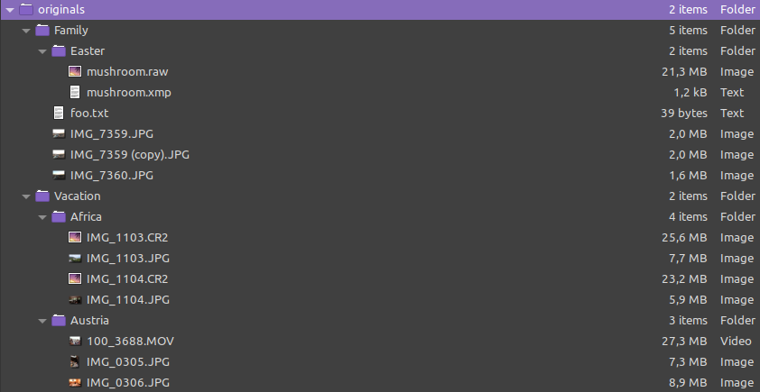
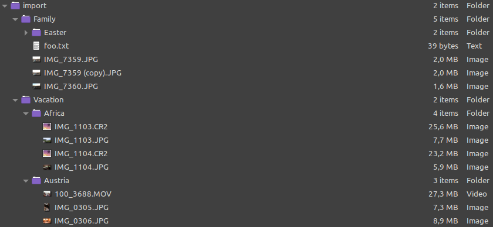
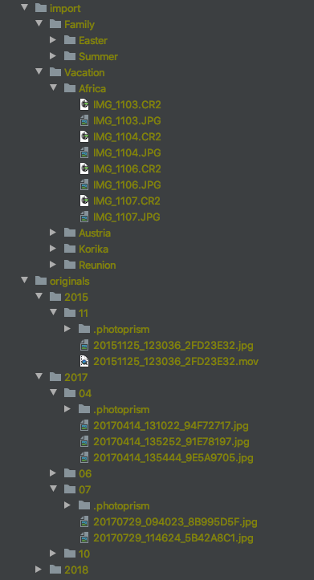

# Indexing Your Library

Most users with an existing library will want to [index their originals](originals.md) directly without using the optional import feature, leaving the file and folder names unchanged.

When [importing](import.md), files are first transferred from a temporary folder to the *originals* folder. In the process, duplicates are automatically skipped, and the imported files are given a unique file name and are sorted by year and month.

Importing is also an efficient way to add files, since PhotoPrism does not need to search your *originals* folder to find new files.

!!! info ""
    Hidden files and folders that start with a `.` or `@` are automatically ignored. Other names to be
    ignored can be added to a `.ppignore` file in the *originals* or *import* folder it should affect.
    You can put it either in the main folder or in a subfolder to limit the scope.

## Indexing Originals

Use *index* if you want to index your photos and videos directly in the *originals* folder, leaving the file and folder names unchanged.

Your folder structure in *originals* might look like this:

{ class="shadow" }
     
**During indexing:**

* files will not be renamed or moved
* your existing folder structure is preserved, so you can later choose to have your folders appear as albums
* metadata from your files is read to create captions, titles, and locations for your photos
* thumbnails and optionally JSON and/or YAML files containing metadata are created

After indexing, the *originals* folder has not been changed in any way:

{ class="shadow" }

### Advantages

* existing file and folder names remain unchanged.
* you can search your images by their current name and location
* indexing is usually faster because no files have to be copied or moved

!!! tldr ""
    You can move media files between the different directories within your *originals* folder. The indexer detects this and updates the path automatically when running the next time.

## Importing Files

*Importing* is more efficient when adding files as you don't need to re-index all originals to find new photos and videos.
[*Uploads*](upload.md) will also be treated as import, you can't directly upload to originals (yet).

Your initial folder structure in *import* might look like this:

{ class="shadow" }
   
**During import:**

* Files are copied or moved from their current directory to the *originals* folder
* duplicates are skipped automatically
* imported files are given a unique file name and are sorted by year and month
* the original file name is indexed as a file property
* all imported files are indexed, the rest remains in the import folder

After import using "copy" (this is the default) your folders could look like this:

{ class="shadow" }

After import using "move" your folders might look like this:

{ class="shadow" }

### Advantages

* unsupported files stay untouched in the import directory
* no duplicates in your originals directory

!!! info ""
    The original file and folder names are used to extract keywords. For example, when you index a folder with the path "Vacation/Africa", all files from this folder will get the keywords "vacation" and "africa".

## Conclusion

In case your picture library is not well organized and/or you have many duplicates, you may consider importing your files as this will remove duplicates. Be aware that imported files are given a unique file name and are sorted by year and month.

Provided you have a well-organized library with meaningful file and folder names, it is best to index your originals directly and leave the file and folder names unchanged.
