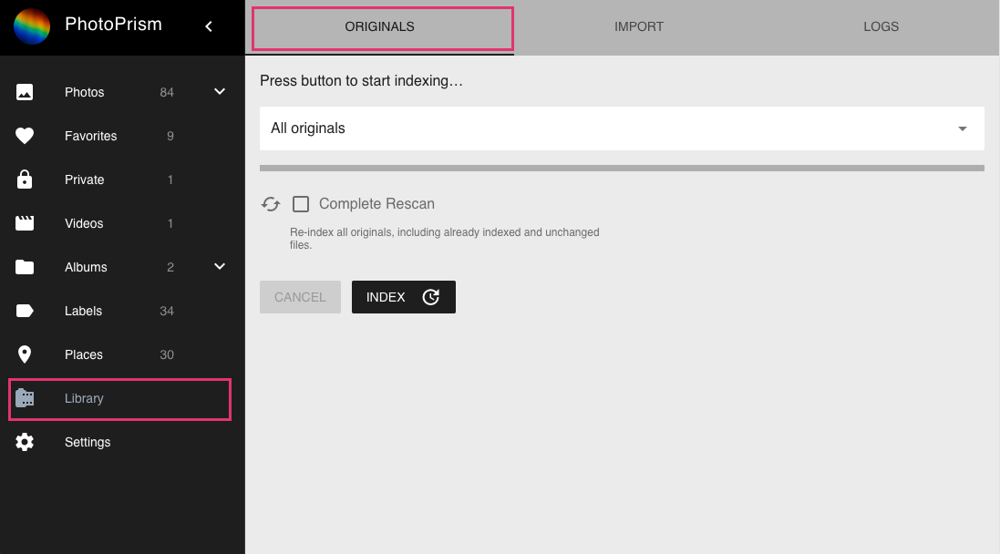

# How to index your originals #

1. Configure the `originals` path to point to your photo and video collection.
   If you start with an empty folder, you need to copy files to it first.

2. On the main navigation click Library.

3. Optionally select a sub folder you want to index.

4. Press button to start indexing.

!!! info
    You can add photos to your `originals` folder in the file system or using [WebDav](webdav.md).

### Index options ###
#### Complete rescan ####
All files are indexed again.
In case this option is not selected only new or changed files will be indexed.

!!! tip 
    NSFW detection can be enabled (`detect-nsfw`) to flag images that may have offensive content (`nsfw` search filter).
   

