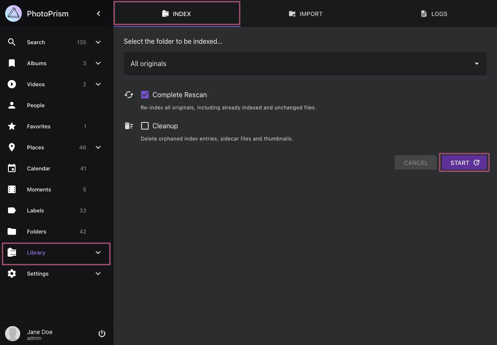

# Indexing Your Originals #

!!! note ""
    When using PhotoPrism for the first time, please make sure that the directory containing your photo and video collection has been [configured as *originals* folder](../../getting-started/docker-compose.md#photoprismoriginals), and that the library settings match [your individual preferences](../settings/library.md).

## Manual Indexing

1. Go to *Library* using the main navigation

2. Select a sub-folder or keep the default to index all files

3. Select *Complete Rescan* to re-index all originals, including already indexed and unchanged files

4. Press *Start* to start indexing

{ class="shadow" }

!!! info ""
    You can use [WebDAV](webdav.md)-compatible apps, including Microsoft's Windows Explorer and Apple's Finder,
    to add files to your *originals* folders from a remote computer or mobile device.

!!! tip "NSFW"
    An NSFW detector can be enabled to automatically mark images with potentially objectionable content as
    private. Note that this feature is only partially reliable.

    Images that have already been indexed before the NSFW detector is activated will not be scanned by the detector.

### When should "Complete Rescan" be selected?

If you select this option, all files in the *originals* folder will be re-indexed, including already indexed and unchanged files.

We recommend performing a complete rescan after major updates to take advantage of new search filters and sorting options. Be sure to [read the notes for each release](../../release-notes.md) to see what changes have been made and if they might affect your library, for example, because of the file types you have or because new search features have been added. If you encounter problems that you cannot solve otherwise (i.e. before reporting a bug), please also try a rescan and see if it solves the problem.

!!! tldr ""
    Manually entered information such as labels, people, titles or captions will not be modified when indexing, even if you perform a "complete rescan".

### Cleanup Option

Admins can optionally enable the cleanup option to delete unused thumbnails from the cache folder and remove orphaned index entries. If you do this from time to time, it can speed up indexing and reduce storage usage.

## Scheduled and Automatic Indexing

[PhotoPrism 240523-923ee0cf7](../../release-notes.md#may-23-2024) and newer versions can optionally perform scheduled rescans of your library. This feature can be enabled by [setting a schedule in your configuration](../../getting-started/config-options.md#indexing). If you are using an external scheduler, please be careful not to start several indexing processes at the same time, as this not only causes a high server load, but may also lead to unexpected indexing results.

By default, a library rescan is also triggered automatically after a safety delay of 5 minutes when *originals* are [added or modified via WebDAV](../sync/webdav.md). You can change the safety delay or disable this feature through the [`PHOTOPRISM_AUTO_INDEX`](../../getting-started/config-options.md#indexing) config option.

!!! tldr ""
    Be aware that automatic indexing may cause files or sets of files to be incompletely indexed if you are using a slow or unreliable internet connection, which is of particular concern with [large video or RAW files](https://github.com/photoprism/photoprism/issues/4310).

## Free Storage Threshold

To prevent the *storage* volume from filling up completely — which can interrupt operation and cause errors or data loss — PhotoPrism can pause indexing, [importing](import.md), and [uploads](upload.md) when free disk space falls below a configured threshold.

This runtime check is **disabled by default**, because the underlying probe cannot reliably report free space on some filesystems — for example network mounts, FUSE layers, and container overlays — where a false low reading would wrongly block writes. Any [storage limit configured with `PHOTOPRISM_FILES_QUOTA`](../../getting-started/config-options.md#storage) continues to be enforced regardless.

To enable the check, set the [`PHOTOPRISM_STORAGE_FREE`](../../getting-started/config-options.md#storage) config option (or the `--storage-free` command flag) to the minimum free space you want to keep available, expressed as a percentage of the total storage capacity:

- `-1` (the default) disables the check entirely.
- A value between `1` and `99` enables the check at that percentage.
- `0` or any value of `100` or more uses the built-in default of **1% of the total capacity**.

When the check is enabled, an absolute floor of **100 MB** of free space also applies, whichever threshold is reached first. A warning is then written to the logs and the affected operation is skipped until enough space is available again; the check is re-evaluated automatically as soon as space is freed.

!!! warning ""
    For safety reasons, this threshold can only be changed by server administrators through the configuration and is intentionally not exposed in the app settings. We recommend enabling the check on filesystems where free space can be read reliably, as a full disk can interrupt operation and lead to data loss.

## Ignoring Files and Folders

Hidden files and folders that start with a `.`, `@`, `_.`, or `__` like `__MACOSX` will be automatically ignored when indexing your library.

Other file and folder names that should be ignored can be added to a `.ppignore` file in the *originals* or *import* folder, e.g.:

```
# ignore a directory by its name
foo
# ignore all folders starting with a #
[#]*
# ignore all files
*.*
# ignore all files with gif extension
*.gif
# ignore videos which name start with MVI
MVI_*.MOV
# or
MVI_*.*
```

Ignore files can be placed either in the main directory or in a subfolder to limit their scope, as only matching files in the same directory and any subdirectories will be ignored. To match specific file extensions or other naming patterns, `*` can be used as a wildcard.

Note that files and folders that have already been indexed cannot be retroactively removed from the index with a `.ppignore` file, i.e. they remain indexed and visible in the user interface, even if you later add their name or a matching name pattern.

Also note that already indexed files may still remain part of a [stack](../organize/stacks.md) if a related file with the same name but a different extension exists and is not ignored, e.g. an already indexed `.raw` file may still appear in a stack with its corresponding `.jpg` file after you add a `.ppignore` rule.

!!! tldr ""
    If you are a new user and files or folders have already been indexed, it is generally easiest to reset the database and start with a new index by running `photoprism reset` in a [terminal](../../getting-started/docker-compose.md#command-line-interface).
