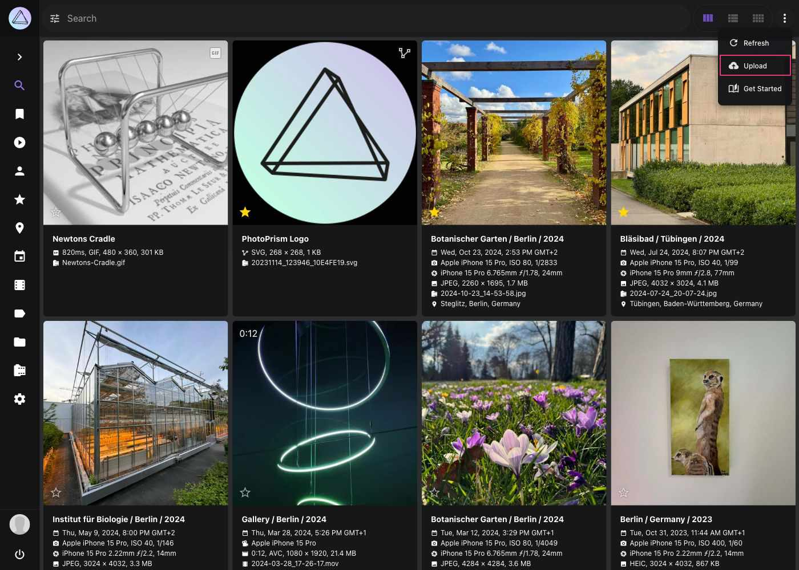
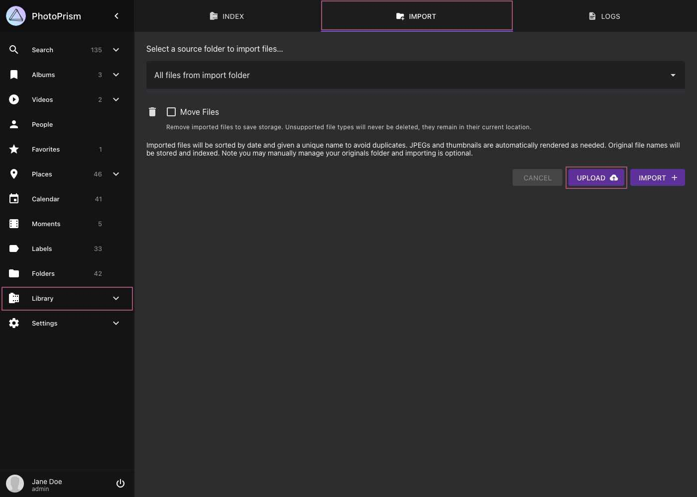

# File Upload Using the Web UI #

The Upload dialog supports drag-and-drop: drop one or many files (or whole folders) onto the upload area, or click it to open the system file picker. Staged files are listed with their sizes, and the action button is disabled until at least one file has been added.

!!! tip "Keyboard Shortcut"
    You can quickly open the upload dialog by pressing **Ctrl + U** from anywhere in the application.

=== "From Toolbar"

    1. Click :material-dots-vertical: in the upper right corner
    2. Click :material-cloud-upload: in the menu that appears

         { class="shadow" }

    3. In case you want to upload the files directly to an album select one

    4. Drag files onto the upload area, or click it to open the file picker

         <!-- TODO: replacement for upload-to-album-2503.jpg -->
         { class="shadow" }

    5. Confirm the selection and click *Upload*

=== "From Library"

    1. Go to *Library* using the main navigation, and open the *Import* tab

    2. Click *Upload*

         { class="shadow" }

    3. In case you want to upload the files directly to an album select one

    4. Drag files onto the upload area, or click it to open the file picker

         <!-- TODO: replacement for upload-to-album-2-2502.jpg -->
         { class="shadow" }

    5. Confirm the selection and click *Upload*

!!! info "Preserve Original Format When Uploading on iOS"
    iOS may convert photos and videos to a more compatible format **before** they are uploaded via Safari or the PhotoPrism PWA, so PhotoPrism will receive and store the already converted files.

    To preserve the original format:

    - In the iOS Photos picker, tap the three-dot menu (…) → *Options* → set **Format** to **Current** instead of **Automatic** so your files are uploaded in the original format.
    - Alternatively, use dedicated sync apps like [PhotoSync](../sync/mobile-devices.md#using-photosync), which can upload files in their original format via WebDAV.

