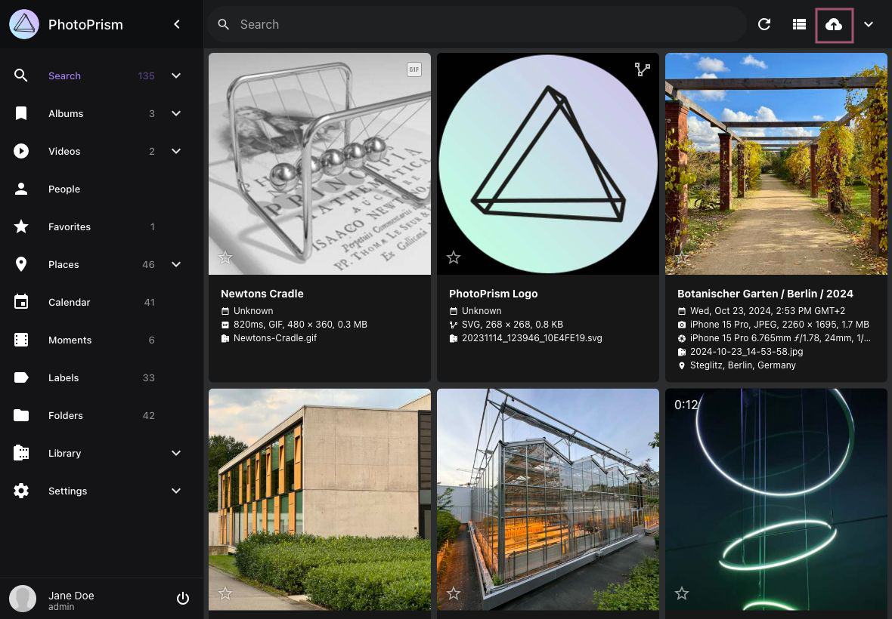
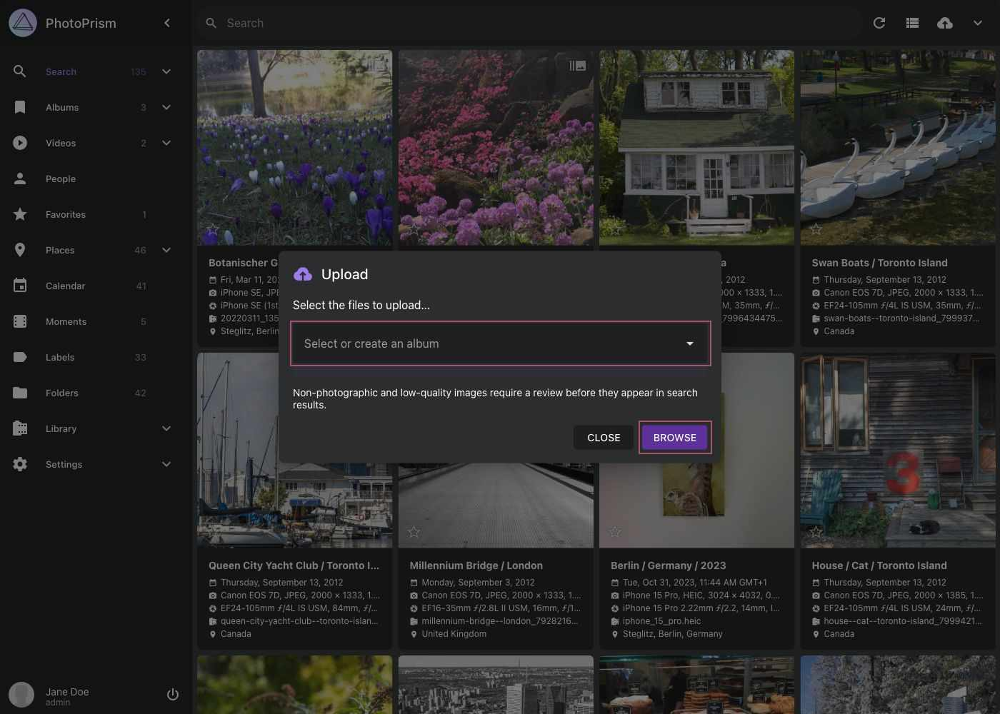

# File Upload Using the Web UI #

=== "From Toolbar"

    1. Click :material-cloud-upload: in the upper right corner

         { class="shadow" }

    2. In case you want to upload the files directly to an album select one

    3. Click *Browse*

         { class="shadow" }

    4. Select files

=== "From Library"

    1. Go to *Library* using the main navigation, and open the *Import* tab

    2. Click *Upload*

         { class="shadow" }

    3. In case you want to upload the files directly to an album select one

    4. Click *Browse*

         { class="shadow" }

    5. Select files

