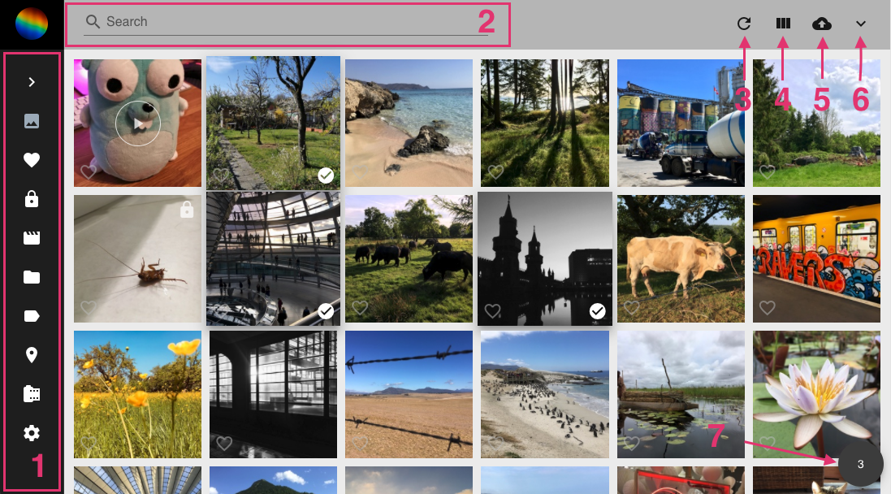
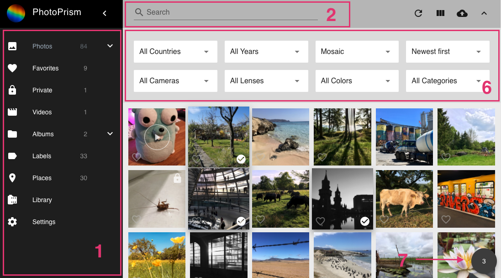
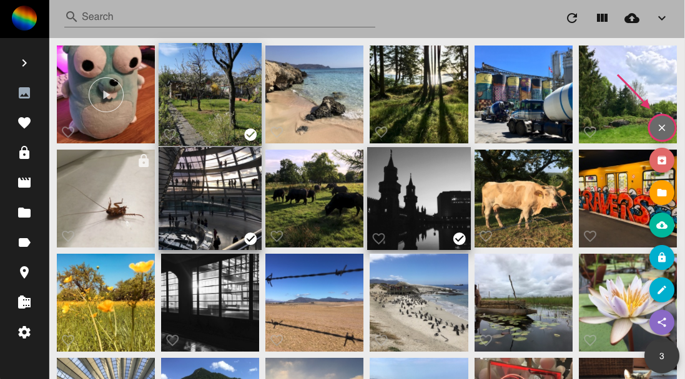

Photo and video search is based on the following components. Note that all pages are fully responsive, 
our screenshots show the user-interface in a desktop browser with medium resolution.

#### 1. Main Navigation ####

Located on the left, minimized on mobile devices.
Click on the links to switch between different pages like Photos, Albums, Places, or Settings.

#### 2. Toolbar ####

Located on the top. Find photos or videos by entering search terms like `cats` and filters like `label:cat`.

#### 3. Reload Button ####

:material-refresh: reloads search results without reloading the full page.

#### 4. View Button ####

Click to switch to a different search result view (cards: :material-view-column:, mosaic: :material-view-comfy:, or list: :material-view-list:).

#### 5. Upload Button ####

:material-cloud-upload: opens the upload dialog. Available on most pages, unless read-only mode is enabled or upload is disabled in [Settings](settings/ui.md).

#### 6. Expanded Toolbar ####

The expanded toolbar contains additional options and search filters for country, year, month, camera, color, and category.

#### 7. Context Menu ####

When photos or videos are selected, the context menu appears in the lower right corner. 
The number displayed is the count of currently selected items.
It also contains the following buttons:

* :material-archive-arrow-down: Archive photos
* :material-folder: Add photos to album
* :material-download: Download photos
* :material-lock: Mark photos as private
* :material-pencil: Open edit dialogue
* :material-share: Share photos

To unselect all items, click the cross at the top:

