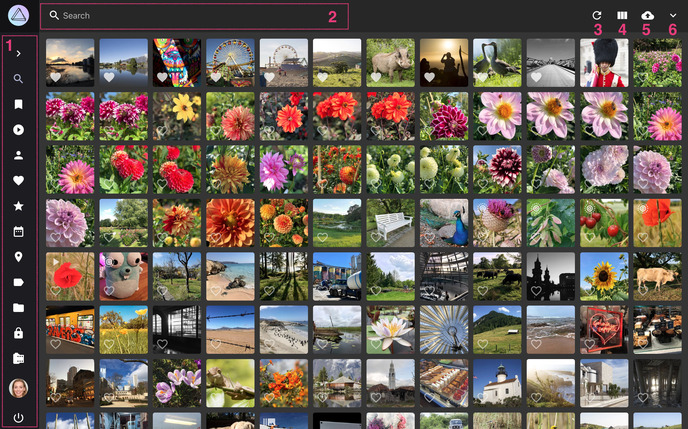
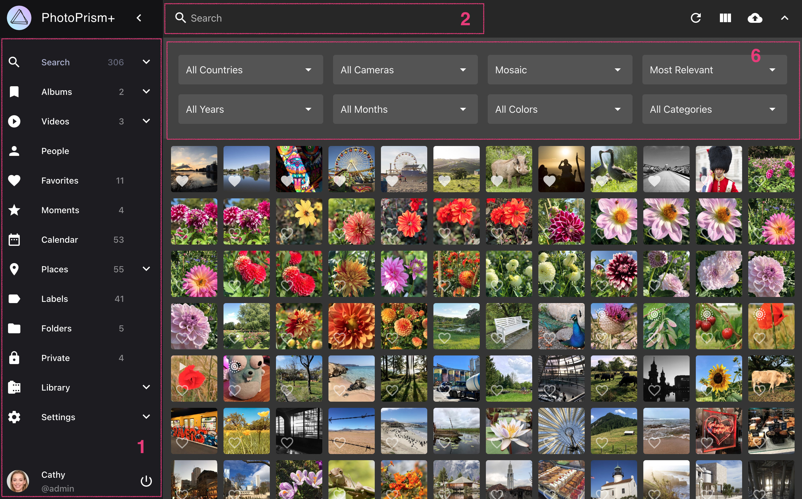
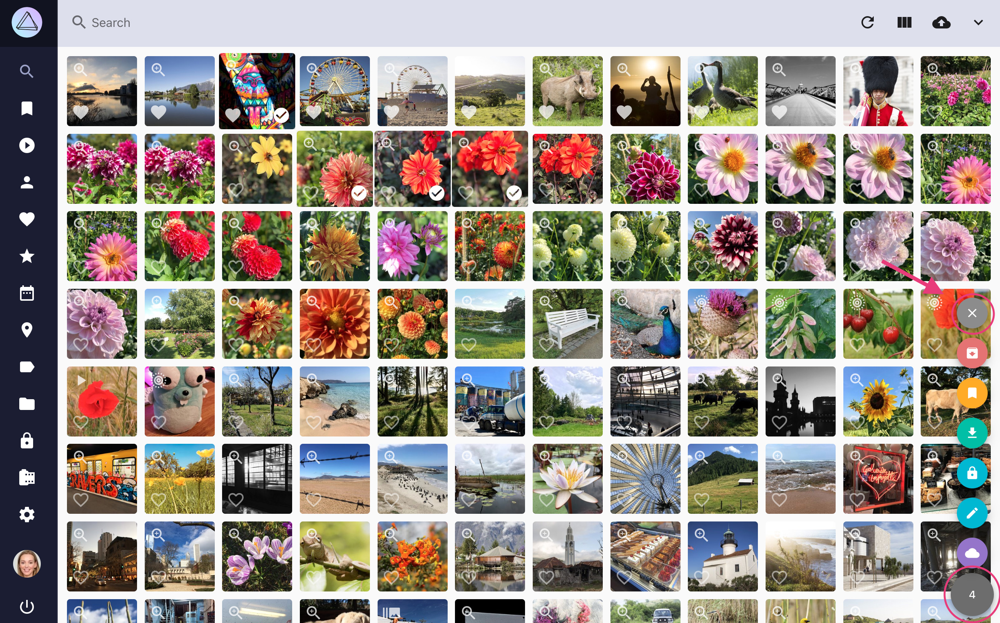

# Navigating the User Interface

The user interface for browsing and searching your pictures is based on the following components. Screenshots in this documentation generally show pages in a medium-resolution desktop browser. All pages are fully responsive, so they may look different on mobile devices.

{ class="shadow" }

{ class="shadow" }

#### 1. Main Navigation ####

Located on the left, minimized on mobile devices.
Click on the links to switch between different pages like Photos, Albums, Places, or Settings.

#### 2. Toolbar ####

Located on the top. Find photos or videos by entering search terms like `cats` and filters like `label:cat`. A list with possible search filters can be found [here](search/filters.md).

#### 3. Reload Button ####

:material-refresh: reloads search results without reloading the full page.

#### 4. View Button ####

Click to switch to a different search result view (cards: :material-view-column:, mosaic: :material-view-comfy:, or list: :material-view-list:).

#### 5. Upload Button ####

:material-cloud-upload: opens the upload dialog. Available on most pages, unless read-only mode is enabled or upload is disabled in [Settings](settings/general.md).

#### 6. Expanded Toolbar ####

The expanded toolbar contains additional options and search filters for country, year, month, camera, color, and category.

#### 7. Context Menu ####

When photos or videos are selected, the context menu appears in the lower right corner. 
The number displayed is the count of currently selected items.
It also contains the following buttons:

* :material-archive-arrow-down: Archive photos
* :material-bookmark: Add photos to album
* :material-cloud-download: Download photos
* :material-lock: Mark photos as private
* :material-pencil: Open edit dialog
* :material-share-variant: Share photos

To unselect all items, click the cross at the top:

{ class="shadow" }

## Selection Mode and Multi-Select ##
### Desktop ###
Select the first photo by clicking :material-checkbox-blank-circle-outline: in the lower right corner.

PhotoPrism is now in selection mode.

- To select more single images, click anywhere on the photo
- To select multiple photos at once, press shift+click. All photos between the last selected photo and the photo you shift+click will be selected.

### Mobile ###
Select the first photo with a long click.

PhotoPrism is now in selection mode.

- To select additional single images use a normal click
- To select multiple photos at once, do a long click. All photos between the last selected photo and the photo you long-click will be selected.