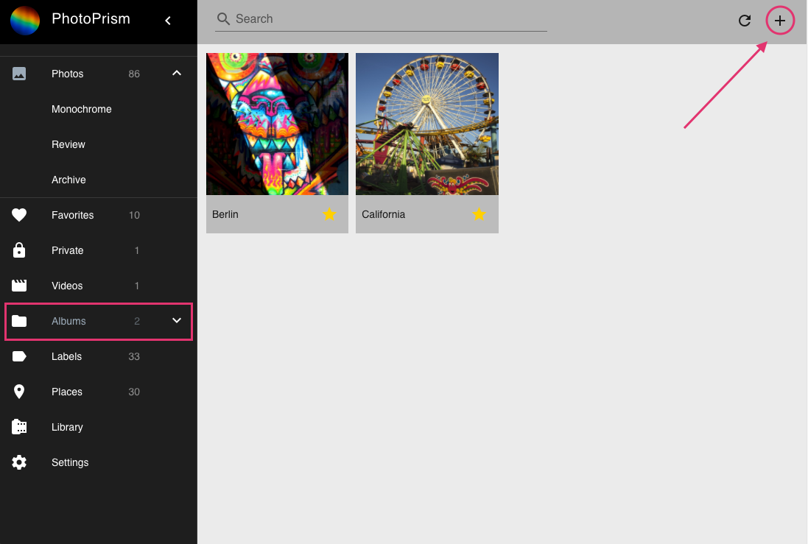
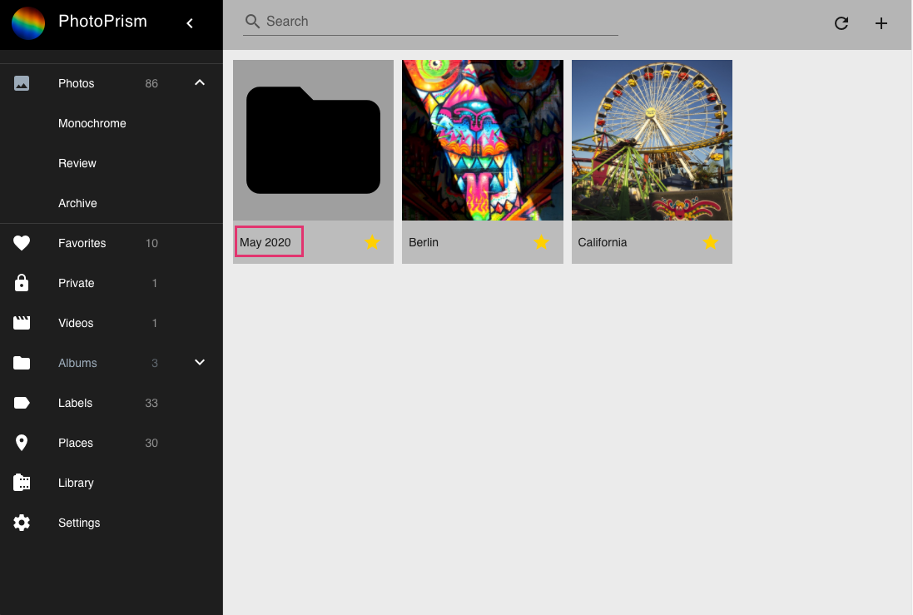
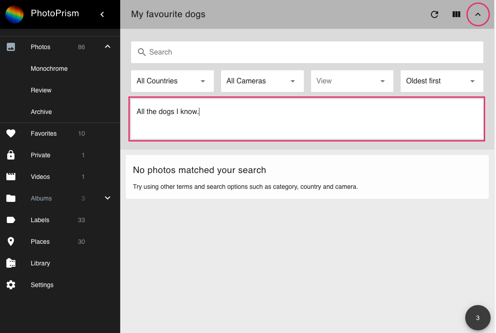
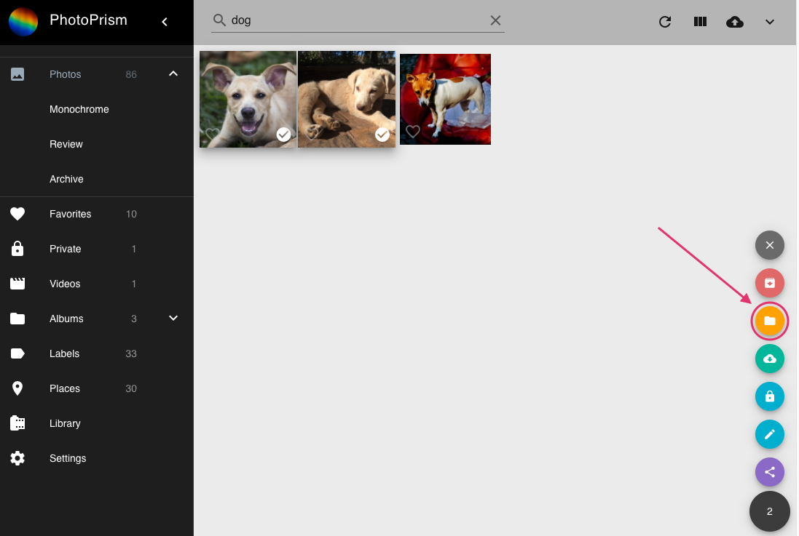

# Albums #
### Create a new album ###

1. Go to Albums.
2. In the upper right corner click :material-plus:.

    
    
3. A new album with name "Month Year" is created.
4. Click on the name to edit it.

    
    
5. Press enter to save the new name.

### Edit album ###

1. Go to Albums.
2. Click on the album you want to edit.

    
    
3. Click on :material-chevron-down: to expand album details.
4. Enter description or category.

    
    
5. Press enter to save new description.

### Add photos to album ###

1. Select photos and videos.
2. Click context menu.
3. Click :material-folder:.

    
    
4. Select album.

    
    
5. Click add to album.

    

!!! tip
    You can select many photos at once using shift.

### Remove photos from album ###

1. Go to your album.
3. Select photos/videos you want to remove.
4. Click context menu.
5. Click :material-minus:.

    

