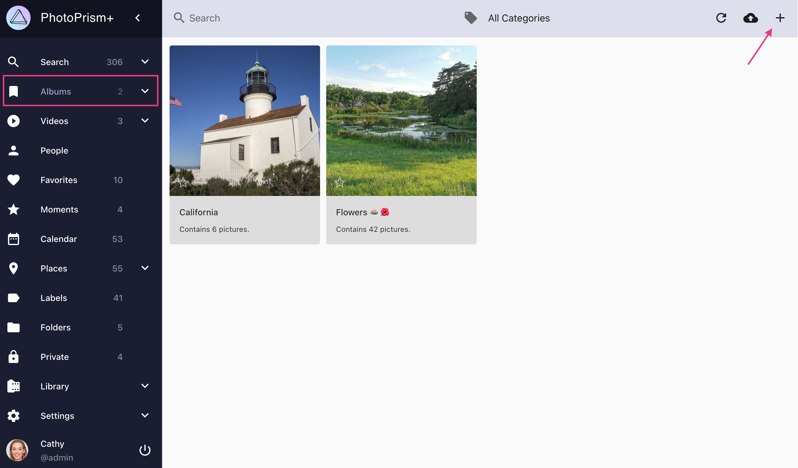
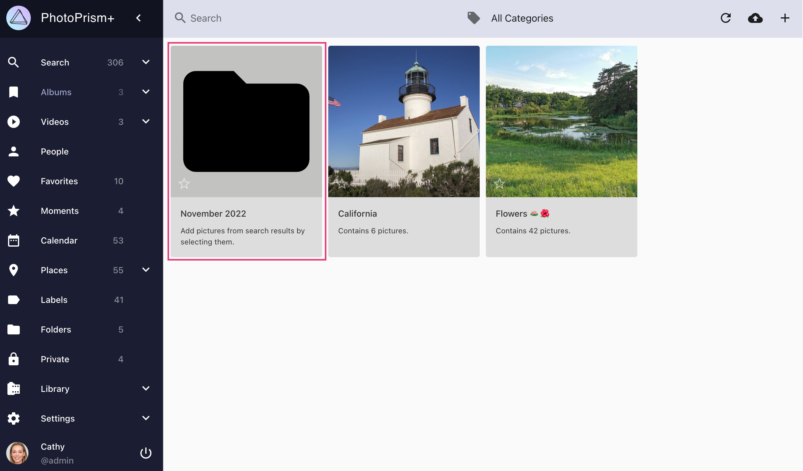
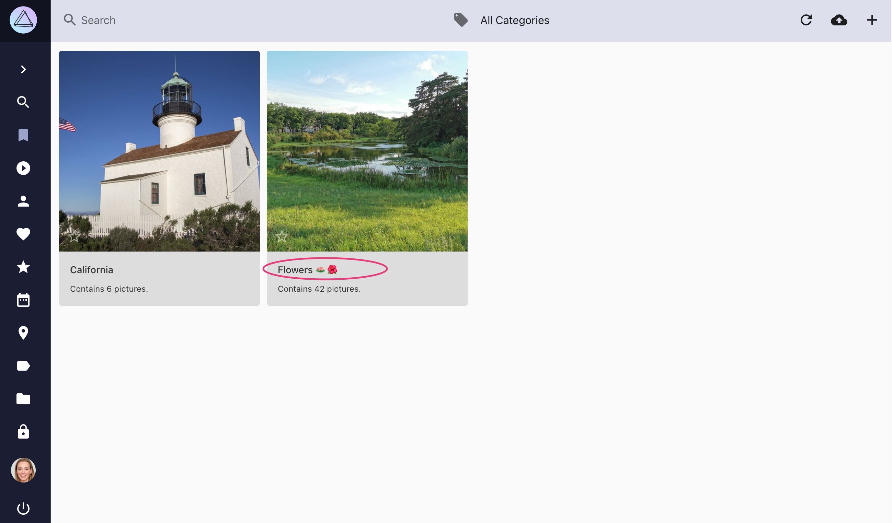
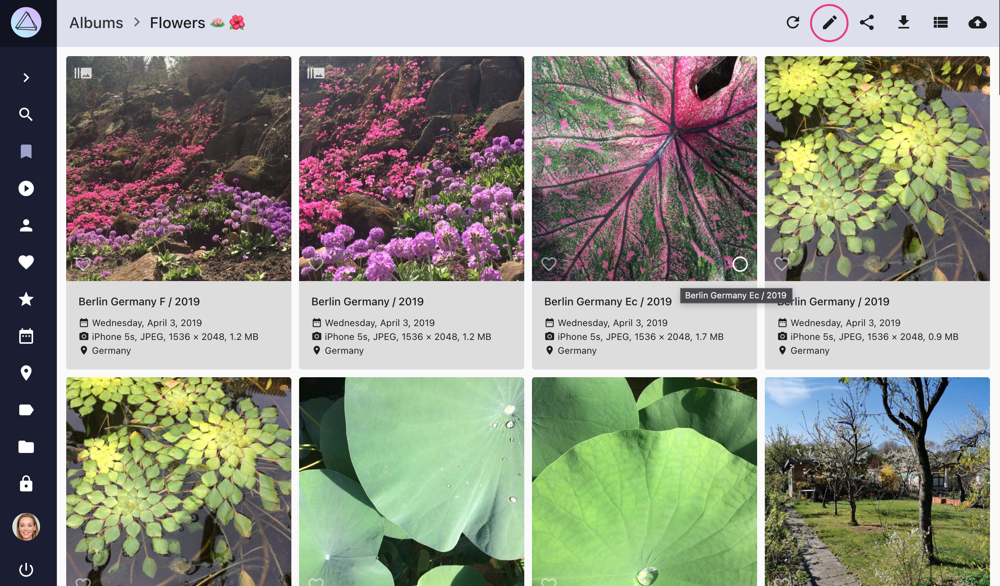
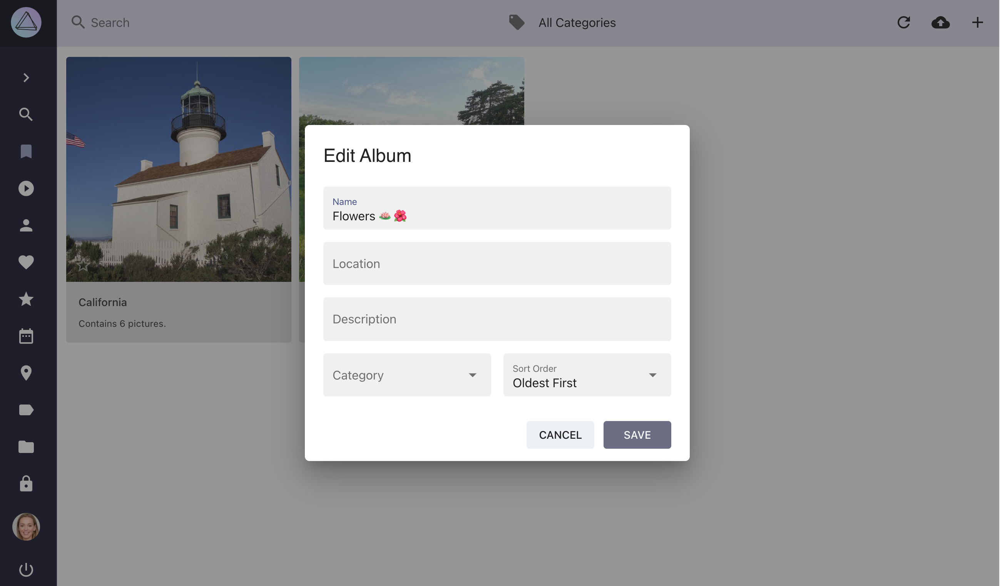
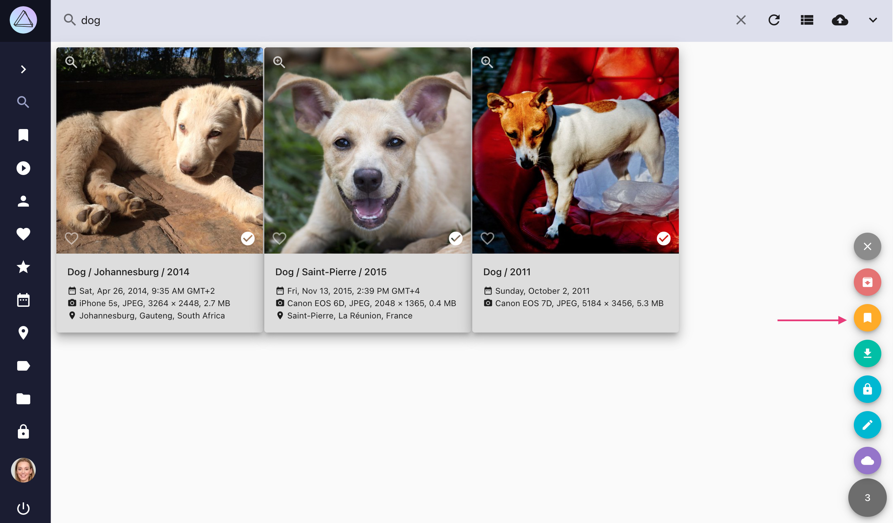
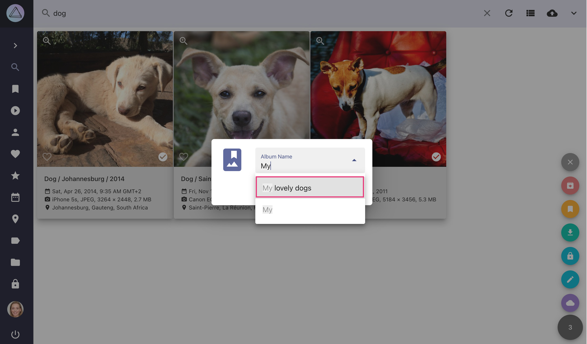
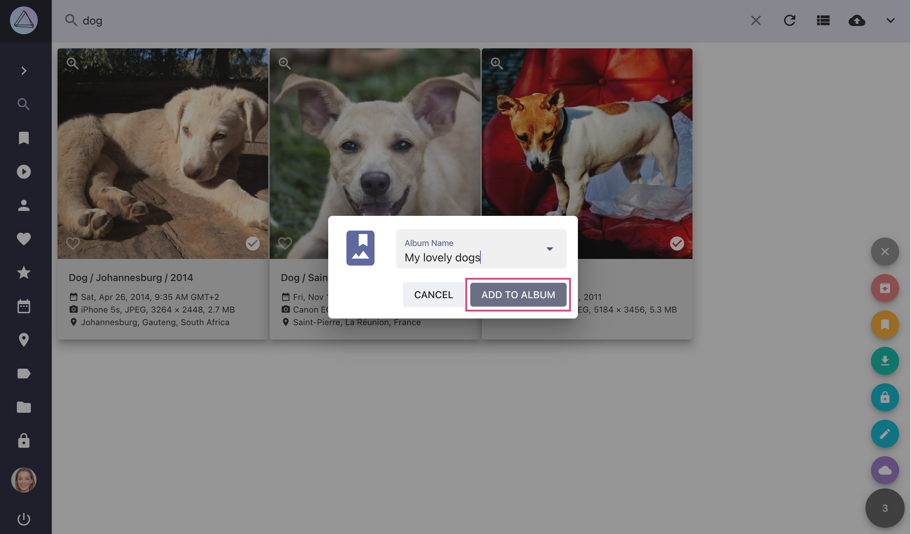
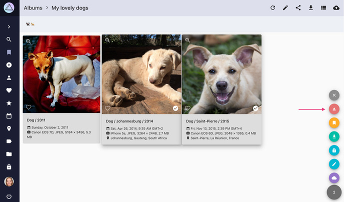

# Albums #
### Create New Album ###

1. Go to *Albums*
2. In the upper right corner click :material-plus:

    { class="shadow" }
    
3. A new album with name "Month Year" is created

    { class="shadow" }

### Edit Album Details ###
Go to *Albums* and open the *album edit dialog*
  
=== "From Title"
      Click on the *album title*
      { class="shadow" }
   
=== "Context Menu"
      Select album, open context menu and click :material-pencil:
    
       
   
=== "Album Toolbar"
       Open album and click :material-pencil: in the upper right corner
    
       

Edit album details and click *save*

{ class="shadow" }
    

### Add Photos to Album ###

1. Select photos and videos
2. Click context menu
3. Click :material-bookmark:

    { class="shadow" }
    
4. Select album

    { class="shadow" }
    
5. Click *add to album*

    { class="shadow" }

!!! tip ""
    You can select many photos at once using shift.

### Remove Photos from Album ###

1. Go to your album
3. Select photos/videos you want to remove
4. Click context menu
5. Click :material-eject:

    { class="shadow" }

