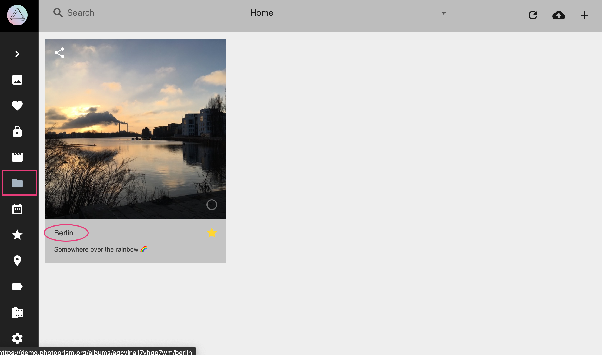
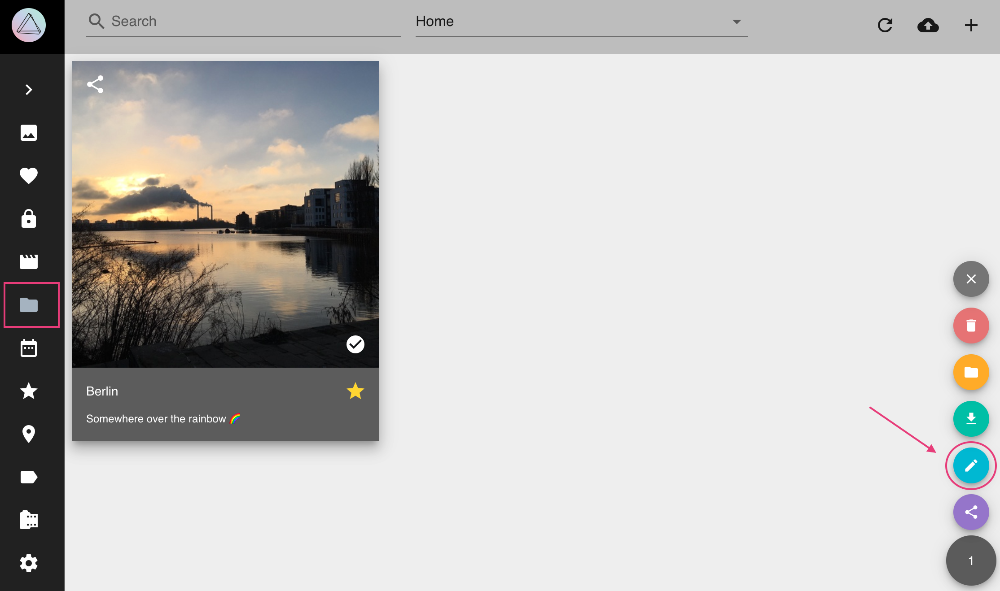
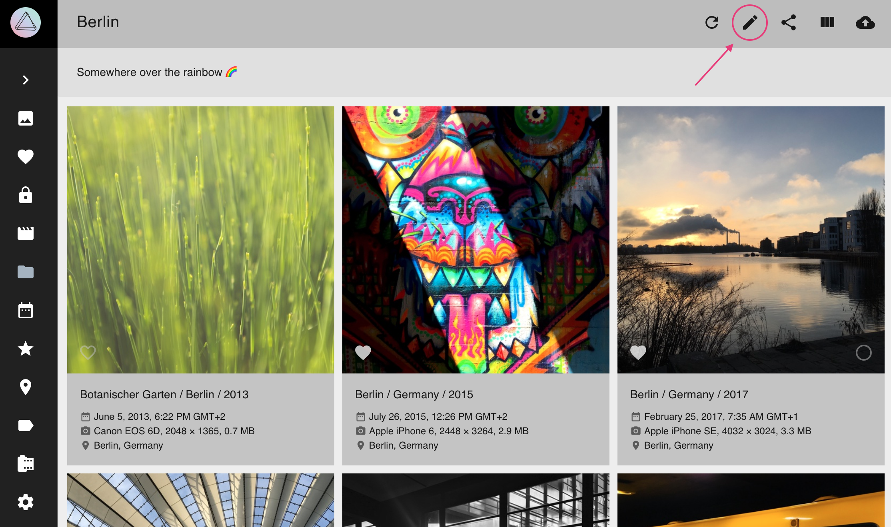
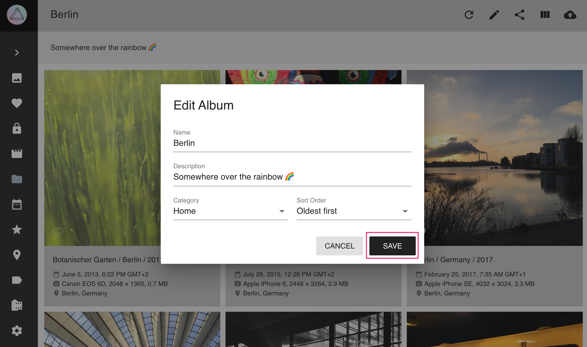

# Albums #
### Create New Albums ###

1. Go to *Albums*
2. In the upper right corner click :material-plus:

    
    
3. A new album with name "Month Year" is created

    

### Edit Albums ###

1. Go to *Albums*
2. To open the *album edit dialogue* click on the *album title*

    
    
    OR
    
    Select album, open context menu and click :material-pencil:
    
    
    
    OR
    
    Open album and click :material-pencil: in the upper right corner
    
    
    
3. Edit album details and click *save*

    
    

### Add Photos to Albums ###

1. Select photos and videos
2. Click context menu
3. Click :material-bookmark:

    
    
4. Select album.

    
    
5. Click *add to album*

    

!!! tip
    You can select many photos at once using shift.

### Remove Photos from Albums ###

1. Go to your album
3. Select photos/videos you want to remove
4. Click context menu
5. Click :material-minus:

    

