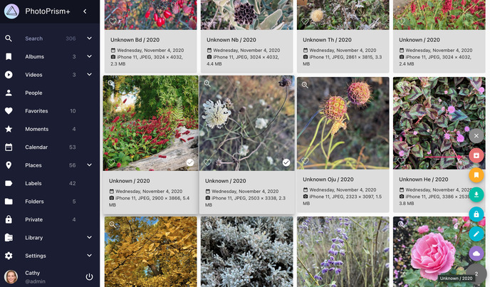
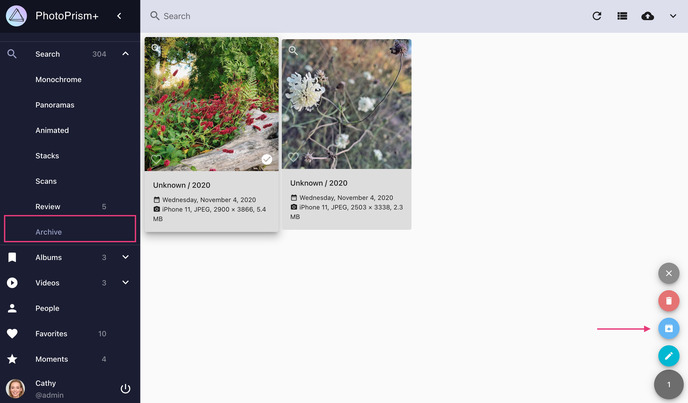

# Archive #
You can move photos and videos you do not want to keep in your collection to *Archive*.
Content that is archived is not deleted but it will not appear in any section apart from *Archive*.

### Archive Photos ###

1. Select photos/videos
2. Click context menu
3. Click :material-archive-arrow-down:
   
    { class="shadow" }
    
    <!---->

### Restore Photos from Archive ###

1. Go to *Archive*
2. Select photos/videos
3. Click context menu
4. Click :material-archive-arrow-up:

    { class="shadow" }

