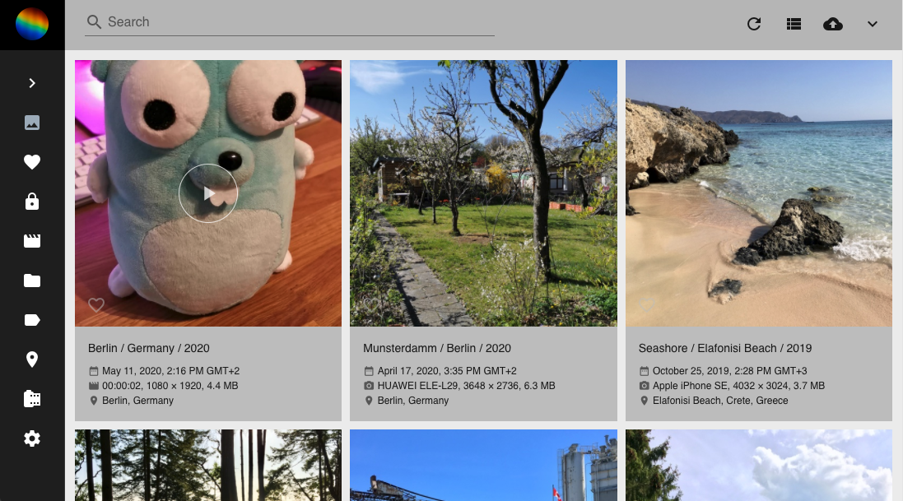
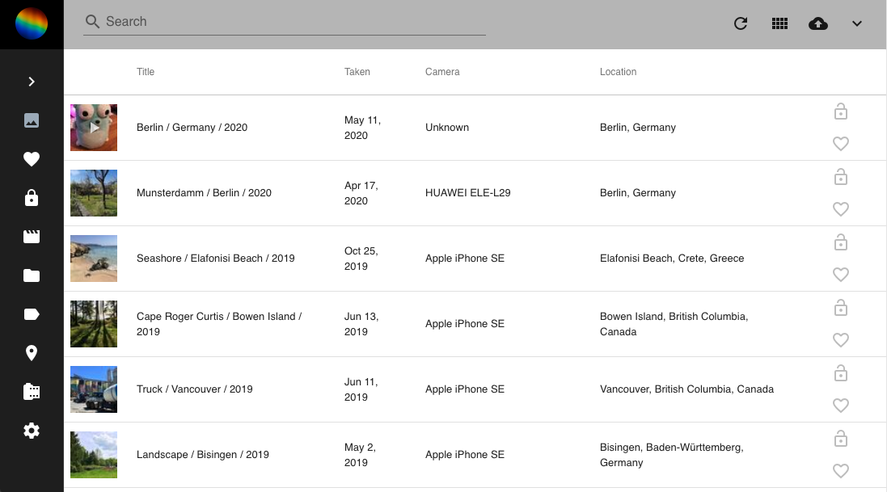

# Browse through your photo collection #
PhotoPrisms photo/video views are a nice way for you to browse through your photo collection.
They enable you to re-discover forgotten photos, find specific photos you are looking for or organize your photos.

### Sections ###
Using the main navigation you can visit the different sections of your photo library:

#### Photos ####
:material-image: shows all photos that are not in review or archived or private.

!!! hint
    In case the review, private or archive functions are turned off - Photos displays those photos as well.
    

#### Favorites :material-heart: ####
Shows all photos and videos you liked.

#### Private :material-lock: ####
Shows photos and videos marked as private.

#### Videos :material-movie: ####
Shows videos that are not in review or archived or private.

#### Albums :material-folder: ####
Shows albums you created.

#### Labels :material-label:####
Shows your photos and videos grouped by labels like cat, dog or beach.

#### Places :material-map-marker: ####
Displays all photos and videos with location information on a worldmap.

#### Moments :material-star: ####
Discover albums we automatically create for you.

#### Calendar :material-calendar-range: ####
Organizes your photos due to time taken.

### Search ###
In all sections you can use the search bar to find certain photos, videos, albums or labels.

You can search for all kind of things:

* Objects that are displayed on the photo
* The main color of the photo
* The filename or foldername of a photo
* Location where the photo has been taken
* ...

Just try it!

   

!!! tip
    In case you want to search for multiple things at once, enter the terms separated by a space.
    
    A search for `cat blue berlin` will find all photos that either display a cat, have blue as main color or have been taken in Berlin.

### Filters ###
Additionally to the search you can set filters for:

* Country
* Year
* Order
* Camera
* Lens
* Color
* Category

In case you set multiple filters only photos are shown in the search result that fulfill all filter criteria.

 

!!! tip
    You can use filters as well in the search bar like this:
    
    `label:cat`
    `color:green`
    `type: live`
    
    You find the full list of filters [here](search.md).
    
   
    
### Views ###
PhotoPrism provides you three beautiful views to enjoy your photos and videos.

* The card view displays important metadata like title, time and location next to the photos.
    
* The mosaic view lets you enjoy your photos without distraction.
    
* The list view provides you photos and metadata in a  well-arranged list.
    

To switch between views you can either use the filter in the filter bar or the view button (:material-view-column:, :material-view-comfy:, :material-view-list:) in the upper right corner.

Additionally you can open your photos/videos in fullscreen mode and start a slideshow (:material-play:).

