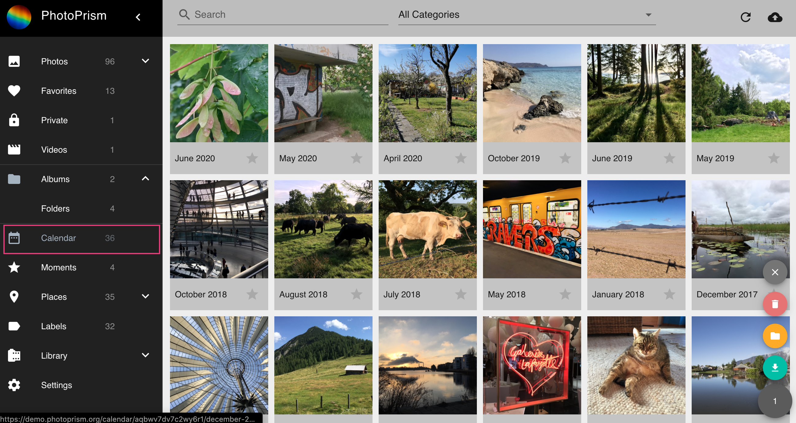

# Calendar #

Our *Calendar* enables you to browse through your photos by year and month.

{ class="shadow" }

The context menu allows you to perform the following actions:

<!--## Remove Months ##
1. Select month
2. Open context menu
3. Click :material-delete:
4. Confirm

!!! hint ""
    Only the representation of the month will be deleted. Your files stay untouched.-->

## Download Months ##
1. Select month
2. Open context menu
3. Click :material-download:

## Create Albums from Months ##
1. Select month
2. Open context menu
3. Click :material-bookmark:
4. Select existing album or enter new album name
5. Click *add to album*