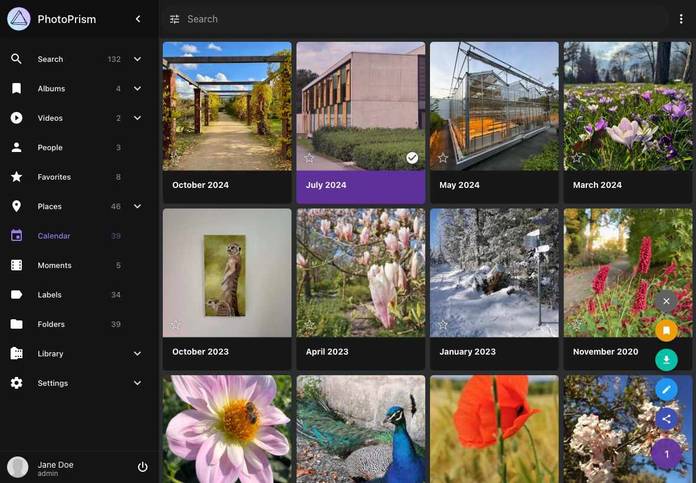

# Calendar #

The *Calendar* view allows you to browse your library by year and month:

{ class="shadow" }

Note that the monthly albums in this view only include pictures that have a valid [creation date and time](edit.md#details) specified in their metadata or as part of their filename.

Files for which the creation date is *estimated* based on the file modification time will therefore not appear in these albums, even if they have been [properly indexed](../library/originals.md).

You can use the context menu to perform the following actions:

### Download Months

1. Select month
2. Open context menu
3. Click :material-download:

### Create Albums from Months

1. Select month
2. Open context menu
3. Click :material-bookmark:
4. Select existing album or enter new album name
5. Click *add to album*