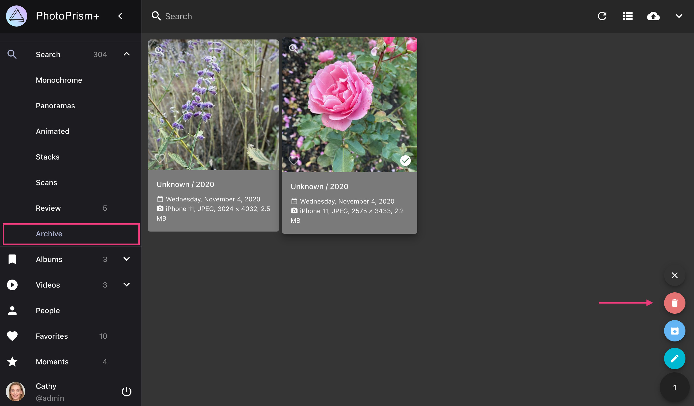

# Removing Files Permanently #

You can permanently delete photo and video files you do not want to keep from your filesystem.
Photos and videos must be [archived](./archive.md) before they can be deleted permanently.

Before you start, make sure the **Delete** feature is enabled in [Settings](../settings/general.md).

### Delete Files ###

1. Go to *Archive*
2. Select the photos and videos your want to delete
2. Click context menu
3. Click :material-delete:
4. Confirm

   { class="shadow" }
